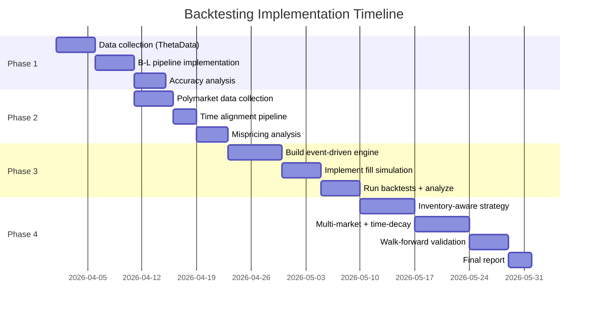

---
tags:
  - backtesting
  - plan
  - market-making
  - polymarket
  - implementation
  - phased-approach
created: 2026-03-31
---

# Backtesting Plan

Phased implementation plan for backtesting market making strategies on Polymarket binary event markets. Each phase builds on the previous one, progressing from data validation to full strategy simulation.

See [[Backtesting-Architecture]] for the technical design and [[Performance-Metrics-and-Pitfalls]] for evaluation methodology.

---

## Overview


| Phase | Goal | Duration | Prerequisites |
|-------|------|----------|---------------|
| **Phase 1** | Validate B-L probability extraction against outcomes | 1-2 weeks | ThetaData API access, historical options data |
| **Phase 2** | Quantify historical mispricings between B-L and Polymarket | 1-2 weeks | Phase 1, Polymarket historical data |
| **Phase 3** | Simulate fixed-spread market making around fair value | 2-3 weeks | Phase 2, fill simulation engine |
| **Phase 4** | Inventory-aware, spread-optimized strategies | 2-4 weeks | Phase 3, full backtest framework |

---

## Phase 1: Probability Extraction Accuracy

### Goal

Validate that the [[Breeden-Litzenberger-Pipeline]] produces accurate risk-neutral probabilities by comparing them to actual binary outcomes. If the probability extraction is not reliable, everything downstream is meaningless.

### Key Questions

1. When we extract P(S > K) from the options chain, how accurate is it?
2. Are the probabilities well-calibrated? (When we say 70%, does it happen ~70% of the time?)
3. How does accuracy vary by:
   - Time to expiry (0-30 DTE)
   - Moneyness (deep ITM, ATM, deep OTM)
   - Ticker (liquid stocks vs indices)
   - Market regime (low vol, high vol, earnings)
4. What is the optimal update frequency for probability recalculation?

### Data Requirements

| Data | Source | Granularity | Volume Estimate |
|------|--------|-------------|-----------------|
| Historical options chains | ThetaData | EOD + intraday snapshots | ~50 GB for 11 tickers, 6 months |
| Stock/index closing prices | ThetaData | Daily OHLCV | ~1 MB |
| Binary outcomes | Manually constructed | Per-strike, per-day | ~5,000 outcomes |

#### ThetaData API Calls

```python
# Collect historical options chains for Breeden-Litzenberger
from thetadata_collector import ThetaDataCollector

collector = ThetaDataCollector()

TICKERS = ["AAPL", "MSFT", "GOOGL", "AMZN", "META", "NVDA", "TSLA", "NFLX", "PLTR"]
INDICES = ["SPX", "NDX"]
DATE_RANGE = ("2024-10-01", "2025-03-31")  # 6 months of history

for ticker in TICKERS + INDICES:
    # 1. Daily stock/index prices for outcome determination
    prices = collector.get_stock_ohlcv(
        ticker=ticker,
        start_date=DATE_RANGE[0],
        end_date=DATE_RANGE[1],
        interval="1day"
    )
    prices.to_parquet(f"data/thetadata/stock_prices/{ticker}.parquet")

    # 2. Historical options chains (EOD) for B-L probability extraction
    # Use bulk endpoint: expiration=* gets all expiries
    for date in pd.date_range(DATE_RANGE[0], DATE_RANGE[1], freq="B"):
        chain = collector.get_historical_options_eod(
            root=ticker,
            expiration="*",   # All expiries
            strike="*",       # All strikes
            right="both",
            start_date=date.strftime("%Y-%m-%d"),
            end_date=date.strftime("%Y-%m-%d"),
        )
        chain.to_parquet(
            f"data/thetadata/options_chains/root={ticker}/date={date.strftime('%Y-%m-%d')}.parquet"
        )
```

### Analysis Steps

```python
# Phase 1: Probability Accuracy Analysis

import numpy as np
import pandas as pd
from breeden_litzenberger import extract_probability  # From our B-L pipeline

def phase1_probability_accuracy(options_data_dir: str,
                                  prices_dir: str,
                                  tickers: list) -> pd.DataFrame:
    """
    For each ticker, for each trading day, for each strike:
    1. Extract P(S > K) from options chain using B-L
    2. Determine actual outcome: did S close above K?
    3. Compare predicted probability to outcome
    """
    results = []

    for ticker in tickers:
        prices = pd.read_parquet(f"{prices_dir}/{ticker}.parquet")

        for date_file in sorted(glob(f"{options_data_dir}/root={ticker}/date=*.parquet")):
            date = extract_date(date_file)
            chain = pd.read_parquet(date_file)

            # Get available expiries from the chain
            for expiry in chain["expiration"].unique():
                expiry_chain = chain[chain["expiration"] == expiry]

                # Extract B-L probability for each strike
                for strike in expiry_chain["strike"].unique():
                    prob = extract_probability(
                        chain=expiry_chain,
                        strike=strike,
                        method="sabr",  # or "svi"
                    )

                    if prob is None:
                        continue

                    # Determine actual outcome
                    closing_price = get_closing_price(prices, expiry)
                    outcome = 1 if closing_price > strike else 0

                    # Days to expiry
                    dte = (pd.Timestamp(expiry) - pd.Timestamp(date)).days

                    # Moneyness
                    spot = get_closing_price(prices, date)
                    moneyness = strike / spot if spot > 0 else None

                    results.append({
                        "ticker": ticker,
                        "date": date,
                        "expiry": expiry,
                        "strike": strike,
                        "dte": dte,
                        "moneyness": moneyness,
                        "predicted_prob": prob,
                        "actual_outcome": outcome,
                        "error": prob - outcome,
                        "abs_error": abs(prob - outcome),
                    })

    return pd.DataFrame(results)

def phase1_report(results: pd.DataFrame) -> dict:
    """Generate Phase 1 accuracy report."""
    return {
        # Overall accuracy
        "brier_score": np.mean((results["predicted_prob"] - results["actual_outcome"]) ** 2),
        "mean_absolute_error": results["abs_error"].mean(),
        "n_observations": len(results),

        # Calibration by probability bin
        "calibration": compute_calibration(results["predicted_prob"], results["actual_outcome"]),

        # Accuracy by DTE
        "brier_by_dte": results.groupby(pd.cut(results["dte"], bins=[0,1,3,7,14,30]))
                               .apply(lambda g: np.mean((g["predicted_prob"] - g["actual_outcome"])**2)),

        # Accuracy by moneyness
        "brier_by_moneyness": results.groupby(pd.cut(results["moneyness"], bins=[0.8,0.9,0.95,1.0,1.05,1.1,1.2]))
                                     .apply(lambda g: np.mean((g["predicted_prob"] - g["actual_outcome"])**2)),

        # Accuracy by ticker
        "brier_by_ticker": results.groupby("ticker")
                                  .apply(lambda g: np.mean((g["predicted_prob"] - g["actual_outcome"])**2)),
    }
```

### Success Criteria

| Metric | Target | Fail Threshold |
|--------|--------|---------------|
| Brier score (overall) | < 0.15 | > 0.25 (worse than coin flip) |
| Calibration gap (avg) | < 5 percentage points | > 15 percentage points |
| Brier score (0-3 DTE) | < 0.12 | > 0.20 |
| Coverage (% strikes with valid probability) | > 80% | < 50% |

### Deliverables

- [ ] Calibration curve plot (predicted vs observed frequency)
- [ ] Brier score breakdown by ticker, DTE, moneyness
- [ ] Identification of failure modes (earnings, illiquid options, extreme strikes)
- [ ] Recommended B-L configuration (SABR vs SVI, filtering criteria, update frequency)
- [ ] Decision: proceed to Phase 2 or iterate on probability extraction

---

## Phase 2: Static Mispricing Analysis

### Goal

Quantify the historical gap between options-implied probabilities (from Phase 1) and Polymarket prices. Determine whether persistent, tradeable mispricings exist.

### Key Questions

1. How large are the mispricings? (mean, median, distribution)
2. How persistent are they? (autocorrelation, half-life)
3. Are mispricings directional? (Polymarket systematically over/under-prices?)
4. When are mispricings largest? (time of day, DTE, volatility regime)
5. Is the mispricing larger than transaction costs?

### Data Requirements

| Data | Source | Granularity | Volume Estimate |
|------|--------|-------------|-----------------|
| Polymarket midpoints | Polymarket CLOB API | 1-minute | ~500 MB for 6 months |
| Polymarket trades | Polymarket CLOB API | Tick-level | ~2 GB for 6 months |
| Options-derived probabilities | Phase 1 output | Per-snapshot | Already computed |
| Market metadata | Polymarket Gamma API | Per-market | ~10 MB |

#### Polymarket Data Collection

```python
from polymarket_collector import PolymarketDataCollector

collector = PolymarketDataCollector()

# 1. Discover all stock/index binary markets
markets = collector.search_markets(query="close above")
stock_markets = [m for m in markets if any(t in m["question"]
                 for t in ["AAPL", "MSFT", "GOOGL", "AMZN", "META",
                           "NVDA", "TSLA", "NFLX", "PLTR", "SPX", "NDX"])]

# 2. For each market, collect midpoints and trades
for market in stock_markets:
    token_id = market["token_id"]

    # Historical midpoints (1-minute)
    midpoints = collector.collect_historical_midpoints(
        token_id=token_id,
        start_ts=market["created_at"],
        end_ts=market["resolved_at"] or int(time.time()),
    )

    # Historical trades
    trades = collector.get_market_trades(token_id=token_id)

    # Save with market metadata
    save_with_metadata(midpoints, trades, market)
```

### Analysis Steps

```python
def phase2_mispricing_analysis(aligned_data: pd.DataFrame) -> dict:
    """
    Analyze mispricings between B-L probability and Polymarket price.

    aligned_data columns:
    - timestamp, polymarket_mid, bl_probability, ticker, strike, expiry, dte
    """
    # Compute mispricing
    aligned_data["mispricing"] = aligned_data["bl_probability"] - aligned_data["polymarket_mid"]
    aligned_data["abs_mispricing"] = aligned_data["mispricing"].abs()

    results = {}

    # 1. Mispricing distribution
    results["mean_mispricing"] = aligned_data["mispricing"].mean()
    results["median_abs_mispricing"] = aligned_data["abs_mispricing"].median()
    results["std_mispricing"] = aligned_data["mispricing"].std()
    results["pct_above_2pct"] = (aligned_data["abs_mispricing"] > 0.02).mean()
    results["pct_above_5pct"] = (aligned_data["abs_mispricing"] > 0.05).mean()

    # 2. Mispricing persistence (autocorrelation)
    results["mispricing_autocorr_1min"] = aligned_data["mispricing"].autocorr(lag=1)
    results["mispricing_autocorr_5min"] = aligned_data["mispricing"].autocorr(lag=5)
    results["mispricing_autocorr_30min"] = aligned_data["mispricing"].autocorr(lag=30)
    results["mispricing_autocorr_60min"] = aligned_data["mispricing"].autocorr(lag=60)

    # Half-life of mispricing
    autocorr_1 = aligned_data["mispricing"].autocorr(lag=1)
    if 0 < autocorr_1 < 1:
        results["mispricing_half_life_minutes"] = -np.log(2) / np.log(autocorr_1)

    # 3. Directional bias
    results["pct_polymarket_overpriced"] = (aligned_data["mispricing"] < 0).mean()
    results["pct_polymarket_underpriced"] = (aligned_data["mispricing"] > 0).mean()

    # 4. Mispricing by time of day (ET)
    aligned_data["hour_et"] = aligned_data["timestamp"].dt.tz_convert("US/Eastern").dt.hour
    results["mispricing_by_hour"] = aligned_data.groupby("hour_et")["abs_mispricing"].mean()

    # 5. Mispricing by DTE
    results["mispricing_by_dte"] = aligned_data.groupby(
        pd.cut(aligned_data["dte"], bins=[0,1,3,7,14,30])
    )["abs_mispricing"].mean()

    # 6. Mispricing by ticker
    results["mispricing_by_ticker"] = aligned_data.groupby("ticker")["abs_mispricing"].mean()

    # 7. Theoretical PnL from perfect capture
    # If we could buy at Polymarket and sell at B-L fair value (or vice versa)
    results["theoretical_max_pnl"] = aligned_data["abs_mispricing"].sum()

    return results
```

### Success Criteria

| Metric | Proceed | Marginal | Abort |
|--------|---------|----------|-------|
| Median |mispricing| | > 3% | 1.5-3% | < 1% |
| % of time |mispricing| > 2% | > 40% | 20-40% | < 10% |
| Mispricing half-life | > 30 min | 10-30 min | < 5 min |
| Mispricing autocorr (5-min lag) | > 0.8 | 0.5-0.8 | < 0.3 |

If mispricings are small and transient, market making will not be profitable (spread + adverse selection will exceed the edge).

### Deliverables

- [ ] Mispricing distribution histogram
- [ ] Mispricing time series for representative markets
- [ ] Autocorrelation and half-life analysis
- [ ] Heatmap: mispricing by (ticker x DTE)
- [ ] Scatter: mispricing vs Polymarket liquidity (bid-ask spread)
- [ ] Decision: proceed to Phase 3 (sufficient edge exists) or pivot strategy

---

## Phase 3: Simple Market Making Simulation

### Goal

Simulate a basic fixed-spread market making strategy around the B-L fair value. This is the first full backtest using the event-driven engine from [[Backtesting-Architecture]].

### Strategy: Fixed-Spread Quoting

```python
class FixedSpreadStrategy:
    """
    Phase 3 baseline strategy.

    Quote bid and ask at fixed distances from the B-L fair value.
    No inventory management, no spread optimization.

    This establishes the baseline PnL before adding sophistication.
    """

    def __init__(self, half_spread: float = 0.02,
                 max_position: int = 50,
                 min_edge: float = 0.01):
        self.half_spread = half_spread   # $0.02 = 2 cents on each side
        self.max_position = max_position # Max YES or NO tokens to hold
        self.min_edge = min_edge         # Minimum |mispricing| to quote

    def on_probability_update(self, fair_value: float,
                                 polymarket_mid: float,
                                 current_position: float) -> dict:
        """Generate quotes when mispricing exceeds threshold."""

        mispricing = fair_value - polymarket_mid

        # Only quote if mispricing exceeds minimum edge
        if abs(mispricing) < self.min_edge:
            return {"action": "cancel_all"}

        # Simple quotes: symmetric around fair value
        bid_price = round(max(0.01, fair_value - self.half_spread), 2)
        ask_price = round(min(0.99, fair_value + self.half_spread), 2)

        # Position limits
        bid_size = max(0, self.max_position - current_position)
        ask_size = max(0, self.max_position + current_position)

        return {
            "action": "update_quotes",
            "bid_price": bid_price,
            "bid_size": bid_size,
            "ask_price": ask_price,
            "ask_size": ask_size,
        }
```

### Data Requirements

Everything from Phases 1 and 2, plus:

| Data | Source | Purpose |
|------|--------|---------|
| Polymarket trade ticks | Polymarket API | Fill simulation calibration |
| Aligned timeline | Phase 2 output | Backtest input |

### Parameters to Test

| Parameter | Range | Purpose |
|-----------|-------|---------|
| `half_spread` | 0.01, 0.02, 0.03, 0.05 | Trade-off: tighter = more fills + more adverse selection |
| `max_position` | 20, 50, 100, 200 | Trade-off: larger = more revenue + more resolution risk |
| `min_edge` | 0.005, 0.01, 0.02, 0.03 | Trade-off: lower = more quoting + lower average edge |
| Fill probability | 0.1, 0.2, 0.3, 0.5 | Sensitivity analysis on fill realism |

### Execution Plan

```python
def phase3_backtest(aligned_data: pd.DataFrame,
                     polymarket_trades: pd.DataFrame,
                     param_grid: dict) -> pd.DataFrame:
    """
    Run Phase 3 backtests across parameter grid.

    For each parameter combination:
    1. Initialize engine with FixedSpreadStrategy
    2. Run through aligned timeline
    3. Resolve all markets at expiry
    4. Compute metrics
    """
    from backtesting_architecture import BacktestEngine, TradeTickFillSimulator

    results = []

    for params in product_dict(param_grid):
        strategy = FixedSpreadStrategy(
            half_spread=params["half_spread"],
            max_position=params["max_position"],
            min_edge=params["min_edge"],
        )

        fill_sim = TradeTickFillSimulator(
            fill_probability=params["fill_probability"]
        )

        engine = BacktestEngine(
            data=aligned_data,
            trades=polymarket_trades,
            strategy=strategy,
            fill_simulator=fill_sim,
        )

        result = engine.run()

        # Compute comprehensive metrics
        metrics = compute_all_metrics(result)
        metrics["params"] = params
        results.append(metrics)

    return pd.DataFrame(results)
```

### Success Criteria

| Metric | Target | Notes |
|--------|--------|-------|
| Net PnL (out-of-sample) | Positive | After all costs and resolution |
| Sharpe ratio | > 0.5 | Modest but positive risk-adjusted return |
| Spread capture > adverse selection | Yes | Core profitability condition |
| Profitable across 60%+ of markets | Yes | Not relying on a few lucky outcomes |
| Consistent across tickers | Yes | Not ticker-specific overfitting |

### Deliverables

- [ ] Parameter sensitivity grid (heatmap of Sharpe across parameters)
- [ ] PnL decomposition for best parameter set
- [ ] Fill analysis: fill rate, adverse selection rate, realized spread
- [ ] Per-market PnL breakdown
- [ ] Equity curves for top parameter sets
- [ ] Sensitivity to fill probability assumptions
- [ ] Decision: viable edge exists, proceed to Phase 4

---

## Phase 4: Advanced Market Making Strategies

### Goal

Implement and test sophisticated market making strategies that adapt quotes based on inventory, volatility, time-to-expiry, and market conditions. Build on the Phase 3 baseline to capture additional edge.

### 4.1 Inventory-Aware Quoting (Avellaneda-Stoikov Adaptation)

```python
class InventoryAwareStrategy:
    """
    Avellaneda-Stoikov inspired market making for binary events.

    Key adaptations for binary markets:
    - Price bounded [0, 1] instead of unbounded
    - Terminal payoff is binary ($0 or $1)
    - Inventory risk increases as expiry approaches (no exit)
    - Volatility derived from options chain, not from Polymarket prices

    See [[Core-Market-Making-Strategies]] for full formulation.
    See [[Inventory-and-Risk-Management]] for risk controls.
    """

    def __init__(self,
                 gamma: float = 0.1,       # Risk aversion
                 kappa: float = 1.5,       # Order book density parameter
                 max_position: int = 100,
                 min_edge: float = 0.005):
        self.gamma = gamma
        self.kappa = kappa
        self.max_position = max_position
        self.min_edge = min_edge

    def compute_quotes(self, fair_value: float,
                        current_position: float,
                        sigma: float,           # Implied volatility
                        time_remaining: float,  # Fraction of time to expiry [0, 1]
                        polymarket_mid: float) -> dict:
        """
        Compute optimal bid/ask quotes using Avellaneda-Stoikov model
        adapted for binary markets.
        """
        # Reservation price: adjust fair value for inventory
        # r = s - q * gamma * sigma^2 * (T - t)
        reservation_price = fair_value - (
            current_position * self.gamma * sigma**2 * time_remaining
        )

        # Clip to valid binary price range
        reservation_price = np.clip(reservation_price, 0.01, 0.99)

        # Optimal spread
        # delta = gamma * sigma^2 * (T-t) + (2/gamma) * ln(1 + gamma/kappa)
        optimal_spread = (
            self.gamma * sigma**2 * time_remaining +
            (2 / self.gamma) * np.log(1 + self.gamma / self.kappa)
        )

        # Floor the spread at minimum tick
        half_spread = max(optimal_spread / 2, 0.01)

        bid_price = round(max(0.01, reservation_price - half_spread), 2)
        ask_price = round(min(0.99, reservation_price + half_spread), 2)

        # Position-dependent sizing
        bid_size = max(0, self.max_position - current_position)
        ask_size = max(0, self.max_position + current_position)

        # Only quote if edge exists relative to Polymarket price
        edge = abs(fair_value - polymarket_mid)
        if edge < self.min_edge:
            return {"action": "cancel_all"}

        return {
            "action": "update_quotes",
            "bid_price": bid_price,
            "ask_price": ask_price,
            "bid_size": bid_size,
            "ask_size": ask_size,
            "reservation_price": reservation_price,
            "optimal_spread": optimal_spread,
        }
```

### 4.2 Time-Decay Aware Strategy

Binary markets have a known expiry. As expiry approaches:
- Probability converges to 0 or 1 (price moves to extremes)
- Adverse selection risk increases (informed traders know outcome sooner)
- Spread should widen to compensate for increased toxicity
- Position limits should decrease to reduce resolution risk

```python
class TimeDecayStrategy(InventoryAwareStrategy):
    """
    Extends inventory-aware strategy with time-decay adjustments
    specific to binary event markets.
    """

    def compute_time_adjustment(self, dte_hours: float) -> dict:
        """
        Adjust strategy parameters based on time to expiry.

        As expiry approaches:
        - Widen spreads (more uncertainty per unit time)
        - Reduce position limits (higher resolution risk)
        - Increase min_edge threshold (need more edge to compensate)
        """
        if dte_hours <= 0:
            return {"action": "cancel_all", "reason": "expired"}

        # Logarithmic decay: aggressive widening in final hours
        time_factor = max(0.1, np.log(1 + dte_hours) / np.log(1 + 24))

        return {
            "spread_multiplier": 1.0 / time_factor,  # Wider as expiry nears
            "position_limit_multiplier": time_factor, # Smaller positions near expiry
            "min_edge_multiplier": 1.0 / time_factor, # Higher bar near expiry
        }
```

### 4.3 Multi-Market Strategy

Trade across multiple correlated binary markets simultaneously.

```python
class MultiMarketStrategy:
    """
    Quote across multiple binary markets for the same underlying.

    Example: NVDA has markets for strikes at $100, $110, $120, $130, $140.
    These are correlated — a move in NVDA affects all markets.

    Benefits:
    - Natural hedging: long YES on low strike + short YES on high strike
    - Portfolio-level inventory management
    - Cross-market mispricing detection
    """

    def __init__(self, tickers: list, max_portfolio_exposure: float = 500):
        self.tickers = tickers
        self.max_exposure = max_portfolio_exposure
        self.market_states = {}  # market_id -> state

    def compute_portfolio_risk(self) -> dict:
        """
        Compute portfolio-level risk across all active markets.

        For correlated binary events on the same underlying,
        net exposure depends on the joint probability structure:

        - Long YES at K=100, Long YES at K=120 → correlated long
        - Long YES at K=100, Short YES at K=120 → partial hedge
        """
        total_exposure = sum(
            abs(state["net_position"]) * state["notional_per_unit"]
            for state in self.market_states.values()
        )

        # Gross vs net exposure
        gross = total_exposure
        net = sum(
            state["net_position"] * state["fair_value"]
            for state in self.market_states.values()
        )

        return {
            "gross_exposure": gross,
            "net_exposure": net,
            "hedge_ratio": 1 - abs(net) / max(gross, 1),
            "n_active_markets": len(self.market_states),
        }
```

### 4.4 Parameters to Optimize in Phase 4

| Parameter | Range | Strategy |
|-----------|-------|----------|
| `gamma` (risk aversion) | 0.01, 0.05, 0.1, 0.5, 1.0 | Inventory-aware |
| `kappa` (book density) | 0.5, 1.0, 1.5, 3.0 | Inventory-aware |
| Time-decay steepness | Linear, log, exponential | Time-decay |
| Max portfolio exposure | $200, $500, $1000 | Multi-market |
| Quote update frequency | 1min, 5min, 15min | All strategies |

### Success Criteria (Phase 4)

| Metric | Target | vs Phase 3 |
|--------|--------|-----------|
| Sharpe ratio (OOS) | > 1.5 | +0.5-1.0 improvement |
| Max drawdown | < 15% | Reduced via inventory management |
| Inventory half-life | < 30 minutes | Faster mean-reversion |
| Profit factor | > 1.5 | Higher efficiency |
| Walk-forward win rate | > 60% | More consistent |

### Deliverables

- [ ] Avellaneda-Stoikov adapted for binary markets, with parameter optimization results
- [ ] Time-decay analysis: optimal quoting behavior as function of DTE
- [ ] Multi-market portfolio analysis
- [ ] Comparison table: Phase 3 baseline vs each Phase 4 strategy
- [ ] Final strategy recommendation with optimized parameters
- [ ] Walk-forward and Monte Carlo validation of best strategy

---

## Tooling Recommendations

### Core Stack

| Tool | Purpose | Why |
|------|---------|-----|
| **Python 3.11+** | Primary language | Ecosystem, pandas/numpy, ThetaData SDK |
| **pandas + numpy** | Data manipulation | Standard for financial data |
| **Parquet + pyarrow** | Data storage | Columnar, compressed, fast reads |
| **DuckDB** | Ad-hoc analytics on Parquet | SQL queries on Parquet without loading into memory |
| **matplotlib + plotly** | Visualization | Static plots + interactive exploration |
| **scipy.stats** | Statistical tests | T-tests, bootstrap, distribution fitting |

### Optional but Recommended

| Tool | Purpose | When to Add |
|------|---------|------------|
| **NautilusTrader** | Production-grade engine | Phase 4, if building toward live trading |
| **HftBacktest** | Fill simulation models | Phase 3, for queue position modeling |
| **PolyBackTest API** | Historical order book depth | Phase 3, for fill calibration if Polymarket API is insufficient |
| **Jupyter notebooks** | Analysis and exploration | All phases, for interactive work |
| **pytest** | Testing the backtesting engine | Phase 3+, to catch bugs in the engine itself |

### Alternative: NautilusTrader Path

For teams that want to move faster toward production, the `prediction-market-backtesting` project (NautilusTrader fork with Polymarket adapters) offers a shortcut:

- **Pros:** L2 order book replay, mature matching engine, path to live trading, existing Polymarket data pipeline (PMXT relay)
- **Cons:** Steeper learning curve, heavier dependency, less control over fill simulation specifics
- **Best for:** Teams prioritizing live trading over research flexibility

### Third-Party Data Services

| Service | Data | Cost | When to Use |
|---------|------|------|------------|
| **PolyBackTest** | Polymarket historical order books (sub-second) | Free (limited) / $19/mo (Pro) | Phase 3: calibrating fill model, estimating queue depth |
| **PolymarketData** | Historical prices, metrics, order books | API-based | Phase 2: if Polymarket CLOB API is insufficient for historical data |
| **ThetaData** | Options chains, stock prices, Greeks | $80/mo (Options Standard) | All phases: primary options data source |

---

## Computational Requirements

| Phase | Data Size | Compute Time (est.) | Memory |
|-------|-----------|-------------------|--------|
| Phase 1 | ~50 GB options data | 2-4 hours (B-L computation) | 8 GB |
| Phase 2 | ~3 GB Polymarket + Phase 1 output | 30-60 minutes (alignment + analysis) | 4 GB |
| Phase 3 | Phase 2 output + trades | 1-4 hours per parameter combination | 8 GB |
| Phase 4 | Same as Phase 3 | 4-16 hours (larger parameter grid) | 16 GB |

**Hardware recommendation:** Any modern laptop with 16 GB RAM is sufficient. Phase 4 parameter sweeps benefit from parallelization across CPU cores.

---

## Risk Register

| Risk | Impact | Likelihood | Mitigation |
|------|--------|------------|------------|
| Insufficient Polymarket historical data | Cannot run Phases 2-4 | Medium | Use PolyBackTest API as fallback; start with recent 3-month window |
| ThetaData API rate limits | Slow data collection | Low | Batch requests, cache aggressively, collect overnight |
| B-L probabilities poorly calibrated | Phase 1 fails, all downstream invalid | Medium | Try multiple vol surface models (SABR, SVI); use simpler Black-Scholes delta as fallback |
| Mispricings too small to trade | Phase 2 shows no edge | Medium | Pivot to different market types or different pricing model |
| Fill simulation too pessimistic | Phase 3 shows no PnL even with edge | Medium | Run sensitivity on fill rate; compare multiple fill models |
| Overfitting in Phase 4 | Good in-sample, poor out-of-sample | High | Strict walk-forward; minimal parameters; regularization |

---

## Timeline



**Estimated total duration:** 8-12 weeks (with some overlap between phases).

---

## References

- [[Backtesting-Architecture]] — Technical design for the engine
- [[Performance-Metrics-and-Pitfalls]] — How to evaluate results
- [[Breeden-Litzenberger-Pipeline]] — Probability extraction methodology
- [[Vol-Surface-Fitting]] — SABR/SVI parameterization
- [[Core-Market-Making-Strategies]] — Strategy theory
- [[Inventory-and-Risk-Management]] — Risk management framework
- [[Polymarket-Data-API]] — Polymarket data endpoints
- [[ThetaData-Options-API]] — ThetaData API documentation
- [[Risk-Neutral-vs-Physical-Probabilities]] — Risk premium considerations
