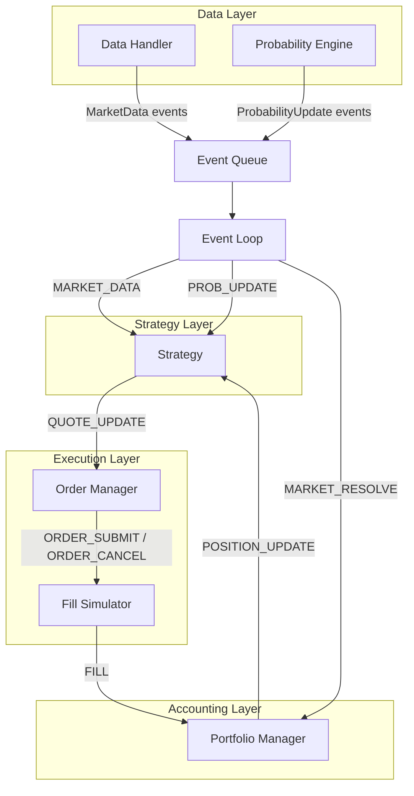
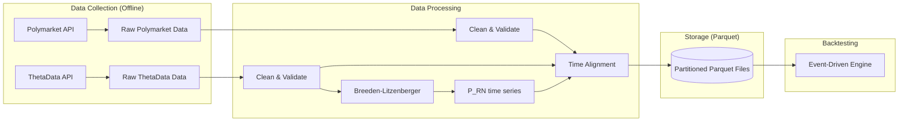

---
tags:
  - backtesting
  - architecture
  - market-making
  - polymarket
  - fill-simulation
  - data-pipeline
created: 2026-03-31
---

# Backtesting Architecture

System design for backtesting market making strategies on Polymarket binary event markets. Covers the event-driven engine, fill simulation, data pipeline, and time synchronization between Polymarket and options/stock data from ThetaData.

See [[Backtesting-Plan]] for the phased implementation plan and [[Performance-Metrics-and-Pitfalls]] for evaluation methodology.

---

## 1. Architecture Choice: Event-Driven vs Vectorized

### Why Event-Driven for Market Making

Market making backtests **must** be event-driven, not vectorized. Vectorized backtests process entire price series at once and work well for directional strategies, but they cannot model the sequential, state-dependent nature of market making:

| Concern | Vectorized | Event-Driven |
|---------|-----------|--------------|
| Two-sided quoting | Cannot model bid/ask independently | Natural per-event quote updates |
| Inventory tracking | Requires complex post-hoc accounting | State evolves naturally with each fill |
| Fill simulation | Assumes fills at observed prices | Models queue position, adverse selection |
| Order management | No concept of resting orders | Tracks live orders, cancellations, modifications |
| Latency modeling | Not possible | Feed and order latency per event |
| Look-ahead bias | Easy to introduce accidentally | Prevented by chronological event processing |

**Recommendation:** Build a custom event-driven engine tailored to binary event market making. General-purpose frameworks like Backtrader or Backtesting.py are designed for directional strategies and lack the fill simulation fidelity needed for market making.

### Reference Frameworks

| Framework                         | Relevance   | Notes                                                                        |
| --------------------------------- | ----------- | ---------------------------------------------------------------------------- |
| **HftBacktest**                   | High        | Queue position models, latency simulation, Rust+Python. Designed for HFT/MM. |
| **NautilusTrader**                | High        | Has Polymarket adapter with L2 replay. Production-grade event-driven engine. |
| **prediction-market-backtesting** | Direct      | NautilusTrader fork with Polymarket + Kalshi adapters, PMXT L2 replay.       |
| **PredictionMarketBench**         | Medium      | SWE-bench-style framework for prediction market agents. Kalshi-focused.      |
| **QuantStart Event Engine**       | Educational | Clean reference architecture for understanding event-driven design.          |

---

## 2. Core Architecture Design

### 2.1 Event Types

```python
from enum import Enum
from dataclasses import dataclass
from typing import Optional
import numpy as np

class EventType(Enum):
    MARKET_DATA = "MARKET_DATA"          # New price/trade data arrived
    PROBABILITY_UPDATE = "PROB_UPDATE"   # New fair value from B-L pipeline
    SIGNAL = "SIGNAL"                    # Mispricing signal generated
    QUOTE_UPDATE = "QUOTE_UPDATE"        # Strategy wants to update quotes
    ORDER_SUBMIT = "ORDER_SUBMIT"        # New order to submit
    ORDER_CANCEL = "ORDER_CANCEL"        # Cancel resting order
    FILL = "FILL"                        # Order was filled
    POSITION_UPDATE = "POSITION_UPDATE"  # Position/inventory changed
    MARKET_RESOLVE = "MARKET_RESOLVE"    # Binary market resolved (YES=1 or NO=1)

@dataclass
class Event:
    timestamp: np.datetime64   # Nanosecond-precision timestamp
    event_type: EventType
    data: dict                 # Event-specific payload
```

### 2.2 Component Architecture



### 2.3 Event Loop

```python
import heapq
from collections import deque
from typing import List

class BacktestEngine:
    """
    Core event-driven backtesting engine for binary event market making.
    Events are processed in strict timestamp order to prevent look-ahead bias.
    """

    def __init__(self, data_handler, prob_engine, strategy,
                 fill_simulator, portfolio):
        self.event_queue: List = []  # Min-heap ordered by timestamp
        self.data_handler = data_handler
        self.prob_engine = prob_engine
        self.strategy = strategy
        self.fill_simulator = fill_simulator
        self.portfolio = portfolio
        self.current_time = None

    def run(self):
        # Pre-load all data events into the priority queue
        for event in self.data_handler.generate_events():
            heapq.heappush(self.event_queue, (event.timestamp, event))

        for event in self.prob_engine.generate_events():
            heapq.heappush(self.event_queue, (event.timestamp, event))

        # Main event loop
        while self.event_queue:
            timestamp, event = heapq.heappop(self.event_queue)
            self.current_time = timestamp
            self._process_event(event)

    def _process_event(self, event: Event):
        if event.event_type == EventType.MARKET_DATA:
            # Update market state, check for fills on resting orders
            new_events = self.fill_simulator.on_market_data(event)
            self._enqueue_events(new_events)

            # Strategy reacts to new market data
            new_events = self.strategy.on_market_data(event)
            self._enqueue_events(new_events)

        elif event.event_type == EventType.PROBABILITY_UPDATE:
            # New fair value — strategy may want to re-quote
            new_events = self.strategy.on_probability_update(event)
            self._enqueue_events(new_events)

        elif event.event_type in (EventType.ORDER_SUBMIT, EventType.ORDER_CANCEL):
            new_events = self.fill_simulator.on_order_event(event)
            self._enqueue_events(new_events)

        elif event.event_type == EventType.FILL:
            new_events = self.portfolio.on_fill(event)
            self._enqueue_events(new_events)

        elif event.event_type == EventType.MARKET_RESOLVE:
            self.portfolio.on_resolution(event)

    def _enqueue_events(self, events: List[Event]):
        for event in events:
            heapq.heappush(self.event_queue, (event.timestamp, event))
```

### 2.4 State Management

```python
@dataclass
class MarketMakingState:
    """Complete state tracked throughout the backtest."""

    # Position tracking
    yes_position: float = 0.0       # YES tokens held (positive = long)
    no_position: float = 0.0        # NO tokens held (positive = long)
    net_position: float = 0.0       # yes_position - no_position
    cash: float = 10_000.0          # Available cash

    # Resting orders
    bid_order: Optional[dict] = None   # Current resting bid
    ask_order: Optional[dict] = None   # Current resting ask

    # PnL tracking
    realized_pnl: float = 0.0
    unrealized_pnl: float = 0.0    # Mark-to-market using current midpoint
    total_fees_paid: float = 0.0

    # Execution stats
    total_fills: int = 0
    bid_fills: int = 0
    ask_fills: int = 0
    total_quotes_placed: int = 0

    # Fair value state
    current_fair_value: float = 0.5   # From Breeden-Litzenberger
    current_polymarket_mid: float = 0.5
    current_mispricing: float = 0.0

    # Inventory history (for analysis)
    inventory_history: list = None    # [(timestamp, net_position), ...]
    pnl_history: list = None          # [(timestamp, total_pnl), ...]
```

---

## 3. Fill Simulation

Fill simulation is the **single most important component** of a market making backtest. Unrealistic fill assumptions are the primary reason market making backtests overstate profitability. Empirical studies show that 65-89% of limit order fills in liquid markets are adverse (the price moves against you immediately after the fill).

### 3.1 Fill Simulation Approaches

#### Approach 1: Trade-Tick Matching (Recommended Starting Point)

Match resting limit orders against historical trade ticks. A resting bid at price P is filled when a trade occurs at or below P.

```python
class TradeTickFillSimulator:
    """
    Fill simulation using historical Polymarket trade data.
    Conservative: only fills when a historical trade crosses our price.
    """

    def __init__(self, fill_probability: float = 0.5,
                 adverse_selection_model: str = "empirical"):
        self.resting_orders = {}  # order_id -> Order
        self.fill_probability = fill_probability
        self.adverse_model = adverse_selection_model

    def on_market_data(self, event: Event) -> List[Event]:
        fills = []
        trade_price = event.data.get("trade_price")
        trade_size = event.data.get("trade_size")
        trade_side = event.data.get("trade_side")  # "buy" or "sell"

        if trade_price is None:
            return fills

        for order_id, order in list(self.resting_orders.items()):
            if self._should_fill(order, trade_price, trade_side):
                # Apply partial fill probability
                if np.random.random() < self.fill_probability:
                    fill_event = self._create_fill(order, trade_price, event.timestamp)
                    fills.append(fill_event)
                    del self.resting_orders[order_id]

        return fills

    def _should_fill(self, order, trade_price, trade_side) -> bool:
        if order["side"] == "buy":
            # Bid filled when someone sells at or below our bid
            return trade_price <= order["price"] and trade_side == "sell"
        else:
            # Ask filled when someone buys at or above our ask
            return trade_price >= order["price"] and trade_side == "buy"

    def _create_fill(self, order, trade_price, timestamp) -> Event:
        # Apply adverse selection: fills more likely when price moves against us
        fill_price = order["price"]  # Filled at our limit price, not trade price

        return Event(
            timestamp=timestamp,
            event_type=EventType.FILL,
            data={
                "order_id": order["order_id"],
                "side": order["side"],
                "price": fill_price,
                "size": order["size"],
                "fee": self._calculate_fee(fill_price, order["size"]),
            }
        )

    def _calculate_fee(self, price, size) -> float:
        # Polymarket: zero maker fees, taker fee on crossing orders
        # For resting limit orders (maker), fee = 0
        return 0.0
```

#### Approach 2: Probabilistic Queue Position Model

Without full L2 order book data, estimate queue position probabilistically using historical trade volume.

```python
class ProbabilisticFillSimulator:
    """
    Probabilistic fill model inspired by HftBacktest's queue position models.
    Estimates fill probability based on volume traded through our price level.
    """

    def __init__(self, queue_depth_estimate: float = 500.0):
        self.queue_depth = queue_depth_estimate  # Estimated shares ahead in queue
        self.volume_at_price = {}  # price_level -> cumulative volume since order placed

    def estimate_fill_probability(self, order, cumulative_volume_at_level: float) -> float:
        """
        P(fill) increases as volume trades through our price level.

        Model: P(fill) = 1 - exp(-volume_traded / estimated_queue_depth)

        This is the exponential queue model — assumes random queue position
        and Poisson-like arrival of fills.
        """
        if cumulative_volume_at_level <= 0:
            return 0.0

        return 1.0 - np.exp(-cumulative_volume_at_level / self.queue_depth)

    def on_trade(self, order, trade_price, trade_size):
        """Update volume tracking and check for fill."""
        if self._is_at_our_level(order, trade_price):
            key = (order["order_id"], order["price"])
            self.volume_at_price[key] = self.volume_at_price.get(key, 0) + trade_size

            fill_prob = self.estimate_fill_probability(
                order, self.volume_at_price[key]
            )

            if np.random.random() < fill_prob:
                return True  # Order filled

        elif self._price_through_our_level(order, trade_price):
            return True  # Trade went through our level — definite fill

        return False
```

#### Approach 3: Adverse Selection-Aware Fill Model

The most realistic but complex model. Fills are more likely when the market moves against us (adverse selection), and less likely when the market moves in our favor (information leakage).

```python
class AdverseSelectionFillModel:
    """
    Incorporates the empirical finding that 65-89% of limit order fills
    are adverse. Models the correlation between fill probability and
    subsequent price movement.

    Based on: "Market Simulation under Adverse Selection" (2024)
    """

    def __init__(self,
                 base_fill_rate: float = 0.2,
                 adverse_fill_rate: float = 0.8,
                 lookforward_window: int = 5):  # minutes
        self.base_fill_rate = base_fill_rate      # Non-adverse fill probability
        self.adverse_fill_rate = adverse_fill_rate # Fill prob when price moves against us
        self.lookforward = lookforward_window
        # NOTE: lookforward is used in CALIBRATION only (on training data),
        # never during the actual backtest to avoid look-ahead bias.
        # At backtest time, we use the calibrated base_fill_rate and
        # adverse_fill_rate parameters directly.

    def classify_fill_opportunity(self, order, current_mid,
                                   recent_price_trajectory) -> str:
        """
        Classify whether a fill opportunity is adverse or non-adverse
        based on recent price momentum (not future prices).

        If price is moving toward our order, it's more likely adverse
        (informed flow pushing price through our level).
        """
        if order["side"] == "buy":
            # Price falling toward our bid — likely adverse
            if recent_price_trajectory < 0:
                return "adverse"
            return "non_adverse"
        else:
            # Price rising toward our ask — likely adverse
            if recent_price_trajectory > 0:
                return "adverse"
            return "non_adverse"

    def get_fill_probability(self, fill_type: str) -> float:
        if fill_type == "adverse":
            return self.adverse_fill_rate
        return self.base_fill_rate
```

### 3.2 Fill Simulation Recommendations for Polymarket

| Factor | Recommendation | Rationale |
|--------|---------------|-----------|
| **Starting model** | Trade-tick matching with 50% fill probability | Conservative baseline; calibrate from historical data |
| **Queue position** | Exponential model with estimated depth | No L2 data available historically |
| **Adverse selection** | Classify fills as adverse/non-adverse | Critical for realistic PnL estimation |
| **Maker fees** | Zero | Polymarket charges zero maker fees |
| **Taker fees** | Model if strategy ever crosses spread | ~2% of notional for aggressive orders |
| **Slippage** | 1 tick ($0.01) for any market order | Minimum price increment on Polymarket |
| **Partial fills** | Model at 50-100% of order size | Thin liquidity means partial fills common |

### 3.3 Calibrating Fill Parameters

Use historical Polymarket trade data to calibrate:

```python
def calibrate_fill_model(historical_trades: pd.DataFrame,
                          historical_midpoints: pd.DataFrame,
                          spread_width: float = 0.02) -> dict:
    """
    Estimate realistic fill parameters from historical data.

    For each minute:
    1. Place hypothetical quotes at mid +/- spread/2
    2. Check if any trades occurred at or beyond our quote prices
    3. Track what happened to the midpoint after each fill
    """
    results = {
        "total_quote_minutes": 0,
        "bid_fill_count": 0,
        "ask_fill_count": 0,
        "adverse_bid_fills": 0,  # Mid moved down after bid fill
        "adverse_ask_fills": 0,  # Mid moved up after ask fill
    }

    for i, row in historical_midpoints.iterrows():
        mid = row["midpoint"]
        bid_price = mid - spread_width / 2
        ask_price = mid + spread_width / 2

        # Find trades in this minute
        minute_trades = historical_trades[
            historical_trades["timestamp"].between(row["timestamp"],
                                                     row["timestamp"] + pd.Timedelta("1min"))
        ]

        results["total_quote_minutes"] += 1

        # Check for bid fills
        bid_fills = minute_trades[minute_trades["price"] <= bid_price]
        if len(bid_fills) > 0:
            results["bid_fill_count"] += 1
            # Check if adverse (mid moved down in next 5 minutes)
            future_mid = get_future_midpoint(historical_midpoints, row["timestamp"], 5)
            if future_mid is not None and future_mid < mid:
                results["adverse_bid_fills"] += 1

        # Check for ask fills
        ask_fills = minute_trades[minute_trades["price"] >= ask_price]
        if len(ask_fills) > 0:
            results["ask_fill_count"] += 1
            future_mid = get_future_midpoint(historical_midpoints, row["timestamp"], 5)
            if future_mid is not None and future_mid > mid:
                results["adverse_ask_fills"] += 1

    fill_rate = (results["bid_fill_count"] + results["ask_fill_count"]) / (2 * results["total_quote_minutes"])
    adverse_rate = (results["adverse_bid_fills"] + results["adverse_ask_fills"]) / max(1, results["bid_fill_count"] + results["ask_fill_count"])

    return {
        "estimated_fill_rate_per_minute": fill_rate,
        "adverse_fill_rate": adverse_rate,
        "bid_fill_rate": results["bid_fill_count"] / results["total_quote_minutes"],
        "ask_fill_rate": results["ask_fill_count"] / results["total_quote_minutes"],
    }
```

---

## 4. Data Pipeline

### 4.1 Data Sources and Requirements

| Source | Data | Granularity | Use | API Endpoint |
|--------|------|-------------|-----|-------------|
| **Polymarket CLOB API** | Midpoint prices | 1-min | Market state, PnL marking | `GET /midpoint` |
| **Polymarket CLOB API** | Historical trades | Tick-level | Fill simulation calibration | `GET /trades` |
| **Polymarket Gamma API** | Market metadata | Per-market | Market discovery, resolution | Gamma endpoints |
| **ThetaData v3** | Options chains (all strikes/expiries) | Snapshot (bulk) | [[Breeden-Litzenberger-Pipeline]] | `/v3/option/snapshot/greeks/all` |
| **ThetaData v3** | Historical options chains | Per-interval | Historical probability extraction | `/v3/option/hist/ohlc` |
| **ThetaData v3** | Stock/index OHLCV | 1-min bars | Underlying reference price | `/v3/stock/hist/ohlc` |
| **ThetaData v3** | Greeks + IV | Per-contract | Vol surface input | Included in options endpoints |

### 4.2 Pipeline Architecture



### 4.3 Time Synchronization

The most critical data pipeline challenge: aligning Polymarket timestamps (blockchain-based, UTC) with ThetaData timestamps (exchange time, Eastern Time) and ensuring point-in-time correctness.

```python
import pytz
from datetime import datetime

class TimeAligner:
    """
    Align timestamps across Polymarket and ThetaData sources.

    Key rules:
    1. All internal timestamps in UTC nanoseconds
    2. ThetaData timestamps are Eastern Time — convert to UTC
    3. Options data only available during market hours (9:30-16:00 ET)
    4. Polymarket trades 24/7 — use last available options data outside hours
    5. Never use future options data — strict point-in-time alignment
    """

    ET = pytz.timezone("US/Eastern")
    UTC = pytz.UTC

    MARKET_OPEN = (9, 30)   # 9:30 AM ET
    MARKET_CLOSE = (16, 0)  # 4:00 PM ET

    def thetadata_to_utc(self, et_timestamp: datetime) -> datetime:
        """Convert ThetaData Eastern Time to UTC."""
        et_aware = self.ET.localize(et_timestamp)
        return et_aware.astimezone(self.UTC)

    def is_market_hours(self, utc_timestamp: datetime) -> bool:
        """Check if a UTC timestamp falls within US equity market hours."""
        et_time = utc_timestamp.astimezone(self.ET)
        market_open = et_time.replace(hour=9, minute=30, second=0)
        market_close = et_time.replace(hour=16, minute=0, second=0)
        return market_open <= et_time <= market_close

    def get_latest_options_data(self, utc_timestamp: datetime,
                                  options_data: pd.DataFrame) -> pd.Series:
        """
        Get the most recent options-derived probability that was available
        at the given timestamp. Never looks forward.
        """
        available = options_data[options_data["timestamp_utc"] <= utc_timestamp]
        if len(available) == 0:
            return None
        return available.iloc[-1]

    def align_datasets(self, polymarket_df: pd.DataFrame,
                        probability_df: pd.DataFrame,
                        underlying_df: pd.DataFrame) -> pd.DataFrame:
        """
        Create an aligned timeline with all data sources.
        Uses forward-fill for options data (carries last known value forward).
        """
        # Resample everything to 1-minute grid
        timeline = pd.date_range(
            start=max(polymarket_df["timestamp"].min(),
                      probability_df["timestamp"].min()),
            end=min(polymarket_df["timestamp"].max(),
                    probability_df["timestamp"].max()),
            freq="1min"
        )

        aligned = pd.DataFrame({"timestamp": timeline})

        # Merge Polymarket midpoints (interpolate within gaps)
        aligned = pd.merge_asof(aligned, polymarket_df, on="timestamp",
                                  direction="backward")

        # Merge options-derived probability (forward-fill from last known)
        aligned = pd.merge_asof(aligned, probability_df, on="timestamp",
                                  direction="backward",
                                  suffixes=("", "_prob"))

        # Merge underlying price
        aligned = pd.merge_asof(aligned, underlying_df, on="timestamp",
                                  direction="backward",
                                  suffixes=("", "_underlying"))

        return aligned
```

### 4.4 Storage Format: Parquet

**Parquet** is the recommended storage format for this pipeline.

| Format | Pros | Cons | Verdict |
|--------|------|------|---------|
| **Parquet** | Columnar compression (80%+ on financial data), fast analytical queries, native pandas/Arrow support, partition by date | Not ideal for frequent small writes | **Primary storage** |
| **SQLite** | Simple, queryable, single file | Row-oriented, slow for large scans, write contention | Metadata and market catalog |
| **HDF5** | Fast array access, hierarchical | Poor ecosystem support, corruption risk, complex API | Avoid |
| **DuckDB** | SQL on Parquet, fast analytics | Additional dependency | Optional analytics layer |

#### Recommended Directory Structure

```
~/market-making-rnd/data/
├── polymarket/
│   ├── midpoints/
│   │   ├── ticker=NVDA/
│   │   │   ├── strike=120/
│   │   │   │   ├── date=2025-04-01.parquet
│   │   │   │   └── date=2025-04-02.parquet
│   │   └── ...
│   └── trades/
│       └── (same partitioning)
├── thetadata/
│   ├── options_chains/
│   │   ├── root=NVDA/
│   │   │   ├── date=2025-04-01.parquet   # All strikes, all expiries
│   │   │   └── ...
│   ├── stock_prices/
│   │   ├── ticker=NVDA/
│   │   │   ├── date=2025-04-01.parquet   # 1-min OHLCV
│   │   │   └── ...
│   └── index_prices/
│       └── ...
├── derived/
│   ├── probabilities/
│   │   ├── ticker=NVDA/
│   │   │   ├── strike=120/
│   │   │   │   ├── date=2025-04-01.parquet   # P_RN time series
│   │   │   │   └── ...
│   └── aligned/
│       └── (fully aligned backtest-ready datasets)
└── metadata.db   # SQLite: market catalog, resolution outcomes, run configs
```

### 4.5 Data Collection Scripts

#### ThetaData Options Chain Retrieval

```python
import requests
import pandas as pd
from datetime import date, timedelta

class ThetaDataCollector:
    """
    Collect historical options chains from ThetaData v3 API.
    Requires ThetaData Terminal running locally on port 25503.

    See [[ThetaData-Options-API]] for full API documentation.
    """

    BASE_URL = "http://127.0.0.1:25503/v3"

    def get_options_chain_snapshot(self, root: str,
                                     expiration: str = "*",
                                     format: str = "json") -> pd.DataFrame:
        """
        Fetch full options chain with Greeks for all strikes and expiries.

        Parameters:
            root: Underlying symbol (e.g., "NVDA", "SPX")
            expiration: "YYYY-MM-DD", "YYYYMMDD", or "*" for all
            format: "csv", "json", "ndjson"

        Response includes: bid, ask, IV, delta, gamma, theta, vega, rho,
                          and higher-order Greeks (vanna, charm, vomma, etc.)
        """
        resp = requests.get(f"{self.BASE_URL}/option/snapshot/greeks/all",
                           params={
                               "symbol": root,
                               "expiration": expiration,
                               "right": "both",
                               "format": format,
                           })
        resp.raise_for_status()
        return pd.DataFrame(resp.json()["response"])

    def get_historical_options_eod(self, root: str, expiration: str,
                                     strike: float, right: str,
                                     start_date: str, end_date: str) -> pd.DataFrame:
        """Fetch end-of-day historical options data for a specific contract."""
        resp = requests.get(f"{self.BASE_URL}/option/hist/eod", params={
            "symbol": root,
            "expiration": expiration,
            "strike": f"{strike:.2f}",
            "right": right,
            "start_date": start_date,
            "end_date": end_date,
            "format": "json",
        })
        resp.raise_for_status()
        return pd.DataFrame(resp.json()["response"])

    def get_stock_ohlcv(self, ticker: str, start_date: str,
                          end_date: str, interval: str = "1min") -> pd.DataFrame:
        """Fetch 1-minute OHLCV bars for the underlying."""
        resp = requests.get(f"{self.BASE_URL}/stock/hist/ohlc", params={
            "symbol": ticker,
            "start_date": start_date,
            "end_date": end_date,
            "ivl": interval,
            "format": "json",
        })
        resp.raise_for_status()
        return pd.DataFrame(resp.json()["response"])
```

#### Polymarket Data Retrieval

```python
import requests
import pandas as pd

class PolymarketDataCollector:
    """
    Collect historical midpoints and trades from Polymarket CLOB API.

    See [[Polymarket-Data-API]] for full API documentation.
    """

    CLOB_BASE = "https://clob.polymarket.com"
    GAMMA_BASE = "https://gamma-api.polymarket.com"

    def get_midpoint(self, token_id: str) -> float:
        """Get current midpoint price for a token."""
        resp = requests.get(f"{self.CLOB_BASE}/midpoint",
                           params={"token_id": token_id})
        return float(resp.json()["mid"])

    def get_order_book(self, token_id: str) -> dict:
        """Get current order book snapshot."""
        resp = requests.get(f"{self.CLOB_BASE}/book",
                           params={"token_id": token_id})
        return resp.json()

    def search_markets(self, query: str) -> list:
        """Search for markets by keyword (e.g., 'NVDA above')."""
        resp = requests.get(f"{self.GAMMA_BASE}/markets",
                           params={"closed": False, "tag": "stocks"})
        return resp.json()

    def get_market_trades(self, token_id: str,
                           start_ts: int = None) -> pd.DataFrame:
        """
        Fetch historical trades for a token.
        Note: May require pagination for large datasets.
        """
        params = {"token_id": token_id}
        if start_ts:
            params["after"] = start_ts
        resp = requests.get(f"{self.CLOB_BASE}/trades", params=params)
        return pd.DataFrame(resp.json())
```

### 4.6 Data Validation

```python
class DataValidator:
    """
    Quality checks before backtesting.
    Run these checks on every dataset before using it.
    """

    def validate_polymarket_midpoints(self, df: pd.DataFrame) -> dict:
        checks = {}

        # Price bounds: must be in [0, 1] for binary markets
        checks["price_in_bounds"] = df["midpoint"].between(0, 1).all()

        # No future timestamps
        checks["no_future_timestamps"] = (df["timestamp"] <= pd.Timestamp.now("UTC")).all()

        # Monotonic timestamps
        checks["monotonic_timestamps"] = df["timestamp"].is_monotonic_increasing

        # Gap detection: flag gaps > 5 minutes
        gaps = df["timestamp"].diff()
        checks["max_gap_minutes"] = gaps.max().total_seconds() / 60
        checks["gaps_over_5min"] = (gaps > pd.Timedelta("5min")).sum()

        # Stale price detection
        price_changes = df["midpoint"].diff().abs()
        checks["stale_periods"] = (price_changes == 0).rolling(10).sum().max()

        return checks

    def validate_options_chain(self, df: pd.DataFrame) -> dict:
        checks = {}

        # IV must be positive
        checks["positive_iv"] = (df["implied_volatility"] > 0).all()

        # Put-call parity check (approximate)
        # C - P ≈ S - K*exp(-rT) for each strike
        checks["put_call_parity_violations"] = 0  # Implement per use case

        # Strike coverage: sufficient strikes around ATM
        checks["num_strikes"] = df["strike"].nunique()
        checks["strike_range_pct"] = (
            (df["strike"].max() - df["strike"].min()) / df["strike"].median() * 100
        )

        # Bid-ask spread sanity
        if "bid" in df.columns and "ask" in df.columns:
            spreads = df["ask"] - df["bid"]
            checks["negative_spreads"] = (spreads < 0).sum()
            checks["median_spread"] = spreads.median()

        return checks
```

---

## 5. Two-Sided Quoting Simulation

### 5.1 Quote Management

Market making requires continuous two-sided quoting. The backtester must track bid and ask orders independently and handle the asymmetric fill dynamics.

```python
class QuoteManager:
    """
    Manages two-sided quotes for a single binary event market.
    Handles quote placement, cancellation, and inventory-aware adjustments.

    See [[Core-Market-Making-Strategies]] for strategy details.
    See [[Inventory-and-Risk-Management]] for inventory management.
    """

    def __init__(self, base_spread: float = 0.04,
                 max_position: float = 100,
                 inventory_skew_factor: float = 0.5):
        self.base_spread = base_spread
        self.max_position = max_position
        self.skew_factor = inventory_skew_factor

    def compute_quotes(self, fair_value: float,
                        current_position: float,
                        volatility: float = None) -> dict:
        """
        Compute bid and ask prices given fair value and inventory.

        Implements Avellaneda-Stoikov style inventory skew:
        - Long inventory → lower reservation price → tighter ask, wider bid
        - Short inventory → higher reservation price → tighter bid, wider ask
        """
        # Reservation price adjustment for inventory
        inventory_ratio = current_position / self.max_position
        reservation_price = fair_value - self.skew_factor * inventory_ratio

        # Spread (optionally widen with volatility)
        half_spread = self.base_spread / 2
        if volatility is not None:
            half_spread = max(half_spread, volatility * 0.5)

        bid_price = max(0.01, reservation_price - half_spread)
        ask_price = min(0.99, reservation_price + half_spread)

        # Size: reduce on same side as inventory buildup
        bid_size = self.max_position - max(0, current_position)
        ask_size = self.max_position + min(0, current_position)

        return {
            "bid_price": round(bid_price, 2),  # Polymarket uses $0.01 ticks
            "ask_price": round(ask_price, 2),
            "bid_size": max(0, bid_size),
            "ask_size": max(0, ask_size),
            "reservation_price": reservation_price,
            "half_spread": half_spread,
        }
```

### 5.2 Handling Market Resolution

Binary markets resolve to $1.00 or $0.00. The backtest must handle terminal PnL correctly:

```python
def resolve_market(self, outcome: str, state: MarketMakingState) -> float:
    """
    Resolve all positions at market expiry.

    outcome: "YES" (YES token = $1.00) or "NO" (NO token = $1.00)
    """
    if outcome == "YES":
        # YES tokens worth $1, NO tokens worth $0
        resolution_pnl = state.yes_position * 1.0 + state.no_position * 0.0
    else:
        resolution_pnl = state.yes_position * 0.0 + state.no_position * 1.0

    # Subtract cost basis
    total_pnl = state.cash + resolution_pnl - state.initial_cash

    return total_pnl
```

---

## 6. Adapting Existing Frameworks

### 6.1 NautilusTrader + Polymarket (Recommended for Production)

The `prediction-market-backtesting` project provides a ready-made NautilusTrader fork with Polymarket adapters. Key features:

- **PMXT L2 replay**: Replays hourly order book events through NautilusTrader's `L2_MBP` matching engine
- **Realistic fee modeling**: Venue fee + CLOB fee-rate enrichment
- **Data pipeline**: PMXT relay server with mirror/shard/prebuild stages for fast data access
- **Caching**: Per-market, per-token, per-hour Parquet files at `~/.cache/nautilus_trader/pmxt`

Limitations: No true queue position visibility from public L2 data.

### 6.2 HftBacktest (Best Fill Simulation Fidelity)

HftBacktest provides the most sophisticated fill simulation with multiple queue position models. While designed for traditional markets, its models can be adapted:

- **Probability queue models**: Exponential, power-law, and custom models for fill probability estimation
- **Latency simulation**: Separate feed and order latency channels
- **Rust backend**: Handles large tick datasets efficiently

Would require a custom data adapter for Polymarket's data format.

### 6.3 Custom Engine (Recommended for This Project)

Given the unique requirements (binary payoffs, options-derived fair value, Polymarket-specific mechanics), a **custom event-driven engine** built on the architecture above is recommended, with selective borrowing of fill simulation models from HftBacktest.

---

## 7. Implementation Checklist

- [ ] **Data collection**: Build Polymarket and ThetaData collectors per Section 4.5
- [ ] **Data validation**: Implement quality checks per Section 4.6
- [ ] **Time alignment**: Build TimeAligner with proper ET→UTC conversion
- [ ] **Storage**: Set up partitioned Parquet directory structure
- [ ] **Event engine**: Implement core event loop (Section 2.3)
- [ ] **Fill simulator**: Start with trade-tick matching (Section 3.1, Approach 1)
- [ ] **Quote manager**: Implement two-sided quoting (Section 5.1)
- [ ] **State tracking**: MarketMakingState with full PnL accounting
- [ ] **Resolution handler**: Binary outcome resolution (Section 5.2)
- [ ] **Calibration**: Run fill calibration on historical data (Section 3.3)
- [ ] **Visualization**: PnL curves, inventory plots, quote/fill overlays

---

## References

- [[Backtesting-Plan]] — Phased implementation plan
- [[Performance-Metrics-and-Pitfalls]] — Evaluation methodology
- [[Breeden-Litzenberger-Pipeline]] — Probability extraction
- [[Core-Market-Making-Strategies]] — Quoting strategies
- [[Inventory-and-Risk-Management]] — Inventory management
- [[Polymarket-Data-API]] — Polymarket data endpoints
- [[ThetaData-Options-API]] — ThetaData API documentation
