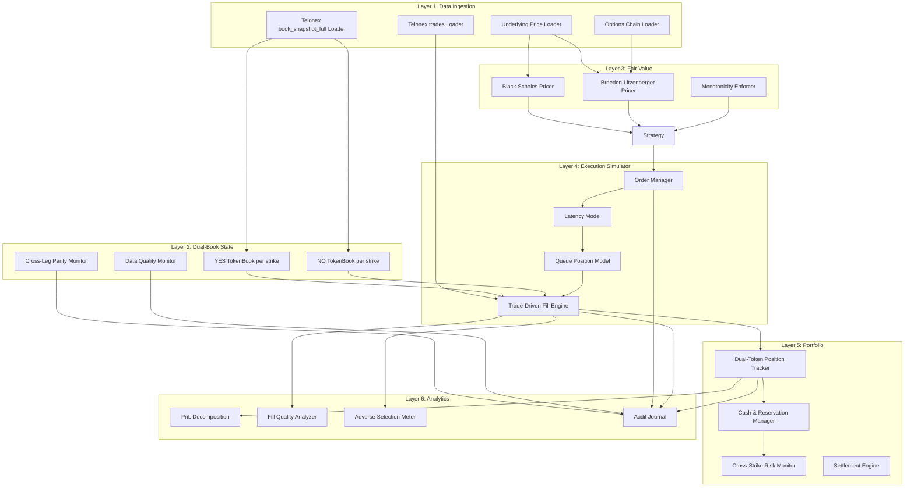
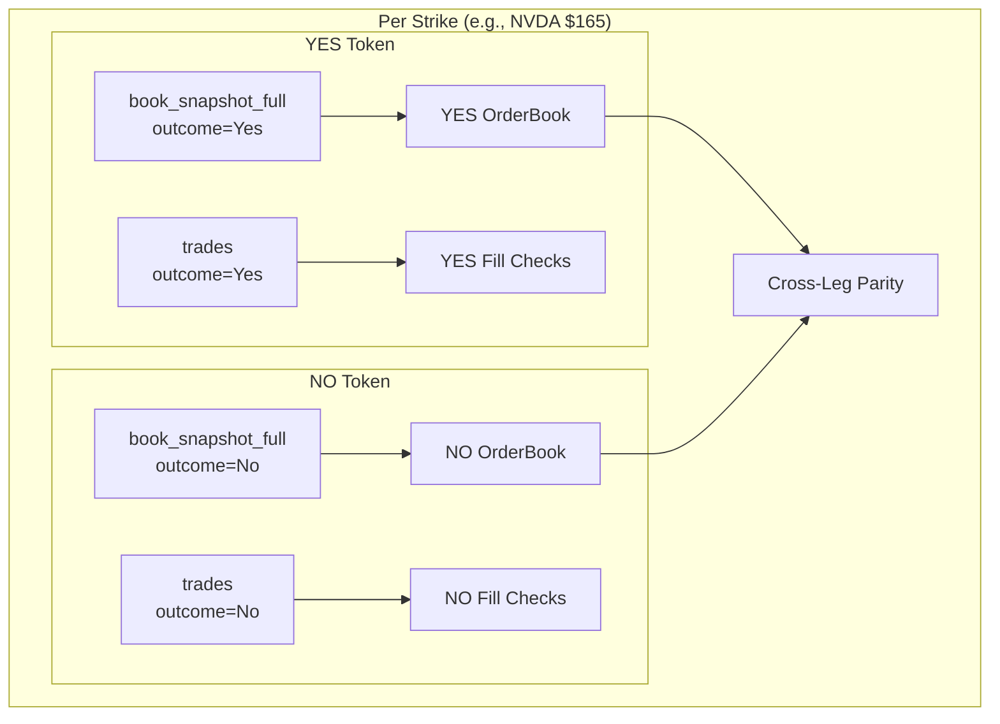
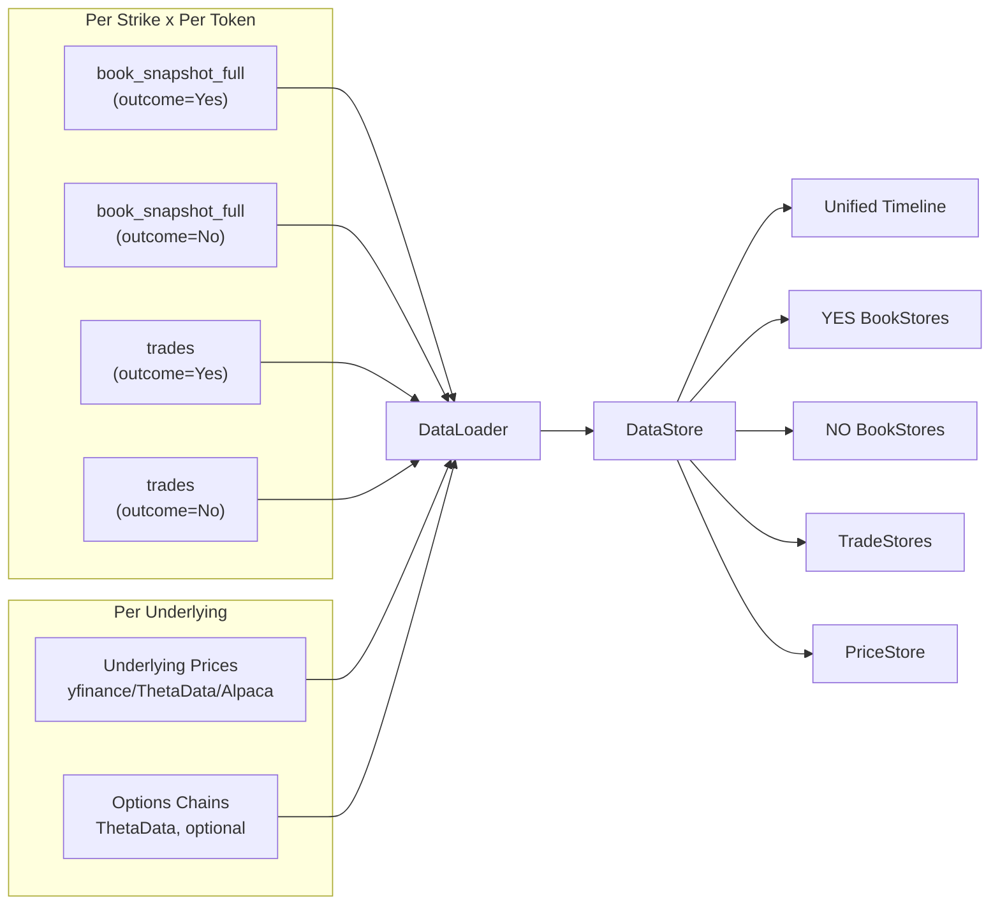
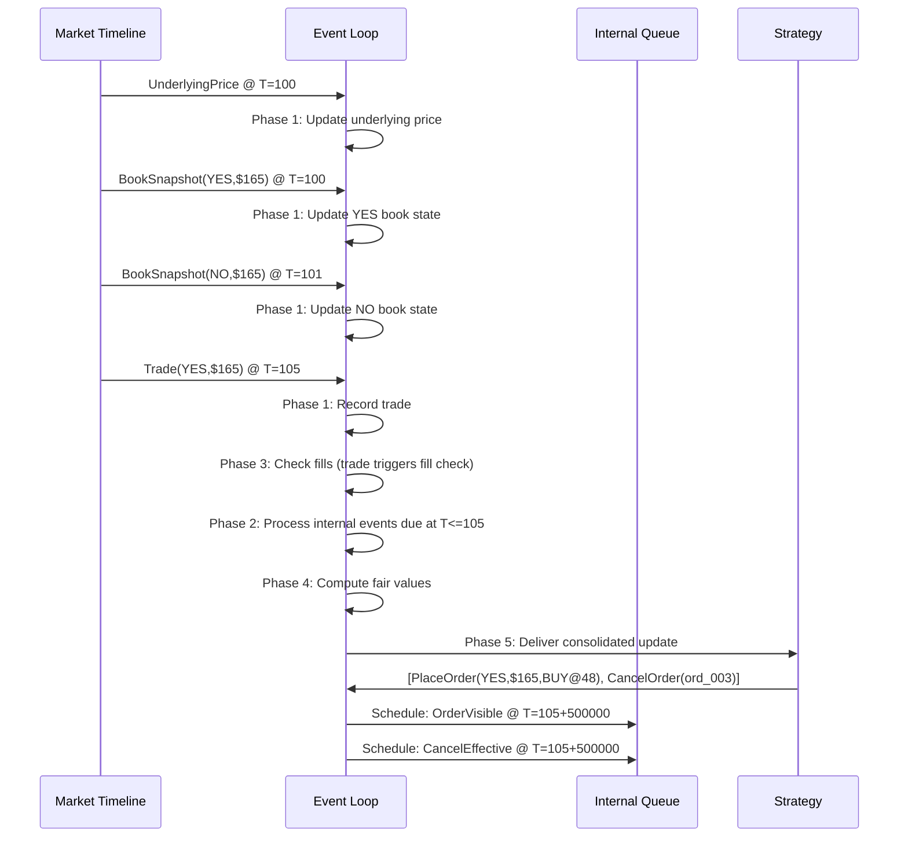
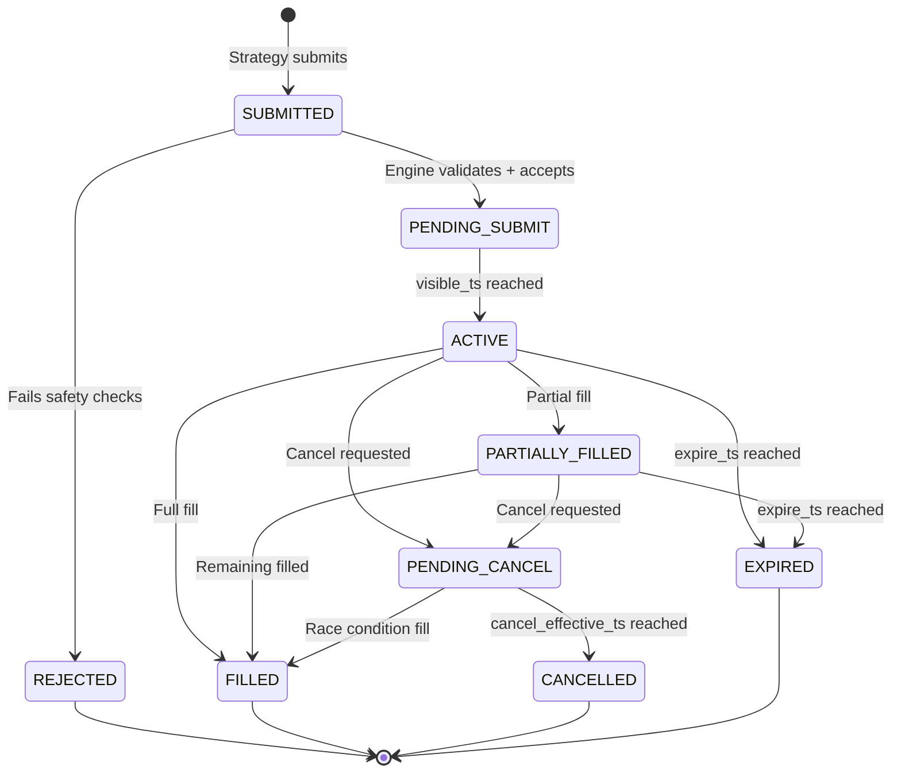
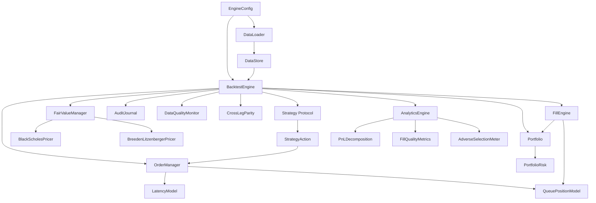

# Backtesting Engine Architecture: Stock/Index Binary Market Making

> **Purpose**: Complete technical specification for a deterministic, realistic backtesting engine for market making on Polymarket stock/index binary event markets. Uses dual Telonex data channels (`book_snapshot_full` + `trades`) with dual-book architecture (YES and NO orderbooks per market).
>
> **Audience**: Implementation team. Every component is specified with interfaces, algorithms, trade-offs, and configuration to enable direct implementation.
>
> **Lineage**: Successor to the [[btc-backtesting-engine|BTC 5-minute binary engine]]. Incorporates lessons from the [[NVDA-POC-Results|NVDA POC]] (16.5x fill overcount without L2 data, $639 P&L overstatement). Adapts the BTC engine's proven patterns (5-phase event loop, integer arithmetic, trade-driven queue drain, dual TokenBook) for Telonex snapshot + trade data across multi-strike stock/index markets.

---

## Table of Contents

1. [System Overview](#1-system-overview)
2. [Data Layer](#2-data-layer)
3. [Time Model and Event Loop](#3-time-model-and-event-loop)
4. [Order Management](#4-order-management)
5. [Queue Position Model](#5-queue-position-model)
6. [Fill Simulation](#6-fill-simulation)
7. [Portfolio Management](#7-portfolio-management)
8. [Fair Value Integration](#8-fair-value-integration)
9. [Settlement and Resolution](#9-settlement-and-resolution)
10. [Analytics and Metrics](#10-analytics-and-metrics)
11. [Strategy Interface](#11-strategy-interface)
12. [Data Quality](#12-data-quality)
13. [Determinism](#13-determinism)
14. [Audit Trail](#14-audit-trail)
15. [Configuration Schema](#15-configuration-schema)
16. [Example Scenarios](#16-example-scenarios)

---

## 1. System Overview

### 1.1 Architecture Layers

The engine is organized into six layers with strict ownership boundaries, extending the BTC engine's five-layer architecture with a dedicated Fair Value layer:



### 1.2 Dual-Channel, Dual-Book Model

This is the foundational architectural decision. Each Polymarket binary market has **two independent orderbooks** (YES and NO tokens), and we consume **two Telonex data channels**:



**Data volume**: 5 strikes x 2 tokens x 2 channels = **20 Telonex downloads per day**. Each download is one channel x one date x one asset.

| Dimension | POC (Single-Book) | Production (Dual-Book) |
|---|---|---|
| Books per strike | 1 (YES only) | 2 (YES + NO) |
| Telonex channels | book_snapshot_25 | book_snapshot_full + trades |
| Total downloads/day | 5 | 20 |
| Fill trigger | Snapshot BBO movement | Actual trade events |
| Queue drain | Inferred from depth changes | Actual trade volume |
| Cross-leg arbitrage | Not modeled | YES_ask + NO_ask >= 100 |

### 1.3 Key Architectural Differences from BTC Engine

| Aspect | BTC Engine | New Engine | Rationale |
|--------|-----------|------------|-----------|
| Data source | Self-collected WebSocket deltas | Telonex Parquet (snapshot_full + trades) | Telonex provides complete snapshots; no reconstruction needed |
| Book model | Delta-based reconstruction with REST validation | Snapshot-direct (each snapshot is authoritative) | Snapshots eliminate reconstruction drift entirely |
| Fill trigger | Trade events from WebSocket | Trade events from Telonex trades channel | Same principle: only trades trigger fills |
| Dual books | YES + NO TokenBooks, delta-maintained | YES + NO TokenBooks, snapshot-maintained | Same dual-book design, different data source |
| Market scope | Single binary market per run | 5-10 simultaneous strikes on same underlying | Stock/index events have multiple strikes |
| Market duration | 5 minutes | 6.5-16+ hours | Much longer horizons change inventory dynamics |
| Fair value | External (strategy's concern) | Integrated layer (B-S + B-L pipeline) | Fair value drives all quoting; engine must synchronize it with book state |

### 1.4 Design Principles

These principles are inherited from the BTC engine and the [[NVDA-POC-Results|POC lessons]], and are **non-negotiable**:

1. **External before internal**: Market data at time $T$ is fully processed before any order actions at time $T$
2. **No same-timestamp reaction**: Strategy decisions at $T$ create effects at $T + \text{latency}$, never at $T$
3. **Only trades trigger fills**: Depth changes (snapshots) never generate fills, even if depth at a level increases. This is the BTC engine's core fill principle (Section 10).
4. **Snapshots provide state, trades provide flow**: Book snapshots give authoritative orderbook state; trade events drive queue drain and fill generation
5. **Conservative fill bias**: When uncertain, assume FEWER fills (the POC showed 16.5x overcount without L2)
6. **Separation of concerns**: Book state, execution sim, portfolio, and strategy are independent modules
7. **Determinism**: Identical inputs and configuration always produce bit-identical results
8. **Dual-book fidelity**: YES and NO orderbooks are independent; cross-leg parity is monitored but not synthesized

---

## 2. Data Layer

### 2.1 Purpose

Load, validate, align, and serve four data streams (Telonex `book_snapshot_full` for YES and NO tokens, Telonex `trades` for YES and NO tokens, underlying price data, optional options chain data) through a unified timeline interface.

### 2.2 Data Sources and Download Map



**Download matrix for 5 strikes, 1 day:**

| Strike | Channel | Outcome | File |
|---|---|---|---|
| $160 | book_snapshot_full | Yes | `bsf_160_yes_2026-03-30.parquet` |
| $160 | book_snapshot_full | No | `bsf_160_no_2026-03-30.parquet` |
| $160 | trades | Yes | `trades_160_yes_2026-03-30.parquet` |
| $160 | trades | No | `trades_160_no_2026-03-30.parquet` |
| ... | ... | ... | ... |
| $180 | trades | No | `trades_180_no_2026-03-30.parquet` |
| **Total** | | | **20 files** |

### 2.3 Core Data Structures

```python
from dataclasses import dataclass, field
from enum import Enum
from pathlib import Path
from typing import Optional
import random


class TokenSide(Enum):
    """Which token in the binary market."""
    YES = "YES"
    NO = "NO"


class EventKind(Enum):
    """Types of events in the unified timeline."""
    BOOK_SNAPSHOT = "BOOK_SNAPSHOT"         # Authoritative book state
    TRADE = "TRADE"                         # Execution event (fill trigger)
    UNDERLYING_PRICE = "UNDERLYING_PRICE"   # Stock/index price update
    OPTIONS_CHAIN = "OPTIONS_CHAIN"         # Options data for B-L
    MARKET_OPEN = "MARKET_OPEN"
    MARKET_CLOSE = "MARKET_CLOSE"
    RESOLUTION = "RESOLUTION"


@dataclass(frozen=True, slots=True)
class TimelineEvent:
    """
    A single event in the unified, chronologically-sorted timeline.

    All timestamps are int64 microseconds since Unix epoch (matching
    Telonex's timestamp_us field). Using int64 avoids floating-point
    drift in timestamp comparisons.
    """
    timestamp_us: int           # Exchange timestamp (microseconds)
    kind: EventKind             # Event type
    strike: int                 # Strike price (integer dollars)
    token_side: TokenSide       # YES or NO (for book/trade events)
    payload_index: int          # Index into the per-kind payload store
    sequence: int               # Global monotonic sequence for deterministic ordering

    def __lt__(self, other: "TimelineEvent") -> bool:
        """Sort by (timestamp_us, kind_priority, sequence)."""
        if self.timestamp_us != other.timestamp_us:
            return self.timestamp_us < other.timestamp_us
        # Kind priority: prices first, then snapshots, then trades
        kind_order = {
            EventKind.UNDERLYING_PRICE: 0,
            EventKind.OPTIONS_CHAIN: 1,
            EventKind.BOOK_SNAPSHOT: 2,
            EventKind.TRADE: 3,
            EventKind.MARKET_OPEN: 4,
            EventKind.MARKET_CLOSE: 5,
            EventKind.RESOLUTION: 6,
        }
        self_priority = kind_order.get(self.kind, 99)
        other_priority = kind_order.get(other.kind, 99)
        if self_priority != other_priority:
            return self_priority < other_priority
        return self.sequence < other.sequence


@dataclass(frozen=True, slots=True)
class BookSnapshot:
    """
    A complete orderbook snapshot from Telonex book_snapshot_full.

    Each snapshot captures the FULL depth for one token (YES or NO)
    at one strike at one point in time. No incremental replay needed.

    Prices are stored as integer ticks (1 tick = 0.01).
    Sizes are stored as integer centi-shares (1 unit = 0.01 shares)
    to preserve the 2-decimal precision in Telonex data without floats.
    """
    timestamp_us: int
    market_id: str
    strike: int
    token_side: TokenSide       # YES or NO

    # BBO (convenience, always equal to level 0)
    best_bid_ticks: int         # 0 if no bid
    best_ask_ticks: int         # 0 if no ask
    best_bid_size: int          # centi-shares
    best_ask_size: int          # centi-shares

    # Full depth arrays (all levels from book_snapshot_full)
    bid_prices_ticks: tuple[int, ...]   # Descending price order
    bid_sizes: tuple[int, ...]          # Corresponding sizes
    ask_prices_ticks: tuple[int, ...]   # Ascending price order
    ask_sizes: tuple[int, ...]          # Corresponding sizes

    @property
    def mid_ticks_x2(self) -> int:
        """Integer midpoint * 2 (to avoid rounding). Divide by 2 for display."""
        if self.best_bid_ticks > 0 and self.best_ask_ticks > 0:
            return self.best_bid_ticks + self.best_ask_ticks
        return 0

    @property
    def spread_ticks(self) -> int:
        if self.best_bid_ticks > 0 and self.best_ask_ticks > 0:
            return self.best_ask_ticks - self.best_bid_ticks
        return 0

    @property
    def is_valid(self) -> bool:
        return (
            self.best_bid_ticks > 0
            and self.best_ask_ticks > 0
            and self.best_ask_ticks > self.best_bid_ticks
        )

    def depth_at_price(self, book_side: str, price_ticks: int) -> int:
        """Return total size at a specific price level, 0 if not present."""
        prices = self.bid_prices_ticks if book_side == "BID" else self.ask_prices_ticks
        sizes = self.bid_sizes if book_side == "BID" else self.ask_sizes
        for p, s in zip(prices, sizes):
            if p == price_ticks:
                return s
        return 0

    def total_depth(self, book_side: str) -> int:
        """Sum of all size on one side of the book."""
        sizes = self.bid_sizes if book_side == "BID" else self.ask_sizes
        return sum(sizes)


@dataclass(frozen=True, slots=True)
class TradeEvent:
    """
    A single trade from Telonex trades channel.

    The taker_side indicates who initiated: "BUY" means a buyer
    took a resting sell order, "SELL" means a seller hit a resting
    buy order. This matches the BTC engine's last_trade_price
    convention (Section 2).

    Trades are the SOLE trigger for fill simulation. Book snapshots
    provide state but never generate fills.
    """
    timestamp_us: int
    market_id: str
    strike: int
    token_side: TokenSide       # YES or NO
    price_ticks: int
    size: int                   # centi-shares
    taker_side: str             # "BUY" or "SELL"


@dataclass(frozen=True, slots=True)
class UnderlyingPrice:
    """A price observation for the underlying stock/index."""
    timestamp_us: int
    ticker: str
    price_cents: int            # Price in cents (e.g., 16506 = $165.06)
    source: str                 # "yfinance", "thetadata", "alpaca"


@dataclass
class MarketConfig:
    """Configuration for a single binary market (one strike)."""
    market_id: str
    slug: str
    yes_asset_id: str           # YES token asset_id
    no_asset_id: str            # NO token asset_id
    strike: int
    underlying_ticker: str
    expiry_us: int              # Resolution timestamp (microseconds)
    resolution: Optional[bool] = None  # True=YES wins, False=NO wins, None=unknown
```

### 2.4 DataStore and DataLoader

```python
@dataclass
class DataStore:
    """
    Central data store holding all loaded and indexed data.

    The timeline is the master clock -- the engine iterates over it
    and uses payload_index to look up full payloads from the stores.

    Dual-book: snapshots and trades are stored per (strike, token_side).
    """
    # Timeline: sorted list of all events across all strikes and tokens
    timeline: list[TimelineEvent]

    # Payload stores (indexed by payload_index in TimelineEvent)
    snapshots: list[BookSnapshot]
    trades: list[TradeEvent]
    underlying_prices: list[UnderlyingPrice]

    # Market metadata
    markets: dict[int, MarketConfig]     # strike -> config
    strikes: list[int]                    # Sorted strike list

    # Index structures for fast lookup
    # (strike, token_side) -> index of most recent snapshot in self.snapshots
    latest_snapshot_idx: dict[tuple[int, TokenSide], int]


class DataLoader:
    """
    Load all data sources and produce a unified DataStore.

    Implementation approach:
    1. For each strike, load 4 Parquet files:
       - book_snapshot_full for YES token
       - book_snapshot_full for NO token
       - trades for YES token
       - trades for NO token
    2. Load underlying price data (1-min bars)
    3. Convert all string columns to integer ticks/centi-shares
       at the ingestion boundary
    4. Build BookSnapshot and TradeEvent objects
    5. Merge ALL events into a single timeline sorted by
       (timestamp_us, kind_priority, sequence)
    6. Align underlying prices via asof-join
    """

    def __init__(self, config: "EngineConfig"):
        self.config = config

    def load(self) -> DataStore:
        """Main entry point. Returns a fully constructed DataStore."""
        snapshots_all = []
        trades_all = []
        timeline_events = []
        seq = 0

        for strike in self.config.strikes:
            for token_side in (TokenSide.YES, TokenSide.NO):
                # Load book snapshots
                snap_path = self._snapshot_path(strike, token_side)
                snaps = self._load_book_snapshots(snap_path, strike, token_side)
                base_idx = len(snapshots_all)
                snapshots_all.extend(snaps)

                for i, snap in enumerate(snaps):
                    timeline_events.append(TimelineEvent(
                        timestamp_us=snap.timestamp_us,
                        kind=EventKind.BOOK_SNAPSHOT,
                        strike=strike,
                        token_side=token_side,
                        payload_index=base_idx + i,
                        sequence=seq,
                    ))
                    seq += 1

                # Load trades
                trade_path = self._trades_path(strike, token_side)
                trd = self._load_trades(trade_path, strike, token_side)
                base_idx = len(trades_all)
                trades_all.extend(trd)

                for i, trade in enumerate(trd):
                    timeline_events.append(TimelineEvent(
                        timestamp_us=trade.timestamp_us,
                        kind=EventKind.TRADE,
                        strike=strike,
                        token_side=token_side,
                        payload_index=base_idx + i,
                        sequence=seq,
                    ))
                    seq += 1

        # Load underlying prices
        prices = self._load_underlying_prices()
        for price in prices:
            timeline_events.append(TimelineEvent(
                timestamp_us=price.timestamp_us,
                kind=EventKind.UNDERLYING_PRICE,
                strike=0,
                token_side=TokenSide.YES,  # Placeholder
                payload_index=len(prices),
                sequence=seq,
            ))
            seq += 1

        # Sort timeline
        timeline_events.sort()

        return DataStore(
            timeline=timeline_events,
            snapshots=snapshots_all,
            trades=trades_all,
            underlying_prices=prices,
            markets=self._load_market_configs(),
            strikes=sorted(self.config.strikes),
            latest_snapshot_idx={},
        )

    def _load_book_snapshots(
        self, path: Path, strike: int, token_side: TokenSide
    ) -> list[BookSnapshot]:
        """
        Load a single token's book_snapshot_full Parquet file.

        book_snapshot_full provides ALL depth levels (not just 25).
        The number of levels varies per snapshot.

        Key steps:
        1. Read with pyarrow for zero-copy columnar access
        2. Detect available depth levels from column names
           (bid_price_0..N, ask_price_0..N)
        3. Convert from string to int ticks: int(round(float(s) * 100))
        4. Convert sizes to int centi-shares: int(round(float(s) * 100))
        5. Filter rows where best_bid > 0 AND best_ask > 0
           AND best_ask > best_bid (valid BBO)
        6. Return list of BookSnapshot objects
        """
        ...

    def _load_trades(
        self, path: Path, strike: int, token_side: TokenSide
    ) -> list[TradeEvent]:
        """
        Load a single token's trades Parquet file.

        Telonex trades schema includes:
        - timestamp_us (int64)
        - price (string -> int ticks)
        - size (string -> int centi-shares)
        - side (string: "buy" or "sell" = taker's side)
        """
        ...
```

### 2.5 Telonex Schema Conversion

All string-to-numeric conversion happens **once** at load time. After this boundary, the engine operates on integers.

| Telonex Column | Type | Engine Representation | Conversion |
|---|---|---|---|
| `timestamp_us` | int64 | `int` (microseconds) | Direct copy |
| `bid_price_0..N` | string | `int` (ticks, 1 tick = 0.01) | `int(round(float(s) * 100))` |
| `bid_size_0..N` | string | `int` (centi-shares) | `int(round(float(s) * 100))` |
| `ask_price_0..N` | string | `int` (ticks) | `int(round(float(s) * 100))` |
| `ask_size_0..N` | string | `int` (centi-shares) | `int(round(float(s) * 100))` |
| `market_id` | string | `str` | Direct copy |
| `slug` | string | `str` | Direct copy |
| `asset_id` | string | `str` | Direct copy |
| `outcome` | string | `TokenSide` enum | `"Yes"` -> `YES`, `"No"` -> `NO` |

### 2.6 Trade-Offs

| Decision | Choice | Alternative | Why |
|----------|--------|-------------|-----|
| Load format | pyarrow (not pandas) | pandas `read_parquet` | 3-5x faster for columnar reads; zero-copy slicing |
| Price representation | Integer ticks | `Decimal` | Ticks are simpler, faster; sufficient precision for 0.01 tick size |
| Size representation | Integer centi-shares | Micro-units (BTC engine uses 10^6) | Telonex sizes have 2 decimal places; centi-shares match naturally |
| Timeline structure | Pre-sorted flat list | Priority queue (heapq) | Pre-sorted is faster for iteration; internal events use a separate insertion queue |
| Channel selection | `book_snapshot_full` | `book_snapshot_25` | Full depth gives complete queue position information at every level |
| Dual books | Load both YES and NO | YES only (derive NO from complement) | YES and NO books are genuinely independent on Polymarket; deriving would be wrong |

---

## 3. Time Model and Event Loop

### 3.1 Purpose

Process all events in strict chronological order across 10+ orderbooks (5 strikes x 2 tokens), enforce temporal causality (no look-ahead), handle latency between strategy decisions and their effects, and fuse snapshot state with trade-driven fills.

### 3.2 Two-Clock Architecture

The engine manages two independent time streams:

1. **Market clock**: Driven by the pre-sorted timeline from the DataStore. Advances through book snapshots, trades, and price updates in chronological order. These events come from Telonex data and are immutable.
2. **Internal clock**: Driven by scheduled future events (order becomes visible, cancel takes effect). These are dynamically inserted as strategies submit orders.



### 3.3 Per-Timestamp Processing (5 Phases)

Adapted from the BTC engine's 5-phase model. The critical change from the POC: **trades trigger fill checks, not snapshots**.

```
For each unique timestamp T in the merged (timeline + internal) event stream:

  PHASE 1: External Market Data
  -----------------------------
  Process ALL external events at timestamp T, in kind-priority order:
  a) Underlying price updates: update current underlying price
  b) Options chain updates: update fair value model inputs
  c) Book snapshots: replace authoritative book state for the
     specific (strike, token_side) combination.
     - YES book and NO book are INDEPENDENT updates
     - Update cross-leg parity checks after both books are current
  d) Trade events: record in trade log.
     >>> TRADES TRIGGER FILL CHECKS <<<
     For each trade at T, immediately check all resting simulated
     orders on the SAME (strike, token_side) for fills.
     This matches the BTC engine's principle: only trades trigger fills.

  PHASE 2: Internal Simulator Events
  -----------------------------------
  Process all internal events scheduled at or before T:
  - ORDER_VISIBLE: PENDING_SUBMIT -> ACTIVE (assign queue position
    using the current book snapshot for this strike+token)
  - CANCEL_EFFECTIVE: PENDING_CANCEL -> CANCELLED (release reservations)
  Sorted by (scheduled_ts_us, submission_sequence) for FIFO

  PHASE 3: Expiration Checks
  --------------------------
  Any order past its expire_ts transitions to EXPIRED.
  Release reservations.

  PHASE 4: Fair Value Computation
  -------------------------------
  - Recompute fair values for all active strikes using current
    underlying price and time-to-expiry
  - Enforce monotonicity across strikes
  - Compute cross-leg parity metrics
  - Record fair values for analytics

  PHASE 5: Strategy Delivery + Action Processing
  -----------------------------------------------
  - Detect which (strike, token_side) combinations had BBO changes
    or trade activity this timestamp
  - Deliver ONE consolidated StrategyUpdate per affected strike
    (containing both YES and NO book state)
  - Collect strategy actions (PlaceOrder, CancelOrder, ReplaceOrder)
  - Each action specifies which token (YES or NO) to trade
  - Validate actions against engine safety checks
  - Schedule future internal events for accepted actions
```

### 3.4 Trade-Driven Fill Integration

This is the core architectural change from the POC. The POC used snapshot BBO movement to infer fills. Now we have actual trade events:

```python
# Inside Phase 1d, when processing a TradeEvent:

def process_trade(self, trade: TradeEvent) -> list[Fill]:
    """
    Process a single trade event.

    Book snapshots provide STATE (what the book looks like).
    Trade events provide FLOW (what actually executed).

    A trade at price P on the YES token with taker_side=BUY means:
    - A buyer lifted a resting YES sell order at price P
    - Any simulated SELL order on YES at price P may have been
      the resting order that was lifted

    Fill check logic:
    - BUY taker trade -> check resting SELL sim orders at this price
    - SELL taker trade -> check resting BUY sim orders at this price
    """
    fills = []
    resting = self.get_resting_orders(trade.strike, trade.token_side)

    for order in resting:
        if not order.is_live:
            continue
        if trade.timestamp_us < order.visible_ts_us:
            continue
        if (order.cancel_effective_ts_us is not None
                and trade.timestamp_us >= order.cancel_effective_ts_us):
            continue

        # Side compatibility: BUY taker fills SELL resting
        if trade.taker_side == "BUY" and order.side != "SELL":
            continue
        if trade.taker_side == "SELL" and order.side != "BUY":
            continue

        # Price compatibility
        if trade.price_ticks != order.price_ticks:
            continue

        # Queue position check
        if order.queue_ahead_centishares > 0:
            # Drain queue first
            consumed = min(order.queue_ahead_centishares, trade.size)
            order.queue_ahead_centishares -= consumed
            remaining_trade = trade.size - consumed
            if remaining_trade <= 0:
                continue  # Trade consumed by queue ahead
            # Queue drained; now fill from remaining
            fill_size = min(order.remaining_centishares, remaining_trade)
        else:
            fill_size = min(order.remaining_centishares, trade.size)

        if fill_size > 0:
            fills.append(self._create_fill(
                order, trade.timestamp_us, fill_size,
                fill_type="PASSIVE", source="trade_match",
            ))

    return fills
```

### 3.5 Temporal Invariants

| Invariant | Enforcement | Violated By |
|-----------|-------------|-------------|
| External before internal | Phase ordering (1 before 2) | Processing internal events before market data |
| No same-timestamp reaction | Latency model adds minimum 1us to all actions | Zero-latency configuration |
| Only trades trigger fills | Fill check code only runs in trade-processing path | Checking fills on snapshot events |
| FIFO for simultaneous internals | Monotonic submission sequence as tiebreaker | Non-deterministic ordering |
| Book state is always current before fill checks | Snapshots processed before trades at same timestamp (kind_priority) | Interleaving in wrong order |

### 3.6 Market Hours Handling

```python
@dataclass
class MarketHoursConfig:
    """Define when trading is allowed."""
    open_hour_utc: int = 13        # 9:30 AM ET = 13:30 UTC
    open_minute_utc: int = 30
    close_hour_utc: int = 20       # 4:00 PM ET = 20:00 UTC
    close_minute_utc: int = 0
    trade_outside_hours: bool = False  # If True, allow 24/7 Polymarket trading

    def is_market_hours(self, timestamp_us: int) -> bool:
        """Check if timestamp falls within configured trading hours."""
        ...
```

**Design decision**: The engine processes ALL snapshots and trades (including outside market hours) for book state tracking and trade logging. The strategy only receives events during configured trading hours. Polymarket trades 24/7, but our fair value model (driven by stock prices) is only meaningful during equity market hours.

### 3.7 Inter-Snapshot Gap Handling

From [[Telonex-Data-Quality-Report]]: gaps up to 2.9 hours exist. With trade data available, gaps in the snapshot stream are less critical (trades still trigger fills). But gaps in the trade stream are more concerning.

| Gap Type | Duration | Classification | Behavior |
|---|---|---|---|
| Snapshot gap < 60s | Normal | No special handling |
| Snapshot gap 60s-300s | Minor | Log warning; book state is stale but trade fills continue |
| Snapshot gap > 300s | Major | Mark segment `DEGRADED`; queue positions may be stale |
| Trade gap < 60s | Normal | Expected (no trading activity) |
| Trade gap > 300s during market hours | Suspicious | Mark segment `DEGRADED`; may indicate data collection issue |
| Both channels gap > 300s | Critical | Mark `INVALID`; cancel all resting orders; emit `GAP_DETECTED` |

---

## 4. Order Management

### 4.1 Purpose

Track the complete lifecycle of simulated orders on both YES and NO tokens, from strategy decision through visibility, fill, cancellation, or expiry, with realistic latency modeling.

### 4.2 Order Lifecycle



### 4.3 Order Data Structure

```python
class OrderStatus(Enum):
    SUBMITTED = "SUBMITTED"
    PENDING_SUBMIT = "PENDING_SUBMIT"
    ACTIVE = "ACTIVE"
    PARTIALLY_FILLED = "PARTIALLY_FILLED"
    PENDING_CANCEL = "PENDING_CANCEL"
    FILLED = "FILLED"
    CANCELLED = "CANCELLED"
    EXPIRED = "EXPIRED"
    REJECTED = "REJECTED"


@dataclass
class SimOrder:
    """
    A simulated order tracked by the engine.

    Each order targets a specific TOKEN (YES or NO) at a specific STRIKE.
    This is critical: buying YES and buying NO are separate orders on
    separate orderbooks.

    Prices and sizes use integer representation:
    - price_ticks: 1 tick = 0.01 (range 1-99 for binary markets)
    - size_centishares: 1 unit = 0.01 shares
    """
    order_id: str                       # "ord_000042"
    market_id: str
    strike: int
    token_side: TokenSide               # YES or NO
    side: str                           # "BUY" or "SELL" (on this token)
    price_ticks: int                    # Integer ticks
    size_centishares: int               # Original size
    remaining_centishares: int          # Unfilled portion

    status: OrderStatus
    submission_seq: int                 # Monotonic counter for FIFO

    # Timestamps (microseconds)
    decision_ts_us: int                 # When strategy decided
    send_ts_us: int                     # decision + decision_to_send latency
    visible_ts_us: int                  # send + exchange_network latency
    expire_ts_us: Optional[int]         # GTD expiration (None = GTC)

    # Cancel timestamps (set when cancel is requested)
    cancel_requested_ts_us: Optional[int] = None
    cancel_send_ts_us: Optional[int] = None
    cancel_effective_ts_us: Optional[int] = None

    # Queue position (set when order becomes ACTIVE)
    queue_ahead_centishares: Optional[int] = None

    # Fill tracking
    fills: list = field(default_factory=list)
    total_filled_centishares: int = 0

    @property
    def is_live(self) -> bool:
        """Can this order still fill?"""
        return self.status in (
            OrderStatus.ACTIVE,
            OrderStatus.PARTIALLY_FILLED,
            OrderStatus.PENDING_CANCEL,
        )

    @property
    def is_terminal(self) -> bool:
        return self.status in (
            OrderStatus.FILLED,
            OrderStatus.CANCELLED,
            OrderStatus.EXPIRED,
            OrderStatus.REJECTED,
        )
```

### 4.4 Latency Model

Adapted from the BTC engine's two-component model (Section 8):

```python
@dataclass
class LatencyConfig:
    """
    Latency configuration for order submission and cancellation.

    Polymarket operates via an off-chain CLOB with on-chain settlement.
    Realistic submission latency is 200-800ms (documented in
    [[btc-backtesting-engine]] Section 8).
    """
    mode: str = "CONSTANT"  # CONSTANT | EMPIRICAL | BUCKETED

    # CONSTANT mode parameters (microseconds)
    decision_to_send_us: int = 0            # Infrastructure latency
    exchange_network_us: int = 500_000      # 500ms default for Polymarket
    cancel_exchange_us: int = 500_000       # Cancel may differ from submit

    # EMPIRICAL mode: sample from observed latency distribution
    empirical_samples_us: Optional[list[int]] = None
    cancel_empirical_samples_us: Optional[list[int]] = None

    # BUCKETED mode: latency varies by time of day
    buckets: Optional[dict[str, int]] = None  # "HH:MM-HH:MM" -> latency_us

    # RNG seed for empirical/bucketed modes
    seed: int = 42

    def get_submit_latency_us(self, timestamp_us: int, rng: random.Random) -> int:
        """Return total latency from decision to order visible."""
        if self.mode == "CONSTANT":
            return self.decision_to_send_us + self.exchange_network_us
        elif self.mode == "EMPIRICAL":
            return self.decision_to_send_us + rng.choice(self.empirical_samples_us)
        elif self.mode == "BUCKETED":
            bucket_latency = self._get_bucket_latency(timestamp_us)
            return self.decision_to_send_us + bucket_latency
        raise ValueError(f"Unknown latency mode: {self.mode}")

    def get_cancel_latency_us(self, timestamp_us: int, rng: random.Random) -> int:
        """Cancel latency is independent from submit latency."""
        if self.mode == "CONSTANT":
            return self.decision_to_send_us + self.cancel_exchange_us
        elif self.mode == "EMPIRICAL":
            samples = self.cancel_empirical_samples_us or self.empirical_samples_us
            return self.decision_to_send_us + rng.choice(samples)
        return self.get_submit_latency_us(timestamp_us, rng)
```

### 4.5 Replace Semantics

Following the BTC engine (Section 12): `REPLACE = CANCEL_old + SUBMIT_new` (non-atomic).

```
decision_ts
    |
    +-- Cancel old order (PENDING_CANCEL path)
    |       cancel_effective_ts = decision_ts + cancel_latency
    |
    +-- Submit new order (PENDING_SUBMIT path)
            visible_ts = decision_ts + submit_latency
```

**Critical implications** (from [[btc-backtesting-engine]] Section 12):
- The old order can fill during the cancel window (race condition)
- Both orders can briefly coexist
- The new order's queue position is assigned independently at its visible_ts
- Both latency paths evolve separately

### 4.6 Engine Safety Checks

Three checks before any order enters the simulator (from [[btc-backtesting-engine]] Section 13):

```python
def validate_order(self, action: "StrategyAction", current_ts_us: int) -> Optional[str]:
    """Returns None if valid, or a rejection reason string."""
    # 1. Market hours check
    if not self.config.market_hours.is_market_hours(current_ts_us):
        if not self.config.market_hours.trade_outside_hours:
            return "market_closed"

    # 2. Tick grid check
    if action.price_ticks < 1 or action.price_ticks > 99:
        return f"price_out_of_range:{action.price_ticks}"
    tick_size_ticks = self.get_tick_size(action.market_id)
    if action.price_ticks % tick_size_ticks != 0:
        return f"off_tick_grid:{action.price_ticks}:{tick_size_ticks}"

    # 3. Capital check (delegated to portfolio)
    capital_result = self.portfolio.check_capital(action)
    if capital_result is not None:
        return capital_result

    return None
```

---

## 5. Queue Position Model

### 5.1 Purpose

Determine where a simulated order sits in the queue relative to other resting orders at the same price level. With full-depth book snapshots for queue assignment and actual trades for queue drain, this model closely matches the BTC engine's approach.

### 5.2 Snapshot + Trade Synergy

| Data Source | Role in Queue Model |
|---|---|
| `book_snapshot_full` | **Assignment**: When order becomes ACTIVE, read depth at our price level to assign initial `queue_ahead` |
| `trades` | **Drain**: When a trade occurs at our price level, reduce `queue_ahead` by trade size. Exactly matches BTC engine Section 9. |

This is the best of both worlds: we get precise depth information (full book, not just 25 levels) for assignment, and actual trade flow for drain.

### 5.3 Queue Position Assignment

When an order transitions from `PENDING_SUBMIT` to `ACTIVE` at `visible_ts_us`:

```python
class QueuePositionModel:
    """
    Assign and evolve queue positions for resting orders.

    Three modes, matching the BTC engine (Section 9):
    - CONSERVATIVE (default): back of queue (queue_ahead = displayed_size)
    - PROBABILISTIC: random position (seeded RNG)
    - OPTIMISTIC: front of queue (for sanity checks only)

    Queue drains ONLY through trades, NOT through cancellations.
    This is the BTC engine's core principle.
    """

    def __init__(self, mode: str = "CONSERVATIVE", seed: int = 42):
        self.mode = mode
        self.rng = random.Random(seed)

    def assign_queue_position(
        self, order: SimOrder, snapshot: BookSnapshot
    ) -> int:
        """
        Assign initial queue_ahead_centishares when order becomes ACTIVE.

        Uses the book_snapshot_full for the matching (strike, token_side)
        to read actual depth at the order's price level.

        Returns the number of centi-shares ahead in the queue.
        """
        # Determine which side of the book to check
        # A BUY order rests on the BID side; a SELL order rests on the ASK side
        book_side = "BID" if order.side == "BUY" else "ASK"
        depth_at_level = snapshot.depth_at_price(book_side, order.price_ticks)

        if self.mode == "CONSERVATIVE":
            return depth_at_level  # We're at the very back

        elif self.mode == "PROBABILISTIC":
            if depth_at_level <= 0:
                return 0
            return self.rng.randint(0, depth_at_level)

        elif self.mode == "OPTIMISTIC":
            return 0  # We're at the front

        return depth_at_level  # Default to conservative
```

### 5.4 Queue Evolution via Trades

Queue position decreases when trades occur at the same price level. This is identical to the BTC engine (Section 9):

```python
def drain_queue_on_trade(self, order: SimOrder, trade: TradeEvent) -> None:
    """
    Reduce queue_ahead when a trade occurs at the order's price level.

    From BTC engine Section 9:
    'Queue position decreases when trades occur at the same price level.'
    'What does NOT improve queue position: Cancellations by other
    participants, new orders placed behind, book snapshots.'

    The queue ONLY drains through actual trades consuming depth
    ahead of the order.
    """
    if order.queue_ahead_centishares is None or order.queue_ahead_centishares <= 0:
        return

    # Trade must be at our price level
    if trade.price_ticks != order.price_ticks:
        return

    # Trade side must be compatible:
    # A BUY taker fills SELL resting orders -> drains ASK queue
    # A SELL taker fills BUY resting orders -> drains BID queue
    if order.side == "BUY" and trade.taker_side != "SELL":
        return
    if order.side == "SELL" and trade.taker_side != "BUY":
        return

    consumed = min(order.queue_ahead_centishares, trade.size)
    order.queue_ahead_centishares -= consumed
```

### 5.5 Configuration

```python
@dataclass
class QueueConfig:
    mode: str = "CONSERVATIVE"    # CONSERVATIVE | PROBABILISTIC | OPTIMISTIC
    seed: int = 42
```

### 5.6 Trade-Offs

| Decision | Choice | Alternative | Why |
|----------|--------|-------------|-----|
| Default mode | CONSERVATIVE | PROBABILISTIC | POC showed 16.5x fill overcount -- err toward fewer fills |
| Queue drain source | Trades only | Trades + inferred from depth changes | Matches BTC engine principle; trades are authoritative |
| Cancel drain | No queue drain from cancellations | Allow partial drain | Matches BTC engine; conservative assumption |
| Full depth for assignment | `book_snapshot_full` | `book_snapshot_25` | Full depth gives accurate queue position at all levels, not just top 25 |

---

## 6. Fill Simulation

### 6.1 Purpose

The most critical component. Determines when and how simulated orders execute. Now that we have actual trade events from Telonex, the fill model is **trade-driven** (matching the BTC engine) rather than **snapshot-inferred** (as in the POC).

### 6.2 The 7 Fill Conditions

Directly from [[btc-backtesting-engine]] Section 10. ALL must be true:

| # | Condition | What It Prevents |
|---|-----------|------------------|
| 1 | Order status is ACTIVE, PARTIALLY_FILLED, or PENDING_CANCEL | Fills on dead orders |
| 2 | `trade_ts >= order.visible_ts` | Fills before order is resting |
| 3 | `cancel_effective_ts` has NOT been reached | Fills after cancellation |
| 4 | Trade price matches order's resting price level | Fills at wrong price |
| 5 | Trade direction is compatible (BUY taker fills SELL resting, vice versa) | Same-side fills |
| 6 | `queue_ahead_centishares == 0` | Fills before queue reached |
| 7 | Remaining trade size is sufficient | Overfilling |

**Only trades trigger fills.** Book snapshots never generate fills.

### 6.3 Fill Engine

```python
@dataclass(frozen=True, slots=True)
class Fill:
    """A completed fill event."""
    fill_id: str                # "fill_000042"
    order_id: str               # Which order was filled
    strike: int
    token_side: TokenSide       # YES or NO
    side: str                   # "BUY" or "SELL"
    price_ticks: int            # Execution price (= our limit price)
    size_centishares: int       # Fill size
    timestamp_us: int           # When the fill occurred
    fill_type: str              # "AGGRESSIVE" | "PASSIVE"
    source_trade_event_idx: int # Index into DataStore.trades for traceability


class FillEngine:
    """
    Trade-driven fill engine using Telonex trade events.

    Architecture:
    - Book snapshots provide STATE (authoritative orderbook)
    - Trade events trigger FILL CHECKS against resting simulated orders
    - Queue positions are assigned from snapshots, drained by trades

    This is conceptually identical to the BTC engine's fill simulator
    (Section 10) but using pre-built snapshots instead of reconstructed
    books.

    Two fill paths:
    A) AGGRESSIVE: our order crosses the current BBO (detected at
       order visibility time using the current snapshot)
    B) PASSIVE: a trade event at our price level fills our resting
       order after queue drain
    """

    def __init__(self, config: "FillConfig"):
        self.config = config
        self.fill_counter = 0

    def check_aggressive_fill(
        self,
        order: SimOrder,
        snapshot: BookSnapshot,
    ) -> Optional[Fill]:
        """
        Check if a newly visible order immediately crosses the spread.

        Called in Phase 2 when an order transitions to ACTIVE.
        Uses the current book snapshot to check if the order price
        crosses the opposing BBO.

        BUY order at price >= best_ask -> aggressive fill
        SELL order at price <= best_bid -> aggressive fill
        """
        if not snapshot.is_valid:
            return None

        if order.side == "BUY" and order.price_ticks >= snapshot.best_ask_ticks:
            return self._create_fill(
                order, order.visible_ts_us,
                min(order.remaining_centishares, snapshot.best_ask_size),
                "AGGRESSIVE", -1,
            )

        if order.side == "SELL" and order.price_ticks <= snapshot.best_bid_ticks:
            return self._create_fill(
                order, order.visible_ts_us,
                min(order.remaining_centishares, snapshot.best_bid_size),
                "AGGRESSIVE", -1,
            )

        return None

    def check_passive_fills_on_trade(
        self,
        trade: TradeEvent,
        trade_idx: int,
        resting_orders: list[SimOrder],
    ) -> list[Fill]:
        """
        Check all resting orders against a single trade event.

        This is the primary fill path. Called in Phase 1d for every
        trade event.

        From BTC engine Section 10:
        - Phase 1 (queue reduction): reduce queue_ahead for each
          eligible order independently using FULL trade size
        - Phase 2 (fill allocation): orders with queue_ahead==0
          allocate fills from a shared pool

        The two-phase approach ensures correct FIFO allocation
        when multiple simulated orders exist at the same level.
        """
        fills = []
        eligible_orders = []

        # Phase 1: Queue Reduction
        for order in resting_orders:
            if not self._passes_conditions_1_to_5(order, trade):
                continue

            original_queue = order.queue_ahead_centishares or 0
            consumed = min(original_queue, trade.size)
            order.queue_ahead_centishares = max(0, original_queue - consumed)

            eligible_orders.append((order, original_queue))

        # Phase 2: Fill Allocation
        remaining_trade_pool = trade.size
        for order, original_queue in eligible_orders:
            if order.queue_ahead_centishares > 0:
                continue  # Queue not yet reached

            # Passthrough = trade volume that passed through our queue position
            passthrough = max(0, trade.size - original_queue)
            fill_size = min(
                order.remaining_centishares,
                passthrough,
                remaining_trade_pool,
            )

            if fill_size > 0:
                fills.append(self._create_fill(
                    order, trade.timestamp_us, fill_size,
                    "PASSIVE", trade_idx,
                ))
                remaining_trade_pool -= fill_size

                # Update order state
                order.total_filled_centishares += fill_size
                order.remaining_centishares -= fill_size
                if order.remaining_centishares <= 0:
                    order.status = OrderStatus.FILLED
                else:
                    order.status = OrderStatus.PARTIALLY_FILLED

        return fills

    def _passes_conditions_1_to_5(
        self, order: SimOrder, trade: TradeEvent
    ) -> bool:
        """Check fill conditions 1-5 from the 7-condition model."""
        # Condition 1: Order is live
        if not order.is_live:
            return False

        # Condition 2: Trade is after order visibility
        if trade.timestamp_us < order.visible_ts_us:
            return False

        # Condition 3: Cancel not yet effective
        if (order.cancel_effective_ts_us is not None
                and trade.timestamp_us >= order.cancel_effective_ts_us):
            return False

        # Condition 4: Price match
        if trade.price_ticks != order.price_ticks:
            return False

        # Condition 5: Side compatibility
        # BUY taker fills SELL resting (and vice versa)
        if trade.taker_side == "BUY" and order.side != "SELL":
            return False
        if trade.taker_side == "SELL" and order.side != "BUY":
            return False

        # Token side must match
        if trade.token_side != order.token_side:
            return False

        return True

    def _create_fill(
        self,
        order: SimOrder,
        timestamp_us: int,
        size: int,
        fill_type: str,
        source_trade_idx: int,
    ) -> Fill:
        self.fill_counter += 1
        return Fill(
            fill_id=f"fill_{self.fill_counter:06d}",
            order_id=order.order_id,
            strike=order.strike,
            token_side=order.token_side,
            side=order.side,
            price_ticks=order.price_ticks,
            size_centishares=size,
            timestamp_us=timestamp_us,
            fill_type=fill_type,
            source_trade_event_idx=source_trade_idx,
        )
```

### 6.4 Fill During PENDING_CANCEL

From [[btc-backtesting-engine]] Section 10: an order in `PENDING_CANCEL` **can still fill**. This models the real-world race condition. Condition 3 checks `cancel_effective_ts_us` -- if the current timestamp has not yet reached it, the order remains fillable. This is one of the most important sources of adverse fills.

### 6.5 Aggressive vs Passive Fill Paths

| Path | Trigger | When | Queue Required? |
|---|---|---|---|
| **Aggressive** | Order becomes visible and crosses BBO | Phase 2 (ORDER_VISIBLE) | No (crosses immediately) |
| **Passive** | Trade event at our price level | Phase 1d (trade processing) | Yes (must drain to 0 first) |

### 6.6 Configuration

```python
@dataclass
class FillConfig:
    """Fill simulation configuration."""
    enable_aggressive_fills: bool = True
    enable_passive_fills: bool = True
    allow_partial_fills: bool = True
    queue_config: QueueConfig = field(default_factory=QueueConfig)
```

---

## 7. Portfolio Management

### 7.1 Purpose

Track positions in both YES and NO tokens across multiple simultaneous strikes, manage cash reservations and collateral, compute boxed positions and directional exposure, and enforce capital constraints.

### 7.2 Dual-Token Position Model

Each strike has independent YES and NO positions. From [[Polymarket-CLOB-Mechanics]]: buying YES and buying NO are separate transactions on separate orderbooks.

```python
@dataclass
class StrikePosition:
    """Position in a single binary market (one strike, both tokens)."""
    strike: int
    yes_position_cs: int = 0    # YES tokens held (centi-shares, positive = long)
    no_position_cs: int = 0     # NO tokens held (centi-shares, positive = long)

    # Reservations for pending orders
    reserved_cash_tc: int = 0   # Cash reserved (ticks * centishares)
    reserved_yes_cs: int = 0    # YES tokens reserved for pending SELL YES orders
    reserved_no_cs: int = 0     # NO tokens reserved for pending SELL NO orders

    @property
    def boxed_cs(self) -> int:
        """
        Risk-free boxed position: min(YES, NO).

        From BTC engine Section 14: holding both YES and NO creates
        a risk-free box. boxed_units pay 100 ticks regardless of
        resolution (YES pays resolution_value, NO pays 100-resolution_value).

        From [[Polymarket-CLOB-Mechanics]]: 1 YES + 1 NO can be merged
        back to $1.00 USDC via the CTF contract (zero-slippage exit).
        """
        return min(self.yes_position_cs, self.no_position_cs)

    @property
    def net_yes_cs(self) -> int:
        """Net YES exposure. Positive = net long YES, negative = net long NO."""
        return self.yes_position_cs - self.no_position_cs

    @property
    def directional_cs(self) -> int:
        """Absolute directional exposure (non-boxed portion)."""
        return abs(self.net_yes_cs)


@dataclass
class Portfolio:
    """
    Multi-strike, dual-token portfolio with cash management.

    Two position modes (from BTC engine Section 14):

    COLLATERAL_BACKED (default for MM):
      Can sell tokens you don't hold by posting cash collateral.
      Collateral per unit = 100 ticks (worst-case binary payout).
      Enables two-sided quoting on both YES and NO books.

    INVENTORY_BACKED:
      Can only sell tokens already held. Simpler but prevents
      pure market making without initial inventory.
    """
    initial_cash_tc: int            # Starting capital (ticks * centishares)
    cash_tc: int                    # Current cash balance
    positions: dict[int, StrikePosition]  # strike -> position
    fees_paid_tc: int = 0
    mode: str = "COLLATERAL_BACKED"

    @property
    def available_cash_tc(self) -> int:
        """Cash available for new orders (after all reservations)."""
        total_reserved = sum(p.reserved_cash_tc for p in self.positions.values())
        return self.cash_tc - total_reserved

    def check_capital(self, action: "StrategyAction") -> Optional[str]:
        """
        Validate sufficient capital exists for this order.

        Returns None if OK, or rejection reason string.
        """
        pos = self.positions[action.strike]

        if action.side == "BUY":
            cost = action.price_ticks * action.size_centishares
            if cost > self.available_cash_tc:
                return "insufficient_cash"

        elif action.side == "SELL":
            # Which token are we selling?
            if action.token_side == TokenSide.YES:
                available = pos.yes_position_cs - pos.reserved_yes_cs
            else:
                available = pos.no_position_cs - pos.reserved_no_cs

            if self.mode == "INVENTORY_BACKED":
                if action.size_centishares > available:
                    return f"insufficient_inventory:{action.token_side.value}"

            elif self.mode == "COLLATERAL_BACKED":
                uncovered = max(0, action.size_centishares - max(0, available))
                cash_collateral = uncovered * 100  # 100 ticks per unit
                if cash_collateral > self.available_cash_tc:
                    return "insufficient_cash_for_collateral"

        return None

    def apply_fill(self, fill: Fill, fee_rate_bps: int = 0) -> None:
        """
        Update portfolio state after a fill.

        All arithmetic is integer to maintain determinism.
        """
        pos = self.positions[fill.strike]
        cost = fill.price_ticks * fill.size_centishares
        fee = (cost * fee_rate_bps) // 10_000

        if fill.side == "BUY":
            self.cash_tc -= (cost + fee)
            pos.reserved_cash_tc -= cost  # Release reservation
            if fill.token_side == TokenSide.YES:
                pos.yes_position_cs += fill.size_centishares
            else:
                pos.no_position_cs += fill.size_centishares

        else:  # SELL
            self.cash_tc += (cost - fee)
            if fill.token_side == TokenSide.YES:
                pos.yes_position_cs -= fill.size_centishares
                inv_released = min(pos.reserved_yes_cs, fill.size_centishares)
                pos.reserved_yes_cs -= inv_released
                collateral_released = (fill.size_centishares - inv_released) * 100
                pos.reserved_cash_tc -= collateral_released
            else:
                pos.no_position_cs -= fill.size_centishares
                inv_released = min(pos.reserved_no_cs, fill.size_centishares)
                pos.reserved_no_cs -= inv_released
                collateral_released = (fill.size_centishares - inv_released) * 100
                pos.reserved_cash_tc -= collateral_released

        self.fees_paid_tc += fee

    def reserve_for_order(self, order: SimOrder) -> None:
        """Reserve capital when order is accepted (before visibility)."""
        pos = self.positions[order.strike]

        if order.side == "BUY":
            pos.reserved_cash_tc += order.price_ticks * order.size_centishares

        elif order.side == "SELL":
            if order.token_side == TokenSide.YES:
                available_inv = pos.yes_position_cs - pos.reserved_yes_cs
            else:
                available_inv = pos.no_position_cs - pos.reserved_no_cs

            if self.mode == "INVENTORY_BACKED":
                if order.token_side == TokenSide.YES:
                    pos.reserved_yes_cs += order.size_centishares
                else:
                    pos.reserved_no_cs += order.size_centishares
            elif self.mode == "COLLATERAL_BACKED":
                from_inv = min(max(0, available_inv), order.size_centishares)
                from_collateral = order.size_centishares - from_inv
                if order.token_side == TokenSide.YES:
                    pos.reserved_yes_cs += from_inv
                else:
                    pos.reserved_no_cs += from_inv
                pos.reserved_cash_tc += from_collateral * 100

    def release_reservation(self, order: SimOrder) -> None:
        """Release reservations when order is cancelled or expired."""
        remaining = order.remaining_centishares
        pos = self.positions[order.strike]

        if order.side == "BUY":
            pos.reserved_cash_tc -= order.price_ticks * remaining
        elif order.side == "SELL":
            if order.token_side == TokenSide.YES:
                inv_portion = min(pos.reserved_yes_cs, remaining)
                pos.reserved_yes_cs -= inv_portion
            else:
                inv_portion = min(pos.reserved_no_cs, remaining)
                pos.reserved_no_cs -= inv_portion
            collateral_portion = remaining - inv_portion
            pos.reserved_cash_tc -= collateral_portion * 100
```

### 7.3 Cross-Leg Parity Monitoring

From [[btc-backtesting-engine]] Section 21:

```python
@dataclass
class CrossLegParity:
    """
    Monitor YES/NO book parity constraints.

    From BTC engine Section 21:
    - YES_ask + NO_ask >= 100 ticks (should always hold)
    - YES_bid + NO_bid <= 100 ticks (should always hold)
    - synthetic_yes_bid = 100 - NO_ask
    - synthetic_no_bid = 100 - YES_ask
    - effective_spread = 2 * (YES_ask + NO_ask) - 200

    Violations indicate potential arbitrage edges.
    """

    def check(
        self,
        yes_snapshot: BookSnapshot,
        no_snapshot: BookSnapshot,
    ) -> dict:
        """Check cross-leg parity and return diagnostic dict."""
        yes_bid = yes_snapshot.best_bid_ticks
        yes_ask = yes_snapshot.best_ask_ticks
        no_bid = no_snapshot.best_bid_ticks
        no_ask = no_snapshot.best_ask_ticks

        result = {
            "yes_bid": yes_bid,
            "yes_ask": yes_ask,
            "no_bid": no_bid,
            "no_ask": no_ask,
        }

        if all(v > 0 for v in [yes_bid, yes_ask, no_bid, no_ask]):
            result["ask_sum"] = yes_ask + no_ask  # Should be >= 100
            result["bid_sum"] = yes_bid + no_bid  # Should be <= 100
            result["ask_sum_violation"] = yes_ask + no_ask < 100
            result["bid_sum_violation"] = yes_bid + no_bid > 100
            result["synthetic_yes_bid"] = 100 - no_ask
            result["synthetic_no_bid"] = 100 - yes_ask
            result["effective_spread"] = 2 * (yes_ask + no_ask) - 200

            # Arbitrage edge detection
            if yes_ask + no_ask < 100:
                result["arb_edge"] = 100 - (yes_ask + no_ask)
                result["arb_type"] = "BUY_BOTH"
            elif yes_bid + no_bid > 100:
                result["arb_edge"] = (yes_bid + no_bid) - 100
                result["arb_type"] = "SELL_BOTH"
            else:
                result["arb_edge"] = 0
                result["arb_type"] = "NONE"

        return result
```

### 7.4 Cross-Strike Risk Aggregation

```python
@dataclass
class PortfolioRisk:
    """
    Aggregate risk metrics across all strikes.

    From [[Inventory-and-Risk-Management]] Section 2:
    - Per-market: 2% of capital
    - Per-underlying: 5% of capital
    - Total portfolio: 25% of capital at risk
    """
    total_long_yes_cs: int = 0
    total_short_yes_cs: int = 0     # Net YES short across strikes
    total_long_no_cs: int = 0
    total_short_no_cs: int = 0
    total_boxed_cs: int = 0
    total_directional_cs: int = 0
    max_loss_if_all_yes_tc: int = 0
    max_loss_if_all_no_tc: int = 0
    capital_at_risk_tc: int = 0
    capital_utilization_pct: int = 0     # 0-100

    @staticmethod
    def compute(portfolio: Portfolio) -> "PortfolioRisk":
        """Compute aggregate risk across all strikes."""
        risk = PortfolioRisk()
        for strike, pos in portfolio.positions.items():
            risk.total_boxed_cs += pos.boxed_cs
            risk.total_directional_cs += pos.directional_cs
            if pos.net_yes_cs > 0:
                risk.total_long_yes_cs += pos.net_yes_cs
            else:
                risk.total_short_yes_cs += abs(pos.net_yes_cs)
        risk.capital_at_risk_tc = risk.total_directional_cs * 100
        if portfolio.initial_cash_tc > 0:
            risk.capital_utilization_pct = (
                risk.capital_at_risk_tc * 100
            ) // portfolio.initial_cash_tc
        return risk
```

---

## 8. Fair Value Integration

### 8.1 Purpose

Provide synchronized, monotonicity-enforced fair values for all active strikes. Fair value is the probability $P(S_T > K)$ and drives both YES and NO token pricing: $V_\text{YES} = P$, $V_\text{NO} = 1 - P$.

### 8.2 Interface

```python
from typing import Protocol
from scipy.stats import norm


class FairValuePricer(Protocol):
    """Protocol for fair value computation modules."""

    def compute(
        self, underlying_price_cents: int, strike: int,
        timestamp_us: int, expiry_us: int,
    ) -> int:
        """
        Compute P(S_T > K) as integer basis points (0-10000).

        Using basis points (0.01%) gives finer granularity for
        internal calculations while staying integer.

        Returns: fair value in basis points (e.g., 7200 = 72.00%)
        """
        ...


class BlackScholesPricer:
    """
    Black-Scholes binary call pricer.

    V_YES = Phi(d2)
    d2 = [ln(S/K) + (r - sigma^2/2)*tau] / (sigma*sqrt(tau))

    From [[fair_value.py]] in the POC, adapted for integer I/O.
    """

    def __init__(self, sigma: float = 0.50, r: float = 0.0):
        self.sigma = sigma
        self.r = r

    def compute(
        self, underlying_price_cents: int, strike: int,
        timestamp_us: int, expiry_us: int,
    ) -> int:
        S = underlying_price_cents / 100.0
        K = float(strike)
        tau_seconds = (expiry_us - timestamp_us) / 1_000_000
        if tau_seconds <= 0:
            return 10000 if S > K else 0
        if S <= 0 or K <= 0:
            return 0

        import numpy as np
        tau_years = tau_seconds / (365.25 * 24 * 3600)
        sqrt_tau = tau_years ** 0.5
        d2 = (
            np.log(S / K) + (self.r - 0.5 * self.sigma**2) * tau_years
        ) / (self.sigma * sqrt_tau)
        prob = float(norm.cdf(d2))
        return int(round(prob * 10000))


class BreedenLitzenbergerPricer:
    """
    Full Breeden-Litzenberger pipeline.

    From [[Breeden-Litzenberger-Pipeline]]:
    1. Ingest options chain (calls + puts)
    2. Unify via put-call parity (BEFORE smoothing)
    3. Fit IV smile with SABR or SVI
    4. Reprice on fine strike grid
    5. Compute: q(K) = e^(rT) * d2C/dK2
    6. Integrate from K to infinity: P(S_T > K)
    """

    def __init__(self, method: str = "sabr"):
        self.method = method
        self._cached_cdf = None

    def update_chain(self, options_chain, expiry_us: int) -> None:
        """Refit the vol surface and recompute P(S_T > K) curve."""
        ...

    def compute(
        self, underlying_price_cents: int, strike: int,
        timestamp_us: int, expiry_us: int,
    ) -> int:
        """Returns P(S_T > K) in basis points from the fitted density."""
        ...


class FairValueManager:
    """
    Orchestrates fair value computation across all strikes.

    Responsibilities:
    1. Select the appropriate pricer (B-S or B-L)
    2. Feed it current underlying price and time
    3. Enforce monotonicity: P(S > K1) >= P(S > K2) for K1 < K2
    4. Provide both YES and NO fair values:
       V_YES(K) = P(S_T > K)
       V_NO(K) = 1 - P(S_T > K)
    5. Cache results for the current timestamp
    """

    def __init__(
        self, pricer: FairValuePricer, strikes: list[int], expiry_us: int,
    ):
        self.pricer = pricer
        self.strikes = sorted(strikes)
        self.expiry_us = expiry_us
        self._cache: dict[int, int] = {}  # strike -> bps

    def update(
        self, underlying_price_cents: int, timestamp_us: int
    ) -> dict[int, int]:
        """Recompute and return fair values for all strikes (bps)."""
        raw = {}
        for strike in self.strikes:
            raw[strike] = self.pricer.compute(
                underlying_price_cents, strike, timestamp_us, self.expiry_us,
            )
        self._cache = self._enforce_monotonicity(raw)
        return self._cache

    def get_yes_fv_ticks(self, strike: int) -> int:
        """YES fair value in ticks (0-100)."""
        return (self._cache.get(strike, 5000) + 50) // 100

    def get_no_fv_ticks(self, strike: int) -> int:
        """NO fair value in ticks (0-100). V_NO = 100 - V_YES."""
        return 100 - self.get_yes_fv_ticks(strike)

    def _enforce_monotonicity(self, values: dict[int, int]) -> dict[int, int]:
        """Ensure P(S > K1) >= P(S > K2) for K1 < K2."""
        result = dict(values)
        for i in range(1, len(self.strikes)):
            k_prev = self.strikes[i - 1]
            k_curr = self.strikes[i]
            if result[k_curr] > result[k_prev]:
                avg = (result[k_prev] + result[k_curr]) // 2
                result[k_prev] = avg
                result[k_curr] = avg
        return result
```

---

## 9. Settlement and Resolution

### 9.1 Purpose

Resolve all positions at market expiry. Binary markets pay $1.00 per winning token and $0.00 per losing token.

### 9.2 Dual-Token Resolution Logic

```python
def settle_all(
    self, portfolio: Portfolio, resolutions: dict[int, bool],
) -> dict[int, int]:
    """
    Settle all positions across all strikes.

    From BTC engine Section 16:
    - resolution_value = 100 ticks if YES wins, 0 if NO wins
    - YES payout = yes_position * resolution_value
    - NO payout = no_position * (100 - resolution_value)

    With dual-token positions, both YES and NO holdings are settled:
    - If YES wins: YES tokens pay 100 ticks each, NO tokens pay 0
    - If NO wins: YES tokens pay 0, NO tokens pay 100 ticks each

    Boxed positions (holding both YES and NO) always net to 100 ticks
    per unit regardless of outcome.

    Returns dict of strike -> settlement_pnl (ticks * centishares).
    """
    settlement_pnl = {}

    for strike, resolved_yes in resolutions.items():
        pos = portfolio.positions[strike]
        resolution_value = 100 if resolved_yes else 0

        yes_payout = pos.yes_position_cs * resolution_value
        no_payout = pos.no_position_cs * (100 - resolution_value)

        total_payout = yes_payout + no_payout
        portfolio.cash_tc += total_payout
        settlement_pnl[strike] = total_payout

        # Zero out positions
        pos.yes_position_cs = 0
        pos.no_position_cs = 0

    return settlement_pnl
```

### 9.3 Settlement Reconciliation Invariant

From [[btc-backtesting-engine]] Section 16:

$$
\text{final\_cash} = \text{initial\_cash} + \sum \text{trading\_cashflows} - \text{fees\_paid} + \sum \text{settlement\_payouts}
$$

$$
\text{realized\_pnl} = \text{final\_cash} - \text{initial\_cash}
$$

Any violation halts the backtest with a detailed error report.

---

## 10. Analytics and Metrics

### 10.1 PnL Decomposition

From [[Performance-Metrics-and-Pitfalls]] Section 1, extended for dual-token:

```python
@dataclass
class PnLDecomposition:
    """
    Five-component PnL decomposition for binary market making.

    Total PnL = Spread Capture - Adverse Selection + Inventory PnL
              + Resolution PnL - Fees
    """
    gross_spread_capture_tc: int = 0
    adverse_selection_tc: int = 0
    inventory_pnl_tc: int = 0
    resolution_pnl_tc: int = 0
    fees_tc: int = 0

    # Per-token breakdown
    yes_fills: int = 0
    no_fills: int = 0
    yes_spread_capture_tc: int = 0
    no_spread_capture_tc: int = 0

    @property
    def total_pnl_tc(self) -> int:
        return (
            self.gross_spread_capture_tc
            + self.adverse_selection_tc  # Negative value
            + self.inventory_pnl_tc
            + self.resolution_pnl_tc
            - self.fees_tc
        )

    @property
    def net_spread_capture_tc(self) -> int:
        """Spread after adverse selection -- the true edge."""
        return self.gross_spread_capture_tc + self.adverse_selection_tc
```

### 10.2 Fill Quality Metrics

```python
@dataclass
class FillQualityMetrics:
    """Metrics for evaluating fill simulation realism."""
    total_fills: int = 0
    aggressive_fills: int = 0
    passive_fills: int = 0
    fill_rate_pct: int = 0              # fills / quotes * 100

    # Per-side and per-token
    yes_buy_fills: int = 0
    yes_sell_fills: int = 0
    no_buy_fills: int = 0
    no_sell_fills: int = 0

    # Fill timing
    avg_time_to_fill_us: int = 0
    median_time_to_fill_us: int = 0

    # Adverse selection (mid movement 60s post-fill)
    avg_post_fill_adverse_ticks: int = 0
    pct_fills_adverse: int = 0          # 0-100

    # Queue metrics
    avg_queue_at_assignment: int = 0
    avg_trades_to_fill: int = 0
```

### 10.3 Per-Strike Breakdown

The engine produces a per-strike breakdown matching the [[NVDA-POC-Results]] format, extended for dual-token:

| Metric | Per Strike | Per Token | Aggregate |
|---|---|---|---|
| Fill count (buy/sell) | Yes | Yes | Sum |
| Final position (YES and NO separately) | Yes | Yes | Sum of abs |
| Boxed position | Yes | N/A | Sum |
| Cash flow from trading | Yes | Yes | Sum |
| Settlement value | Yes | N/A | Sum |
| Total PnL | Yes | N/A | Sum |
| Spread capture | Yes | Yes | Sum |

---

## 11. Strategy Interface

### 11.1 Purpose

Define the contract between the engine and user-implemented strategies. Strategies receive consolidated market updates (with both YES and NO book state) and return order actions specifying which token to trade.

### 11.2 Events Delivered to Strategy

```python
@dataclass(frozen=True)
class StrategyUpdate:
    """
    Consolidated market update for one strike.

    Contains BOTH YES and NO book state, fair values for both tokens,
    position information, and current underlying price.
    """
    timestamp_us: int
    strike: int

    # YES token book state
    yes_best_bid_ticks: int
    yes_best_ask_ticks: int
    yes_best_bid_size: int
    yes_best_ask_size: int
    yes_spread_ticks: int
    yes_bid_depth_total: int
    yes_ask_depth_total: int

    # NO token book state
    no_best_bid_ticks: int
    no_best_ask_ticks: int
    no_best_bid_size: int
    no_best_ask_size: int
    no_spread_ticks: int
    no_bid_depth_total: int
    no_ask_depth_total: int

    # Fair values
    yes_fair_value_bps: int         # P(S_T > K) in basis points
    yes_fair_value_ticks: int       # Rounded to nearest tick
    no_fair_value_bps: int          # 10000 - yes_fair_value_bps
    no_fair_value_ticks: int        # 100 - yes_fair_value_ticks

    # Cross-leg parity
    ask_sum_ticks: int              # YES_ask + NO_ask (should be >= 100)
    bid_sum_ticks: int              # YES_bid + NO_bid (should be <= 100)

    # Underlying
    underlying_price_cents: int
    time_to_expiry_seconds: int

    # Own state
    yes_position_cs: int            # Current YES position
    no_position_cs: int             # Current NO position
    net_yes_cs: int                 # yes - no
    boxed_cs: int                   # min(yes, no)
    yes_resting_orders: list[SimOrder]
    no_resting_orders: list[SimOrder]
    cash_available_tc: int


class ActionType(Enum):
    PLACE_ORDER = "PLACE_ORDER"
    CANCEL_ORDER = "CANCEL_ORDER"
    REPLACE_ORDER = "REPLACE_ORDER"
    NO_OP = "NO_OP"


@dataclass
class StrategyAction:
    """
    An action returned by the strategy.

    Each order action must specify WHICH TOKEN (YES or NO) to trade.
    """
    action_type: ActionType

    # For PLACE_ORDER / REPLACE_ORDER
    strike: Optional[int] = None
    token_side: Optional[TokenSide] = None  # YES or NO
    side: Optional[str] = None               # "BUY" or "SELL"
    price_ticks: Optional[int] = None
    size_centishares: Optional[int] = None
    expire_ts_us: Optional[int] = None

    # For CANCEL_ORDER / REPLACE_ORDER
    cancel_order_id: Optional[str] = None


class Strategy(Protocol):
    """
    Strategy protocol.

    Strategies receive updates containing both YES and NO book state
    for each strike, and return actions targeting specific tokens.
    """

    def on_init(self, strikes: list[int], config: dict) -> None:
        """Called once before the first event."""
        ...

    def on_event(self, event: "StrategyEvent") -> list[StrategyAction]:
        """React to a market event. Return zero or more actions."""
        ...
```

### 11.3 Strategy Implementations

| Strategy | Reference | Tokens Traded |
|---|---|---|
| `ProbabilityBasedQuoting` | [[Core-Market-Making-Strategies#1. Probability-Based Quoting]] | YES only (NO derived from complement) |
| `DualBookQuoting` | Extension of probability-based | YES and NO independently |
| `AvellanedaStoikovMM` | [[Core-Market-Making-Strategies#2. Inventory-Aware Quoting]] | YES (with inventory skewing) |
| `GLFTMM` | [[Core-Market-Making-Strategies#3. GLFT Model]] | YES or both |
| `CrossLegArbitrage` | [[btc-backtesting-engine]] Section 21 | Both YES and NO (exploit parity violations) |
| `MultiStrikeQuoting` | [[Core-Market-Making-Strategies#4. Multi-Market Quoting]] | YES across all strikes |

---

## 12. Data Quality

### 12.1 Validation Pipeline

Now validates BOTH book snapshots and trade events:

```python
@dataclass
class StrikeQuality:
    """Quality metrics for a single strike's data (both tokens)."""
    strike: int

    # Per-token snapshot metrics
    yes_snapshots: int = 0
    no_snapshots: int = 0
    yes_valid_bbo_pct: int = 0
    no_valid_bbo_pct: int = 0
    yes_max_gap_s: int = 0
    no_max_gap_s: int = 0

    # Per-token trade metrics
    yes_trades: int = 0
    no_trades: int = 0
    yes_trade_volume_cs: int = 0
    no_trade_volume_cs: int = 0

    # Cross-leg parity violations
    parity_violations: int = 0

    # Crossed book incidents
    yes_crossed_books: int = 0
    no_crossed_books: int = 0
```

### 12.2 Segment Classification

From [[btc-backtesting-engine]] Section 19:

| Label | Criteria | Impact |
|---|---|---|
| `TRUSTED` | Valid BBO > 95% on both tokens, no gaps > 60s, no crossed books, trade data present | Full confidence |
| `DEGRADED` | Valid BBO > 80%, gaps < 300s, < 3 crossed books | Fills counted but flagged |
| `INVALID` | Valid BBO < 80%, gaps > 300s, or no trade data | Exclude from metrics |

---

## 13. Determinism

### 13.1 Guarantees

From [[btc-backtesting-engine]] Section 26:

| Guarantee | Implementation |
|---|---|
| Integer arithmetic | All price*size computations use `int` |
| Seeded RNG | `random.Random(seed)` for queue position and latency |
| Canonical ordering | `(timestamp_us, kind_priority, sequence)` |
| Float boundary | B-S uses floats internally; output rounded to int bps at boundary |
| Monotonic counters | `ord_000042`, `fill_000042` |
| FIFO for same-timestamp | Submission sequence as tiebreaker |
| No external I/O during sim | All data pre-loaded |

### 13.2 Verification

```python
def verify_determinism(config: "EngineConfig", data: DataStore) -> bool:
    """Run twice and verify bit-identical results."""
    result_a = run_backtest(config, data)
    result_b = run_backtest(config, data)
    assert result_a.final_cash == result_b.final_cash
    assert result_a.total_fills == result_b.total_fills
    assert result_a.journal_hash == result_b.journal_hash
    return True
```

---

## 14. Audit Trail

### 14.1 Journal Entry Types

From [[btc-backtesting-engine]] Section 24, extended for dual-book:

| Category | Entry Types |
|---|---|
| **Lifecycle** | `ENGINE_START`, `ENGINE_END`, `ENGINE_CONFIG` |
| **Data** | `DATA_LOADED`, `SNAPSHOT_PROCESSED`, `TRADE_PROCESSED`, `UNDERLYING_PRICE_UPDATE` |
| **Orders** | `ORDER_SUBMITTED`, `ORDER_VISIBLE`, `ORDER_REJECTED`, `ORDER_EXPIRED` |
| **Cancels** | `CANCEL_REQUESTED`, `CANCEL_EFFECTIVE` |
| **Fills** | `FILL` (with source_trade_event_idx for traceability) |
| **Portfolio** | `PNL_TRANSITION` (before/after for every state change) |
| **Settlement** | `SETTLEMENT` (resolution values and final PnL per strike) |
| **Quality** | `SEGMENT_BOUNDARY`, `ANOMALY_DETECTED`, `GAP_DETECTED` |
| **Parity** | `CROSS_LEG_PARITY` (YES_ask + NO_ask, violations, arb edges) |
| **Fair Value** | `FAIR_VALUE_UPDATE` (all strikes, underlying price, tau) |

### 14.2 Persistence

| Mode | Format | Use Case |
|---|---|---|
| `MEMORY` | In-memory list | Development iteration |
| `FILE` | JSONL (one JSON per line, canonical sorted keys) | Production, post-hoc analysis |

---

## 15. Configuration Schema

### 15.1 Top-Level Configuration

```python
@dataclass
class EngineConfig:
    """Complete engine configuration."""

    # === Data ===
    data_dir: Path = Path("data/telonex")
    underlying_ticker: str = "NVDA"
    underlying_price_source: str = "yfinance"
    strikes: list[int] = field(default_factory=lambda: [160, 165, 170, 175, 180])
    dates: list[str] = field(default_factory=lambda: ["2026-03-30"])
    options_chain_source: Optional[str] = None  # None | "thetadata"

    # === Market ===
    expiry_us: int = 0
    resolutions: dict[int, bool] = field(default_factory=dict)
    market_hours: MarketHoursConfig = field(default_factory=MarketHoursConfig)

    # === Execution ===
    latency: LatencyConfig = field(default_factory=LatencyConfig)
    fill: FillConfig = field(default_factory=FillConfig)
    queue: QueueConfig = field(default_factory=QueueConfig)

    # === Portfolio ===
    initial_cash_tc: int = 50_000_000   # $500 = 50000 ticks * 100 cs/share * 10 shares
    position_mode: str = "COLLATERAL_BACKED"
    fee_rate_bps: int = 0               # Polymarket: 0 maker fee

    # === Fair Value ===
    fair_value_pricer: str = "black_scholes"
    sigma: float = 0.50
    risk_free_rate: float = 0.0

    # === Determinism ===
    rng_seed: int = 42

    # === Output ===
    audit_mode: str = "MEMORY"
    output_dir: Path = Path("output")
    save_fills_csv: bool = True
    save_pnl_csv: bool = True
    save_fair_values_csv: bool = True
```

### 15.2 NVDA POC Replication Config

```python
config = EngineConfig(
    data_dir=Path("data/telonex/nvda-poc"),
    underlying_ticker="NVDA",
    strikes=[160, 165, 170, 175, 180],
    dates=["2026-03-30"],
    expiry_us=1743364800_000000,  # 2026-03-30 20:00 UTC
    resolutions={160: True, 165: True, 170: False, 175: False, 180: False},
    initial_cash_tc=50_000_000,
    sigma=0.50,
    latency=LatencyConfig(mode="CONSTANT", exchange_network_us=500_000),
    queue=QueueConfig(mode="CONSERVATIVE"),
)
```

---

## 16. Example Scenarios

### 16.1 Trade-Driven Passive Fill on YES Token

```
T=100us: BookSnapshot(YES, $165): bid=68, ask=72, bid_size=500, ask_size=300

Strategy places BUY YES @ 69 ticks, 1000 cs
  -> Accepted, visible_ts = 100 + 500000 = 500100 us

T=500200us: BookSnapshot(YES, $165): bid=69, ask=71
  -> Phase 2: ORDER_VISIBLE fires. Order becomes ACTIVE.
     Queue position from snapshot: depth at bid=69 is 200 cs
     CONSERVATIVE: queue_ahead = 200

T=600000us: Trade(YES, $165): SELL taker, price=69, size=150
  -> Phase 1d: Fill check against resting BUY @ 69.
     Queue drain: min(200, 150) = 150. queue_ahead = 50.
     No fill yet (queue_ahead > 0).

T=700000us: Trade(YES, $165): SELL taker, price=69, size=100
  -> Phase 1d: Fill check.
     Queue drain: min(50, 100) = 50. queue_ahead = 0.
     Passthrough = 100 - 50 = 50.
     Fill size = min(1000, 50) = 50 cs. PARTIAL FILL.
     Remaining = 950 cs.

T=800000us: Trade(YES, $165): SELL taker, price=69, size=2000
  -> Phase 1d: queue_ahead = 0 (already drained).
     Fill size = min(950, 2000) = 950 cs. FILL COMPLETE.

Portfolio: cash -= 69 * 1000 = 69000 tc. yes_position[$165] += 1000 cs.
```

### 16.2 Dual-Book Arbitrage Detection

```
T=1000us:
  BookSnapshot(YES, $170): bid=22, ask=26
  BookSnapshot(NO,  $170): bid=72, ask=76

  Cross-leg parity:
    ask_sum = 26 + 76 = 102 >= 100  -> OK (no arb buying both)
    bid_sum = 22 + 72 = 94  <= 100  -> OK (no arb selling both)

T=2000us:
  BookSnapshot(YES, $170): bid=22, ask=26
  BookSnapshot(NO,  $170): bid=72, ask=73

  Cross-leg parity:
    ask_sum = 26 + 73 = 99 < 100   -> VIOLATION!
    arb_edge = 100 - 99 = 1 tick
    BUY YES @ 26 + BUY NO @ 73 = 99 ticks
    At resolution: one pays 100 ticks -> profit = 1 tick per unit

Strategy can exploit by submitting:
  BUY YES @ 26, BUY NO @ 73 (guaranteed 1 tick profit per pair)
```

### 16.3 Race Condition During Cancel

```
T=1000us: ORD_005 is ACTIVE, BUY YES @ 70, 1000 cs, $165 strike

T=1500us: Strategy requests CANCEL of ORD_005
  -> cancel_effective_ts = 1500 + 500000 = 501500 us
  -> Status -> PENDING_CANCEL

T=2000us: Trade(YES, $165): SELL taker, price=70, size=500
  -> Fill check: ORD_005 is PENDING_CANCEL.
     Timestamp 2000 < 501500 (cancel not yet effective).
     Condition 3 PASSES -> order is fillable.
     queue_ahead = 0 (already at front).
     Fill: BUY 500 cs @ 70 ticks. PARTIAL FILL.

  This is a race condition adverse fill. The strategy wanted to
  cancel but the cancel hadn't taken effect yet.

T=501500us: cancel_effective_ts reached.
  -> Status -> CANCELLED. Release reservation for remaining 500 cs.
```

### 16.4 Multi-Strike Settlement

```
End of day: NVDA closes at $165.06

Positions before settlement:
  $160: YES=2000cs, NO=0cs     (long YES)
  $165: YES=0cs,    NO=5000cs  (long NO)
  $170: YES=0cs,    NO=3000cs  (long NO)
  $175: YES=500cs,  NO=500cs   (fully boxed)
  $180: YES=0cs,    NO=0cs     (flat)

Resolutions: $160=YES, $165=YES, $170=NO, $175=NO, $180=NO

Settlement:
  $160: YES wins.  YES: 2000*100=200000tc. NO: 0*0=0.     Total: +200000tc ($20.00)
  $165: YES wins.  YES: 0.       NO: 5000*0=0.             Total: 0 ($0.00) LOSS
        (Held NO tokens that resolved worthless!)
  $170: NO wins.   YES: 0.       NO: 3000*100=300000tc.     Total: +300000tc ($30.00)
  $175: NO wins.   YES: 500*0=0. NO: 500*100=50000tc.       Total: +50000tc ($5.00)
        (Boxed portion: 500*100=50000tc guaranteed regardless)
  $180: Flat. Total: 0.

Net settlement: 200000 + 0 + 300000 + 50000 = 550000tc ($55.00)
The $165 position was the disaster: long 5000 NO that resolved worthless.
```

---

## Appendix A: Unit Reference

| Quantity | Unit | Scale | Example |
|----------|------|-------|---------|
| Price (Polymarket) | Integer ticks | 1 tick = $0.01 | 48 ticks = $0.48 |
| Size | Integer centi-shares | 1 cs = 0.01 shares | 1000 cs = 10 shares |
| Cash/Cost | ticks * centi-shares (tc) | | 48 * 1000 = 48000 tc |
| Fair value (internal) | Basis points | 1 bp = 0.01% | 7200 bp = 72.00% |
| Fair value (display) | Ticks | 1 tick = $0.01 | 72 ticks = $0.72 |
| Underlying price | Integer cents | 1 = $0.01 | 16506 = $165.06 |
| Strike price | Integer dollars | | 165 = $165 |
| Fee rate | Basis points | 100 bps = 1% | 0 bps (maker) |
| Latency | Microseconds | | 500000 us = 500ms |
| Timestamps | Microseconds since epoch | | Matches Telonex `timestamp_us` |
| Resolution | 0 or 100 ticks | | 100 = YES wins |

## Appendix B: Module Dependency Graph



## Appendix C: Data Volume Estimates

For 5 strikes, 1 day, dual-book + trades:

| Component | Files | Estimated Rows | Estimated Size |
|---|---|---|---|
| book_snapshot_full (YES, 5 strikes) | 5 | ~150K total | ~10 MB |
| book_snapshot_full (NO, 5 strikes) | 5 | ~150K total | ~10 MB |
| trades (YES, 5 strikes) | 5 | ~20K total | ~2 MB |
| trades (NO, 5 strikes) | 5 | ~20K total | ~2 MB |
| Underlying prices (1-min) | 1 | ~400 | ~30 KB |
| **Total** | **21** | **~340K** | **~24 MB** |

Telonex downloads required: **20** per day (5 strikes x 2 tokens x 2 channels).

## Appendix D: Implementation Roadmap

| Phase | Components | Est. LOC | Dependencies |
|---|---|---|---|
| **Phase 1: Core Data** | DataLoader (dual-book, dual-channel), BookSnapshot, TradeEvent, DataStore, TimelineEvent | ~1000 | pyarrow, numpy |
| **Phase 2: Event Loop** | BacktestEngine (5-phase loop), MarketHoursConfig, gap handling | ~600 | Phase 1 |
| **Phase 3: Execution** | SimOrder, OrderManager, LatencyModel, QueuePositionModel, FillEngine (trade-driven) | ~1200 | Phase 2 |
| **Phase 4: Portfolio** | Portfolio (dual-token), StrikePosition, CrossLegParity, PortfolioRisk, Settlement | ~700 | Phase 3 |
| **Phase 5: Fair Value** | BlackScholesPricer, FairValueManager, Monotonicity | ~300 | scipy, Phase 2 |
| **Phase 6: Strategy** | Strategy protocol, ProbabilityBasedQuoting, DualBookQuoting, AvellanedaStoikovMM | ~800 | Phases 2-5 |
| **Phase 7: Analytics** | PnLDecomposition, FillQualityMetrics, AuditJournal, DataQuality | ~700 | Phases 2-6 |
| **Phase 8: B-L Integration** | BreedenLitzenbergerPricer, OptionsChainLoader, VolSurfaceFitter | ~800 | thetadata, Phase 5 |
| **Total** | | **~6100** | |

## Appendix E: Related Notes

- [[btc-backtesting-engine]] -- Complete BTC 5-minute binary engine reference (5-phase loop, 7 fill conditions, dual TokenBook, integer arithmetic, queue-drain-by-trade-only)
- [[Backtesting-Architecture]] -- Original architecture design (pre-Telonex)
- [[NVDA-POC-Results]] -- POC results: 16.5x fill overcount, $639 P&L overstatement without L2
- [[NVDA-POC-Implementation-Plan]] -- POC implementation plan
- [[Orderbook-Backtesting-with-Telonex]] -- L2 fill simulation research with Telonex data
- [[Core-Market-Making-Strategies]] -- Quoting strategies (probability-based, AS, GLFT, multi-market, cross-market arb)
- [[Inventory-and-Risk-Management]] -- Position limits, skewing, hedging, VPIN
- [[Capital-Efficiency-and-Edge-Cases]] -- Returns, capital lockup, risk scenarios
- [[Breeden-Litzenberger-Pipeline]] -- Risk-neutral probability extraction from options chains
- [[Vol-Surface-Fitting]] -- SABR/SVI calibration for the B-L pipeline
- [[Risk-Neutral-vs-Physical-Probabilities]] -- Risk premium adjustments
- [[Telonex-Data-Platform]] -- Telonex API, channels, schemas, coverage
- [[Telonex-Data-Quality-Report]] -- Data quality analysis (4.2/5 score, gaps, BBO validity)
- [[Telonex-Viability-Verdict]] -- Decision to subscribe to Telonex Plus
- [[Polymarket-CLOB-Mechanics]] -- Order types, fees, token mechanics, CTF, split/merge
- [[Performance-Metrics-and-Pitfalls]] -- Metrics methodology, common pitfalls, adverse selection
- [[Backtesting-Plan]] -- Phased implementation plan (probability accuracy -> mispricing -> sim -> advanced)
