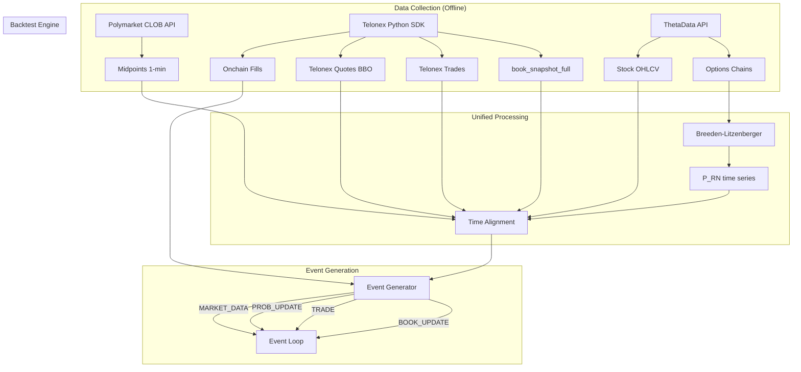

# Orderbook Backtesting with Telonex

How Telonex historical order book data transforms our backtesting from midpoint-based estimation into realistic L2-driven simulation. This note covers fill simulation improvements, microstructure analysis capabilities, integration with our existing pipeline, and a concrete implementation plan.

See [[Telonex-Data-Platform]] for the full data platform reference, [[Backtesting-Architecture]] for the existing engine design, and [[Performance-Metrics-and-Pitfalls]] for evaluation methodology.

---

## 1. The Gap Telonex Fills

### Current State (Without Telonex)

Our backtesting pipeline (described in [[Backtesting-Architecture]] Section 3) currently uses:

| Data Source | What We Have | Limitation |
|---|---|---|
| Polymarket CLOB API | 1-min midpoint prices | No bid/ask spread, no depth |
| Polymarket CLOB API | Tick-level trade data | Trades only, not resting orders |
| ThetaData | Options chains, stock OHLCV | Fair value input, no Polymarket book |

This forces us into several unrealistic modeling assumptions:

1. **Estimated queue depth:** We guess `queue_depth_estimate = 500` in the `ProbabilisticFillSimulator` (see [[Backtesting-Architecture]] Section 3.1, Approach 2). This is a single constant applied to all markets and all times.

2. **No spread modeling:** Without bid/ask data, we cannot measure the actual spread we would capture or the cost of crossing. We estimate midpoint +/- a fixed spread width.

3. **No slippage modeling:** Without depth data, we cannot estimate the market impact of our orders or the fills of larger orders walking the book.

4. **Blind adverse selection:** We classify fills as adverse/non-adverse using price trajectory alone (Approach 3), but we cannot correlate adverse fills with order book thinning, aggressive order flow, or depth imbalances.

5. **No liquidity regime awareness:** Markets cycle between liquid and illiquid states. Without depth data, our strategy cannot adapt to these regimes.

### With Telonex

Telonex provides `book_snapshot_full` -- complete order book snapshots at every tick, captured via redundant WebSocket connections. This is transformative:

| Dimension         | Before (Estimated)                   | After (Telonex L2)                              |
| ----------------- | ------------------------------------ | ----------------------------------------------- |
| Queue position    | Fixed constant (500 shares)          | Actual depth ahead at each price level          |
| Spread            | Assumed constant (e.g., 2 cents)     | Real bid-ask spread at every moment             |
| Slippage          | 1 tick minimum                       | Walk-the-book based on actual depth             |
| Fill probability  | Exponential model with guessed depth | Volume vs. actual queue depth ratio             |
| Adverse selection | Price trajectory classification      | Depth imbalance + trade flow signals            |
| Liquidity regime  | None                                 | Depth profiles, spread percentiles, depth decay |
| Market impact     | Not modeled                          | Impact = f(order_size / available_depth)        |

---

## 2. Fill Simulation Improvements

### 2.1 Queue Position Model with Real Depth

The existing `ProbabilisticFillSimulator` in [[Backtesting-Architecture]] uses a constant `queue_depth_estimate`. With Telonex book data, we replace this with actual depth:

```python
class L2FillSimulator:
    """
    Fill simulation using Telonex historical order book snapshots.
    Replaces estimated queue depth with actual L2 depth data.
    """

    def __init__(self, queue_position_model: str = "uniform"):
        self.resting_orders = {}
        self.current_book = None  # Latest book snapshot
        self.queue_position_model = queue_position_model

    def on_book_update(self, book_snapshot: dict):
        """Process a new Telonex book_snapshot_full event."""
        self.current_book = book_snapshot
        fills = []

        for order_id, order in list(self.resting_orders.items()):
            fill_event = self._check_fill_against_book(order)
            if fill_event:
                fills.append(fill_event)
                del self.resting_orders[order_id]

        return fills

    def _get_depth_at_price(self, side: str, price: float) -> float:
        """Get actual resting liquidity at a specific price level."""
        if self.current_book is None:
            return 0.0

        book_side = self.current_book["bids"] if side == "buy" else self.current_book["asks"]
        for level in book_side:
            if abs(float(level["price"]) - price) < 1e-6:
                return float(level["size"])
        return 0.0

    def _get_depth_ahead(self, side: str, price: float) -> float:
        """
        Calculate total depth ahead of our order at this price level.

        For a bid at 0.48, depth ahead = all bids at 0.48 that arrived before us.
        With queue_position_model='uniform', we assume random position
        in the queue: depth_ahead = total_depth * uniform(0, 1).

        With 'back_of_queue' (conservative), we assume worst case:
        depth_ahead = total_depth (our order is last).
        """
        total_depth = self._get_depth_at_price(side, price)

        if self.queue_position_model == "uniform":
            import numpy as np
            return total_depth * np.random.uniform(0, 1)
        elif self.queue_position_model == "back_of_queue":
            return total_depth
        elif self.queue_position_model == "front_of_queue":
            return 0.0
        else:
            return total_depth * 0.5  # Default: middle of queue

    def estimate_fill_probability(
        self,
        order: dict,
        trade_volume_at_level: float,
    ) -> float:
        """
        P(fill) based on actual queue depth vs volume traded.

        With real depth data, this is much more accurate than the
        exponential model with guessed queue_depth_estimate.

        P(fill) = max(0, (volume_traded - depth_ahead) / order_size)
        Clamped to [0, 1].
        """
        depth_ahead = self._get_depth_ahead(order["side"], order["price"])
        remaining_volume = trade_volume_at_level - depth_ahead

        if remaining_volume <= 0:
            return 0.0

        return min(1.0, remaining_volume / order["size"])

    def _check_fill_against_book(self, order: dict):
        """
        Check if order would be filled given current book state.
        A resting bid is filled when the ask side has crossed our price.
        """
        if self.current_book is None:
            return None

        if order["side"] == "buy":
            best_ask = self.current_book["asks"][0] if self.current_book["asks"] else None
            if best_ask and float(best_ask["price"]) <= order["price"]:
                return self._create_fill(order)
        else:
            best_bid = self.current_book["bids"][0] if self.current_book["bids"] else None
            if best_bid and float(best_bid["price"]) >= order["price"]:
                return self._create_fill(order)

        return None
```

**Key improvement:** Instead of `queue_depth = 500` for every market and every moment, we use actual depth at the price level from the Telonex snapshot. For a TSLA binary market at 0.48 bid, the real depth might be 50 shares at quiet times and 5,000 during active trading. This difference changes fill probability by orders of magnitude.

### 2.2 Realistic Spread and Slippage Modeling

With the `quotes` channel (tick-level BBO) and `book_snapshot_full`:

```python
class SpreadAndSlippageModel:
    """
    Model realistic spread capture and slippage using Telonex data.
    """

    def __init__(self):
        self.spread_history = []
        self.depth_history = []

    def calculate_quoted_spread(self, book_snapshot: dict) -> float:
        """Quoted spread from best bid/ask."""
        if not book_snapshot["bids"] or not book_snapshot["asks"]:
            return float('inf')

        best_bid = float(book_snapshot["bids"][0]["price"])
        best_ask = float(book_snapshot["asks"][0]["price"])
        return best_ask - best_bid

    def calculate_effective_spread(
        self,
        trade_price: float,
        midpoint: float,
        side: str,
    ) -> float:
        """
        Effective spread = 2 * |trade_price - midpoint|.
        Compare with quoted spread to measure execution quality.
        """
        return 2.0 * abs(trade_price - midpoint)

    def estimate_market_impact(
        self,
        order_size: float,
        book_snapshot: dict,
        side: str,
    ) -> float:
        """
        Walk the book to estimate price impact of a market order.

        Returns the volume-weighted average fill price.
        This replaces the constant 1-tick slippage assumption.
        """
        levels = book_snapshot["asks"] if side == "buy" else book_snapshot["bids"]
        remaining = order_size
        total_cost = 0.0

        for level in levels:
            level_price = float(level["price"])
            level_size = float(level["size"])
            fill_at_level = min(remaining, level_size)

            total_cost += fill_at_level * level_price
            remaining -= fill_at_level

            if remaining <= 0:
                break

        if order_size - remaining <= 0:
            return float('inf')  # Not enough liquidity

        vwap = total_cost / (order_size - remaining)
        return vwap

    def calculate_depth_weighted_midpoint(
        self,
        book_snapshot: dict,
        levels: int = 5,
    ) -> float:
        """
        Depth-weighted midpoint: accounts for liquidity imbalance.
        More accurate fair value estimate than simple (bid+ask)/2.

        DWM = (bid_depth * ask_price + ask_depth * bid_price) /
              (bid_depth + ask_depth)
        """
        bid_depth = sum(
            float(l["size"]) for l in book_snapshot["bids"][:levels]
        )
        ask_depth = sum(
            float(l["size"]) for l in book_snapshot["asks"][:levels]
        )

        if bid_depth + ask_depth == 0:
            return None

        best_bid = float(book_snapshot["bids"][0]["price"])
        best_ask = float(book_snapshot["asks"][0]["price"])

        return (bid_depth * best_ask + ask_depth * best_bid) / (bid_depth + ask_depth)
```

### 2.3 Adverse Selection with Order Flow

Combining Telonex trades + book snapshots + onchain fills enables sophisticated adverse selection modeling:

```python
class OrderFlowAdverseSelection:
    """
    Adverse selection analysis using Telonex order book + trade data.

    Key insight: adverse fills correlate with:
    1. Depth imbalance (thin side gets picked off)
    2. Large aggressive orders (informed flow)
    3. Rapid book depletion before the fill
    """

    def __init__(self, lookback_ticks: int = 10):
        self.recent_trades = []
        self.recent_books = []
        self.lookback = lookback_ticks

    def calculate_depth_imbalance(self, book_snapshot: dict) -> float:
        """
        Depth imbalance = (bid_depth - ask_depth) / (bid_depth + ask_depth)

        Positive = more bids (buying pressure)
        Negative = more asks (selling pressure)

        Strong predictor of short-term price direction.
        """
        bid_depth = sum(float(l["size"]) for l in book_snapshot["bids"][:5])
        ask_depth = sum(float(l["size"]) for l in book_snapshot["asks"][:5])

        if bid_depth + ask_depth == 0:
            return 0.0

        return (bid_depth - ask_depth) / (bid_depth + ask_depth)

    def calculate_trade_flow_imbalance(self) -> float:
        """
        Net buy volume - net sell volume over recent trades.
        Sustained one-sided flow indicates informed trading.
        """
        buy_volume = sum(
            t["size"] for t in self.recent_trades[-self.lookback:]
            if t["side"] == "buy"
        )
        sell_volume = sum(
            t["size"] for t in self.recent_trades[-self.lookback:]
            if t["side"] == "sell"
        )

        total = buy_volume + sell_volume
        if total == 0:
            return 0.0
        return (buy_volume - sell_volume) / total

    def is_adverse_fill_likely(
        self,
        order_side: str,
        book_snapshot: dict,
    ) -> float:
        """
        Probability that filling this order would be adverse.

        A bid fill is adverse when:
        - Depth imbalance is negative (selling pressure)
        - Trade flow is net selling
        - Ask side is thinning (informed sellers depleting asks)

        Returns probability [0, 1] of adverse fill.
        """
        depth_imb = self.calculate_depth_imbalance(book_snapshot)
        flow_imb = self.calculate_trade_flow_imbalance()

        if order_side == "buy":
            # Bid fill is adverse when selling pressure exists
            adverse_signal = -depth_imb * 0.5 + (-flow_imb) * 0.5
        else:
            # Ask fill is adverse when buying pressure exists
            adverse_signal = depth_imb * 0.5 + flow_imb * 0.5

        # Map to probability with sigmoid
        import numpy as np
        return 1.0 / (1.0 + np.exp(-3.0 * adverse_signal))

    def classify_trade_toxicity(
        self,
        trade: dict,
        book_before: dict,
        book_after: dict,
    ) -> dict:
        """
        Classify whether a trade was toxic (informed) using book changes.

        Toxic trades:
        - Remove significant depth on one side
        - Cause spread widening
        - Are followed by further price movement in same direction
        """
        spread_before = (
            float(book_before["asks"][0]["price"]) -
            float(book_before["bids"][0]["price"])
        )
        spread_after = (
            float(book_after["asks"][0]["price"]) -
            float(book_after["bids"][0]["price"])
        )

        depth_before = sum(
            float(l["size"]) for l in
            (book_before["bids"] if trade["side"] == "sell" else book_before["asks"])[:5]
        )
        depth_after = sum(
            float(l["size"]) for l in
            (book_after["bids"] if trade["side"] == "sell" else book_after["asks"])[:5]
        )

        return {
            "spread_change": spread_after - spread_before,
            "depth_depletion": (depth_before - depth_after) / max(depth_before, 1),
            "is_toxic": spread_after > spread_before * 1.5,
        }
```

### 2.4 Enhanced Fill Simulation: Putting It Together

Integrating all three improvements into the backtest engine:

```python
class TelonexFillSimulator:
    """
    Production fill simulator using Telonex L2 data.

    Replaces all three approaches from Backtesting-Architecture Section 3.1
    with a single, data-driven model.
    """

    def __init__(
        self,
        queue_model: str = "uniform",
        adverse_selection_weight: float = 0.3,
    ):
        self.l2_sim = L2FillSimulator(queue_position_model=queue_model)
        self.spread_model = SpreadAndSlippageModel()
        self.adverse_model = OrderFlowAdverseSelection()
        self.adverse_weight = adverse_selection_weight
        self.volume_at_price = {}  # Track volume since order placed

    def on_book_snapshot(self, snapshot: dict, timestamp):
        """Process new Telonex book_snapshot_full event."""
        self.l2_sim.on_book_update(snapshot)
        self.adverse_model.recent_books.append(snapshot)

    def on_trade(self, trade: dict, timestamp) -> list:
        """Process new Telonex trade event. Returns list of fill events."""
        self.adverse_model.recent_trades.append(trade)
        fills = []

        for order_id, order in list(self.l2_sim.resting_orders.items()):
            # Only consider fills where trade crosses our price
            if not self._trade_crosses_order(trade, order):
                continue

            # Track volume at our price level
            key = (order_id, order["price"])
            if self._is_at_price(trade, order):
                self.volume_at_price[key] = (
                    self.volume_at_price.get(key, 0) + trade["size"]
                )

            # Calculate fill probability with real depth
            fill_prob = self.l2_sim.estimate_fill_probability(
                order, self.volume_at_price.get(key, 0)
            )

            # Modulate by adverse selection probability
            adverse_prob = self.adverse_model.is_adverse_fill_likely(
                order["side"], self.l2_sim.current_book
            )

            # Adverse fills are more likely (informed traders push through)
            # Non-adverse fills are less likely (we get lucky, price bounces)
            if adverse_prob > 0.5:
                fill_prob *= (1.0 + self.adverse_weight * adverse_prob)
            else:
                fill_prob *= (1.0 - self.adverse_weight * (1 - adverse_prob))

            fill_prob = min(1.0, max(0.0, fill_prob))

            import numpy as np
            if np.random.random() < fill_prob:
                fill_event = {
                    "timestamp": timestamp,
                    "order_id": order_id,
                    "side": order["side"],
                    "price": order["price"],
                    "size": order["size"],
                    "adverse_probability": adverse_prob,
                    "depth_at_fill": self.l2_sim._get_depth_at_price(
                        order["side"], order["price"]
                    ),
                    "spread_at_fill": self.spread_model.calculate_quoted_spread(
                        self.l2_sim.current_book
                    ),
                }
                fills.append(fill_event)
                del self.l2_sim.resting_orders[order_id]
                if key in self.volume_at_price:
                    del self.volume_at_price[key]

        return fills

    def _trade_crosses_order(self, trade, order) -> bool:
        if order["side"] == "buy":
            return trade["price"] <= order["price"]
        return trade["price"] >= order["price"]

    def _is_at_price(self, trade, order) -> bool:
        return abs(trade["price"] - order["price"]) < 1e-6
```

---

## 3. Market Microstructure Analysis

With Telonex data, we can perform analyses that were previously impossible. These inform strategy parameter calibration and market selection.

### 3.1 Depth Profile Analysis

```python
def analyze_depth_profile(book_snapshots: pd.DataFrame) -> dict:
    """
    Analyze how liquidity is distributed across price levels.

    Questions answered:
    - How much depth is at the best level vs deeper levels?
    - Is liquidity concentrated or dispersed?
    - How stable is depth over time?
    """
    results = {
        "avg_spread": [],
        "avg_depth_level_1": [],
        "avg_depth_level_5": [],
        "avg_total_depth_5": [],
        "depth_concentration": [],  # % of top-5 depth at best level
    }

    # Aggregate across snapshots
    # (Exact implementation depends on Telonex Parquet schema,
    #  which includes per-level bid/ask price and size columns)

    return results


def identify_liquidity_regimes(
    spreads: pd.Series,
    depths: pd.Series,
    window: str = "1h",
) -> pd.Series:
    """
    Classify market into liquidity regimes:
    - TIGHT: Narrow spread, deep book (favorable for MM)
    - NORMAL: Average conditions
    - WIDE: Wide spread, thin book (dangerous for MM)
    - STRESSED: Very wide spread, minimal depth (exit or widen quotes)
    """
    spread_pct = spreads.rolling(window).median()
    depth_pct = depths.rolling(window).median()

    conditions = [
        (spread_pct < spread_pct.quantile(0.25)) & (depth_pct > depth_pct.quantile(0.75)),
        (spread_pct > spread_pct.quantile(0.75)) & (depth_pct < depth_pct.quantile(0.25)),
        (spread_pct > spread_pct.quantile(0.9)),
    ]
    choices = ["TIGHT", "WIDE", "STRESSED"]

    import numpy as np
    return pd.Series(
        np.select(conditions, choices, default="NORMAL"),
        index=spreads.index,
    )
```

### 3.2 Spread Dynamics

```python
def analyze_spread_dynamics(
    quotes_df: pd.DataFrame,
    trades_df: pd.DataFrame,
) -> dict:
    """
    Compare quoted spread vs effective (realized) spread.

    Quoted spread: best ask - best bid at each moment
    Effective spread: 2 * |trade_price - midpoint| for each trade

    If effective > quoted, traders are getting worse fills than expected.
    If effective < quoted, there may be hidden liquidity or mid improvement.

    This ratio is a key input for our strategy's spread-setting logic.
    """
    # Merge trades with contemporary quotes
    merged = pd.merge_asof(
        trades_df.sort_values("timestamp"),
        quotes_df.sort_values("timestamp"),
        on="timestamp",
        direction="backward",
    )

    merged["midpoint"] = (merged["best_bid"] + merged["best_ask"]) / 2
    merged["quoted_spread"] = merged["best_ask"] - merged["best_bid"]
    merged["effective_spread"] = 2 * abs(merged["trade_price"] - merged["midpoint"])
    merged["realized_vs_quoted"] = merged["effective_spread"] / merged["quoted_spread"]

    return {
        "mean_quoted_spread": merged["quoted_spread"].mean(),
        "median_quoted_spread": merged["quoted_spread"].median(),
        "mean_effective_spread": merged["effective_spread"].mean(),
        "realized_to_quoted_ratio": merged["realized_vs_quoted"].median(),
        "spread_percentiles": merged["quoted_spread"].describe(),
    }
```

### 3.3 Order Flow Toxicity (VPIN)

```python
def calculate_vpin(
    trades_df: pd.DataFrame,
    bucket_size: float = 1000.0,  # USDC per bucket
    n_buckets: int = 50,
) -> pd.Series:
    """
    Volume-synchronized Probability of Informed Trading.

    VPIN measures the imbalance between buy and sell volume
    in equal-volume buckets. High VPIN signals informed flow
    and predicts adverse selection.

    With Telonex trade data, we can compute this at tick-level
    instead of relying on minute bars.
    """
    trades = trades_df.sort_values("timestamp").copy()
    trades["dollar_volume"] = trades["price"] * trades["size"]

    # Classify trades as buy/sell using side field
    # (Telonex provides this directly -- no Lee-Ready needed)
    trades["signed_volume"] = trades.apply(
        lambda r: r["dollar_volume"] if r["side"] == "buy" else -r["dollar_volume"],
        axis=1,
    )

    # Create equal-volume buckets
    trades["cumulative_volume"] = trades["dollar_volume"].cumsum()
    trades["bucket"] = (trades["cumulative_volume"] / bucket_size).astype(int)

    # VPIN per bucket
    bucket_stats = trades.groupby("bucket").agg(
        buy_volume=("signed_volume", lambda x: x[x > 0].sum()),
        sell_volume=("signed_volume", lambda x: (-x[x < 0]).sum()),
        timestamp=("timestamp", "last"),
    )

    bucket_stats["abs_imbalance"] = abs(
        bucket_stats["buy_volume"] - bucket_stats["sell_volume"]
    )
    bucket_stats["total_volume"] = (
        bucket_stats["buy_volume"] + bucket_stats["sell_volume"]
    )

    # Rolling VPIN over n_buckets
    vpin = (
        bucket_stats["abs_imbalance"].rolling(n_buckets).sum() /
        bucket_stats["total_volume"].rolling(n_buckets).sum()
    )

    return vpin
```

### 3.4 Maker/Taker Analysis with Onchain Data

The `onchain_fills` channel provides wallet-level data going back to November 2022. Combined with book data:

```python
def analyze_maker_taker_flow(
    onchain_df: pd.DataFrame,
    book_snapshots_df: pd.DataFrame,
) -> dict:
    """
    Identify informed vs. uninformed flow using wallet-level data.

    Key analyses:
    1. Whale identification: wallets with cumulative volume > threshold
    2. Maker vs taker profitability by wallet
    3. Correlation between whale activity and book state changes
    4. Cross-token trade detection (44% of election markets)
    """
    # Filter to non-mirrored rows to avoid double-counting
    fills = onchain_df[onchain_df["mirrored"] == False].copy()

    # Per-wallet statistics
    wallet_stats = fills.groupby("maker_address").agg(
        total_volume=("size", "sum"),
        trade_count=("size", "count"),
        avg_price=("price", "mean"),
    ).sort_values("total_volume", ascending=False)

    # Top 1% of wallets by volume = "whales"
    volume_threshold = wallet_stats["total_volume"].quantile(0.99)
    whales = wallet_stats[wallet_stats["total_volume"] >= volume_threshold]

    return {
        "total_wallets": len(wallet_stats),
        "whale_count": len(whales),
        "whale_volume_share": (
            whales["total_volume"].sum() / wallet_stats["total_volume"].sum()
        ),
        "whale_addresses": whales.index.tolist(),
    }
```

---

## 4. Integration with Existing Pipeline

### 4.1 Data Pipeline Modifications

The existing pipeline in [[Backtesting-Architecture]] Section 4 processes Polymarket midpoints/trades and ThetaData options data. Adding Telonex requires:



### 4.2 New Event Type for Book Updates

Extend the event types from [[Backtesting-Architecture]] Section 2.1:

```python
class EventType(Enum):
    MARKET_DATA = "MARKET_DATA"
    PROBABILITY_UPDATE = "PROB_UPDATE"
    SIGNAL = "SIGNAL"
    QUOTE_UPDATE = "QUOTE_UPDATE"
    ORDER_SUBMIT = "ORDER_SUBMIT"
    ORDER_CANCEL = "ORDER_CANCEL"
    FILL = "FILL"
    POSITION_UPDATE = "POSITION_UPDATE"
    MARKET_RESOLVE = "MARKET_RESOLVE"

    # New events enabled by Telonex
    BOOK_UPDATE = "BOOK_UPDATE"          # L2 order book snapshot
    BBO_UPDATE = "BBO_UPDATE"            # Best bid/offer change
    TRADE_TICK = "TRADE_TICK"            # Individual trade (Telonex)
```

### 4.3 Telonex Data Handler

```python
import pandas as pd
from telonex import get_dataframe, get_availability

class TelonexDataHandler:
    """
    Data handler that loads Telonex historical data and generates
    events for the backtest engine.

    Integrates with the existing DataHandler interface from
    Backtesting-Architecture Section 2.2.
    """

    def __init__(
        self,
        api_key: str,
        exchange: str = "polymarket",
        download_dir: str = "./data/telonex",
    ):
        self.api_key = api_key
        self.exchange = exchange
        self.download_dir = download_dir

    def load_market_data(
        self,
        slug: str,
        outcome: str,
        from_date: str,
        to_date: str,
        channels: list = None,
    ) -> dict:
        """
        Load all Telonex data for a market into DataFrames.

        Returns dict of channel_name -> DataFrame.
        """
        if channels is None:
            channels = [
                "book_snapshot_full",
                "trades",
                "quotes",
            ]

        data = {}
        for channel in channels:
            try:
                df = get_dataframe(
                    api_key=self.api_key,
                    exchange=self.exchange,
                    channel=channel,
                    slug=slug,
                    outcome=outcome,
                    from_date=from_date,
                    to_date=to_date,
                    download_dir=self.download_dir,
                )
                data[channel] = df
                print(
                    f"Loaded {channel}: {len(df)} rows, "
                    f"columns: {list(df.columns)}"
                )
            except Exception as e:
                print(f"Warning: Could not load {channel}: {e}")

        return data

    def generate_events(
        self,
        data: dict,
    ) -> list:
        """
        Generate chronologically-ordered events from all Telonex channels.
        These merge into the backtest engine's priority queue.
        """
        events = []

        # Book snapshot events
        if "book_snapshot_full" in data:
            for _, row in data["book_snapshot_full"].iterrows():
                events.append(Event(
                    timestamp=row["timestamp"],
                    event_type=EventType.BOOK_UPDATE,
                    data=row.to_dict(),
                ))

        # Trade events
        if "trades" in data:
            for _, row in data["trades"].iterrows():
                events.append(Event(
                    timestamp=row["timestamp"],
                    event_type=EventType.TRADE_TICK,
                    data=row.to_dict(),
                ))

        # BBO events
        if "quotes" in data:
            for _, row in data["quotes"].iterrows():
                events.append(Event(
                    timestamp=row["timestamp"],
                    event_type=EventType.BBO_UPDATE,
                    data=row.to_dict(),
                ))

        # Sort by timestamp
        events.sort(key=lambda e: e.timestamp)
        return events
```

### 4.4 Time Alignment with ThetaData

The `TimeAligner` from [[Backtesting-Architecture]] Section 4.3 needs to handle Telonex timestamps. Telonex data is already UTC (collected from Polymarket's UTC-based system), so no timezone conversion is needed -- unlike ThetaData which is Eastern Time.

```python
class EnhancedTimeAligner(TimeAligner):
    """
    Extends TimeAligner to handle Telonex book data alignment
    with ThetaData options and Polymarket midpoints.

    Key principle: Telonex timestamps are UTC (same as Polymarket).
    ThetaData timestamps are Eastern Time -- convert to UTC first.
    """

    def align_all_sources(
        self,
        telonex_books: pd.DataFrame,
        telonex_trades: pd.DataFrame,
        telonex_quotes: pd.DataFrame,
        probability_df: pd.DataFrame,
        underlying_df: pd.DataFrame,
    ) -> pd.DataFrame:
        """
        Create unified timeline with all sources at tick-level.

        Unlike the original 1-min grid approach, with Telonex data
        we can align at the actual tick level for higher fidelity.
        """
        # Convert ThetaData timestamps to UTC
        probability_df = probability_df.copy()
        probability_df["timestamp_utc"] = probability_df["timestamp"].apply(
            self.thetadata_to_utc
        )

        # Telonex timestamps are already UTC -- no conversion needed

        # For each Telonex event, find the latest available probability
        # (strict point-in-time: never look forward)
        events = pd.concat([
            telonex_books[["timestamp"]].assign(source="book"),
            telonex_trades[["timestamp"]].assign(source="trade"),
            telonex_quotes[["timestamp"]].assign(source="quote"),
        ]).sort_values("timestamp")

        # Merge with latest probability (forward-fill from last known)
        aligned = pd.merge_asof(
            events,
            probability_df[["timestamp_utc", "risk_neutral_prob"]].rename(
                columns={"timestamp_utc": "timestamp"}
            ),
            on="timestamp",
            direction="backward",
        )

        # Merge with latest underlying price
        aligned = pd.merge_asof(
            aligned,
            underlying_df[["timestamp", "close"]].rename(
                columns={"close": "underlying_price"}
            ),
            on="timestamp",
            direction="backward",
        )

        return aligned
```

### 4.5 Storage Requirements

| Channel | Typical Daily Size (per market) | Storage Estimate (1 market, 1 month) |
|---|---|---|
| `trades` | 1-10 MB | 30-300 MB |
| `quotes` | 5-20 MB (estimated) | 150-600 MB |
| `book_snapshot_5` | 5-15 MB (estimated) | 150-450 MB |
| `book_snapshot_25` | 15-50 MB (estimated) | 450 MB - 1.5 GB |
| `book_snapshot_full` | 20-100 MB (estimated) | 600 MB - 3 GB |
| `onchain_fills` | 1-5 MB | 30-150 MB |

**For our use case:** Backtesting 10-20 stock/index markets over 2-3 months with `book_snapshot_full` + `trades` + `quotes` would require approximately 20-80 GB of Parquet storage. This is very manageable.

Parquet compression (5-50x vs CSV) means this data would be 100-4,000 GB as CSV. The columnar format also enables reading only the columns needed for each analysis.

**Recommended approach:** Use `book_snapshot_5` for rapid prototyping (smaller files) and `book_snapshot_full` for final backtesting runs.

---

## 5. Concrete Backtesting Scenarios

### 5.1 Scenario: NVDA $190 Binary Market

Consider backtesting our market making strategy on the "Will NVIDIA (NVDA) close above $190 on January 26?" market using Telonex data:

```python
from telonex import get_dataframe, get_availability

API_KEY = "your-api-key"

# Step 1: Check data availability
avail = get_availability(
    exchange="polymarket",
    slug="nvda-close-above-190-on-january-26-2026",
    outcome="Yes",
)
print(f"Book data: {avail['channels']['book_snapshot_full']}")
# Output: {'from_date': '2026-01-23', 'to_date': '2026-01-28'}

# Step 2: Load order book data
books = get_dataframe(
    api_key=API_KEY,
    exchange="polymarket",
    channel="book_snapshot_full",
    slug="nvda-close-above-190-on-january-26-2026",
    outcome="Yes",
    from_date="2026-01-23",
    to_date="2026-01-28",
)

# Step 3: Load trade data
trades = get_dataframe(
    api_key=API_KEY,
    exchange="polymarket",
    channel="trades",
    slug="nvda-close-above-190-on-january-26-2026",
    outcome="Yes",
    from_date="2026-01-23",
    to_date="2026-01-28",
)

# Step 4: Load quotes for spread analysis
quotes = get_dataframe(
    api_key=API_KEY,
    exchange="polymarket",
    channel="quotes",
    slug="nvda-close-above-190-on-january-26-2026",
    outcome="Yes",
    from_date="2026-01-23",
    to_date="2026-01-28",
)

print(f"Book snapshots: {len(books)} rows")
print(f"Trades: {len(trades)} rows")
print(f"Quotes: {len(quotes)} rows")

# Step 5: Inspect schemas (first-time discovery)
print(f"Book columns: {list(books.columns)}")
print(f"Trade columns: {list(trades.columns)}")
print(f"Quote columns: {list(quotes.columns)}")
```

### 5.2 Scenario: Spread Capture Analysis

With Telonex data, we can answer: "If we quoted at mid +/- 2 cents, what would our actual spread capture be given real book dynamics?"

```python
def analyze_spread_capture_with_real_book(
    quotes_df: pd.DataFrame,
    trades_df: pd.DataFrame,
    half_spread: float = 0.02,
) -> dict:
    """
    Simulate spread capture using real BBO data instead of assumed spreads.

    Compare:
    - Assumed spread capture (our model): half_spread per fill
    - Realistic spread capture: min(our_half_spread, actual_half_spread) per fill
    """
    # Merge trades with contemporary BBO
    merged = pd.merge_asof(
        trades_df.sort_values("timestamp"),
        quotes_df.sort_values("timestamp"),
        on="timestamp",
        direction="backward",
    )

    merged["actual_half_spread"] = (
        merged["best_ask"] - merged["best_bid"]
    ) / 2.0
    merged["midpoint"] = (merged["best_bid"] + merged["best_ask"]) / 2.0

    # Our bid = mid - half_spread, our ask = mid + half_spread
    merged["our_bid"] = merged["midpoint"] - half_spread
    merged["our_ask"] = merged["midpoint"] + half_spread

    # Would we have been at top of book?
    merged["bid_competitive"] = merged["our_bid"] >= merged["best_bid"]
    merged["ask_competitive"] = merged["our_ask"] <= merged["best_ask"]

    # How often is the real spread wider than our target spread?
    merged["spread_wider_than_target"] = (
        merged["actual_half_spread"] > half_spread
    )

    return {
        "mean_actual_half_spread": merged["actual_half_spread"].mean(),
        "target_half_spread": half_spread,
        "pct_time_competitive_bid": merged["bid_competitive"].mean(),
        "pct_time_competitive_ask": merged["ask_competitive"].mean(),
        "pct_time_spread_wider": merged["spread_wider_than_target"].mean(),
        "realistic_capture_per_fill": min(
            half_spread,
            merged["actual_half_spread"].median()
        ),
    }
```

### 5.3 Scenario: Adverse Selection Comparison

Compare adverse selection metrics between our current model (price-trajectory-based) and the enhanced model (depth-imbalance-based):

```python
def compare_adverse_selection_models(
    trades_df: pd.DataFrame,
    books_df: pd.DataFrame,
    quotes_df: pd.DataFrame,
    half_spread: float = 0.02,
    lookforward_minutes: int = 5,
) -> dict:
    """
    Compare adverse selection detection accuracy:
    1. Old model: classify by recent price trajectory
    2. New model: classify by depth imbalance + trade flow
    3. Ground truth: did midpoint move against us in next N minutes?

    The depth-based model should have higher precision in identifying
    which fills are truly adverse.
    """
    results = {
        "total_hypothetical_fills": 0,
        "old_model_adverse_correct": 0,
        "new_model_adverse_correct": 0,
        "actual_adverse_fills": 0,
    }

    # For each trade that would have filled our resting order...
    # (implementation depends on exact Telonex column schema)
    # The key insight: with real depth data, we can distinguish between:
    #
    # 1. A trade that depletes the book on one side (likely informed, adverse)
    # 2. A trade that is absorbed by deep liquidity (likely noise, not adverse)
    #
    # The old model treats both the same; the new model differentiates them.

    return results
```

---

## 6. Implementation Plan

### Phase 1: Data Discovery and Schema Mapping (1-2 days)

1. Sign up for Telonex free trial (5 downloads)
2. Download `book_snapshot_full`, `trades`, and `quotes` for one stock market
3. Inspect the exact Parquet column schemas (`df.columns`, `df.dtypes`)
4. Document the precise field names and types for each channel
5. Verify timestamp format and precision

**Deliverable:** Updated [[Telonex-Data-Platform]] with exact column schemas.

### Phase 2: Data Pipeline Integration (3-5 days)

1. Create `TelonexDataHandler` class with `download` + `load` methods
2. Subscribe to Plus plan ($79/month) for unlimited downloads
3. Build data download script for target stock/index markets
4. Implement `EnhancedTimeAligner` for Telonex + ThetaData alignment
5. Add `BOOK_UPDATE`, `BBO_UPDATE`, `TRADE_TICK` event types to engine
6. Store downloaded data in project's Parquet directory structure

**Deliverable:** Working data pipeline that loads Telonex data into the backtest engine.

### Phase 3: L2 Fill Simulator (5-7 days)

1. Implement `L2FillSimulator` with real depth-based queue position
2. Implement `SpreadAndSlippageModel` with walk-the-book slippage
3. Implement `OrderFlowAdverseSelection` with depth imbalance signals
4. Integrate into `TelonexFillSimulator` combining all three
5. Calibrate queue position model (uniform vs back-of-queue) against historical fills
6. Compare fill rates and PnL between old (estimated) and new (L2) simulators

**Deliverable:** Production fill simulator, calibration results showing improvement vs midpoint-based approach.

### Phase 4: Microstructure Analysis (3-5 days)

1. Depth profile analysis across stock/index markets
2. Spread dynamics: quoted vs effective, time-of-day patterns
3. VPIN calculation for toxicity detection
4. Liquidity regime classification
5. Maker/taker flow analysis using onchain data

**Deliverable:** Market microstructure research note with findings that inform strategy parameters.

### Phase 5: Strategy Calibration (Ongoing)

1. Run full backtests with L2 data on 10-20 stock/index markets
2. Compare PnL decomposition (spread capture, inventory PnL, adverse selection) between old and new fill models
3. Calibrate strategy parameters (spread width, inventory limits, quote skew) using L2 data
4. Validate against [[Performance-Metrics-and-Pitfalls]] metrics

**Deliverable:** Calibrated strategy parameters with confidence intervals backed by realistic L2-based backtesting.

---

## 7. Expected Impact on Backtest Realism

| Metric | Current (Midpoint-Based) | Expected (Telonex L2) | Why It Matters |
|---|---|---|---|
| Fill rate accuracy | ~50% (guessed constant) | Market-specific, time-varying | Prevents overestimating fills in thin markets |
| Spread capture | Assumed constant | Real bid-ask spread dynamics | Prevents overestimating revenue in tight markets |
| Slippage | 1 tick constant | Walk-the-book based on depth | Prevents underestimating costs in thin markets |
| Adverse selection | Price trajectory only | Depth imbalance + trade flow | Distinguishes informed from noise fills |
| Queue position | Random (no depth data) | Actual depth ahead in queue | Core driver of fill probability |
| Liquidity regime | Not modeled | Classified from depth/spread data | Enables regime-aware quoting |
| PnL estimation bias | Likely 20-50% optimistic | Within 5-10% of live (estimated) | The difference between paper profits and real profits |

The bottom line: without L2 data, our backtests likely **overstate profitability by 20-50%** because they assume fills happen when they would not (too-easy queue, no spread cost, no slippage). With Telonex data, we can build the most realistic prediction market backtest currently possible.

---

## 8. References

- [[Backtesting-Architecture]] -- Event-driven engine design and current fill simulation
- [[Performance-Metrics-and-Pitfalls]] -- PnL decomposition and evaluation methodology
- [[Telonex-Data-Platform]] -- Full API reference and data coverage
- [[Polymarket-CLOB-Mechanics]] -- Order book structure, fees, token mechanics
- [[Polymarket-Data-API]] -- Current API endpoints (limited historical depth)
- [[Breeden-Litzenberger-Pipeline]] -- Options-derived probability for fair value
- [[Core-Market-Making-Strategies]] -- Strategy designs that benefit from L2 data
- [[Inventory-and-Risk-Management]] -- Inventory management with depth awareness
- [[Capital-Efficiency-and-Edge-Cases]] -- Practical constraints on strategy execution
