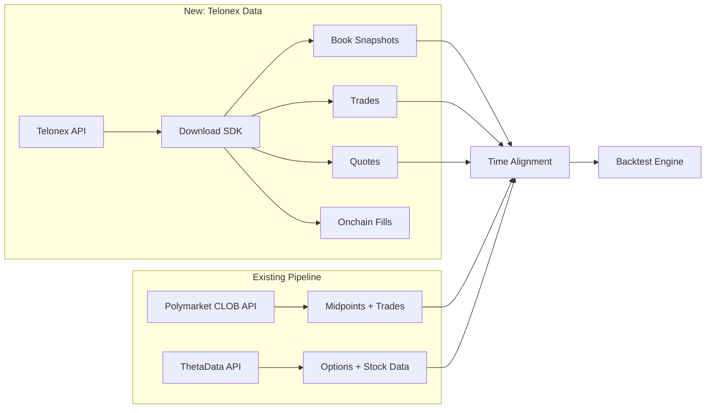

# Telonex Data Platform

Telonex is a historical prediction market data platform providing tick-level trades, order book snapshots, best bid/ask quotes, and onchain settlement data for Polymarket. It positions itself as "the industry standard for historical prediction market data." All data is delivered as daily-partitioned Apache Parquet files via a REST API and Python SDK.

This is the **primary source** for historical L2 order book data on Polymarket -- a critical gap in our current backtesting pipeline (see [[Backtesting-Architecture]]).

---

## 1. Data Coverage

### Exchanges Supported

| Exchange | Status | Channels |
|---|---|---|
| **Polymarket** | Active | `trades`, `quotes`, `book_snapshot_5`, `book_snapshot_25`, `book_snapshot_full`, `onchain_fills` |
| **Binance** | Active | `trades`, `quotes`, `book_snapshot_5`, `book_snapshot_25` |

### Scale

- **839,000+** total markets in the catalog
- **500,000+** markets with at least one data channel
- **20 billion+** individual data points
- **3+ years** of onchain history (from November 2022)

### Historical Date Ranges

| Channel | Earliest Date | Coverage |
|---|---|---|
| `trades` | 2025-10-11 | Daily updates, ongoing |
| `quotes` | 2025-10-11 | Daily updates, ongoing |
| `book_snapshot_5` | 2025-10-11 | Daily updates, ongoing |
| `book_snapshot_25` | 2025-10-11 | Daily updates, ongoing |
| `book_snapshot_full` | 2025-10-11 | Daily updates, ongoing |
| `onchain_fills` | 2022-11-21 | Full history from Polymarket inception |

Off-chain data (trades, quotes, book snapshots) is collected via redundant WebSocket connections with zero-downtime infrastructure. Onchain fills are derived from Polygon blockchain logs.

### Stock/Index Market Coverage

Markets relevant to our [[Core-Market-Making-Strategies]] are well-represented:

| Underlying | Markets with Data | Examples |
|---|---|---|
| TSLA | 1,129 | "Will Tesla (TSLA) close above $400 on February 26?" |
| NVDA | 1,129 | "Will NVIDIA (NVDA) close above $190 on January 26?" |
| AAPL | 1,854 | "Will Apple (AAPL) close above $255 on March 26?" |
| AMZN | 1,088 | Amazon close/finish-week markets |
| GOOG | 1,493 | Google/Alphabet price threshold markets |
| META | 1,304 | Meta Platforms price threshold markets |
| MSFT | 1,050 | Microsoft price threshold markets |
| SPX | 357 | "Will the SPX opening price on January 5 be between..." |
| NASDAQ | 230 | Nasdaq composite level markets |
| BTC | 41,040 | Bitcoin price threshold markets |
| ETH | 39,325 | Ethereum price threshold markets |

Stock/index market volume is growing: from 423 markets in October 2025 to 2,368 in March 2026.

---

## 2. Data Channels & Schemas

### 2.1 Trades (`trades`)

Every executed trade on Polymarket with full execution details.

**Key fields** (from FAQ and documentation):
- Timestamp (tick-level precision)
- Price
- Size
- Side (buy/sell direction)

These are deduplicated at the collection layer using redundant WebSocket instances. Each trade appears exactly once.

**Use cases:** Fill simulation calibration, trade-tick matching (see [[Backtesting-Architecture]] Section 3.1), volume analysis, market activity measurement.

### 2.2 Quotes / Best Bid-Offer (`quotes`)

Best bid and ask snapshots captured at every change for all markets.

**Key fields:**
- Timestamp
- Best bid price
- Best bid size
- Best ask price
- Best ask size

Every quote change is recorded -- this is tick-level BBO data, not interval-sampled. This provides a complete picture of spread dynamics over time.

**Use cases:** Spread analysis, midpoint calculation, quoted spread vs realized spread comparison, top-of-book liquidity measurement.

### 2.3 Order Book Snapshots (`book_snapshot_5`, `book_snapshot_25`, `book_snapshot_full`)

Order book depth snapshots at three levels of granularity:

| Channel | Depth | Description |
|---|---|---|
| `book_snapshot_5` | Top 5 levels | Bid and ask price/size for the 5 best levels on each side |
| `book_snapshot_25` | Top 25 levels | Bid and ask price/size for the 25 best levels on each side |
| `book_snapshot_full` | All levels | Complete order book state at every captured snapshot |

Each snapshot captures the **complete order book state at that moment** -- no incremental replay or delta reconstruction needed. From the FAQ: "Order book snapshots provided at three depth levels: top 5, top 25, and full depth. Each snapshot captures complete order book state at that moment without needing incremental replay."

**Key fields per level:**
- Bid price at level N
- Bid size at level N
- Ask price at level N
- Ask size at level N
- Timestamp

**This is the critical data for our backtesting.** With `book_snapshot_full`, we can reconstruct the complete order book at any historical point and model:
- Queue position estimation with real depth
- Realistic slippage based on actual liquidity
- Depth profiles and liquidity concentration
- Market impact modeling

### 2.4 Onchain Fills (`onchain_fills`)

Actual settlement records from the Polygon blockchain for every trade.

**Key fields:**
- Maker wallet address
- Taker wallet address
- Token IDs
- Price
- Size
- Transaction hash
- USDC amount
- `mirrored` flag (boolean)

**Mirroring:** Each trade on the blockchain emits multiple events (OrderFilled for maker, OrderFilled for taker, OrdersMatched). Telonex combines these into a single row per trade, then mirrors into two rows: one in the maker's asset partition (`mirrored=false`) and one in the sibling partition (`mirrored=true`) with complementary price (`1 - original_price`). Filter to `mirrored=false` to avoid double-counting.

**Coverage:** Full history from November 2022 (3+ years) -- the longest coverage of any channel.

**Use cases:** Wallet-level flow analysis, whale tracking, maker/taker analysis, P&L calculation, adverse selection analysis by identifying informed vs uninformed flow.

### 2.5 Markets Dataset (FREE)

Metadata for all 839,000+ markets. No API key required.

**Schema (35 columns):**

| Column | Type | Description |
|---|---|---|
| `exchange` | string | Always "polymarket" |
| `market_id` | string | Condition ID (hex) |
| `slug` | string | URL-friendly market identifier |
| `event_id` | string | Parent event ID |
| `event_slug` | string | Parent event slug |
| `event_title` | string | Parent event title |
| `question` | string | Full market question text |
| `description` | string | Detailed market description |
| `category` | string | Market category |
| `outcome_0` | string | First outcome label (e.g., "Yes") |
| `outcome_1` | string | Second outcome label (e.g., "No") |
| `asset_id_0` | string | Token ID for outcome 0 |
| `asset_id_1` | string | Token ID for outcome 1 |
| `status` | string | `active`, `resolved`, `unopened`, `closed` |
| `result_id` | string | Winning outcome index (empty if unresolved) |
| `settled_at_us` | int64 | Settlement timestamp (microseconds) |
| `prepared_at_us` | int64 | Preparation timestamp (microseconds) |
| `start_date_us` | int64 | Market start timestamp (microseconds) |
| `end_date_us` | int64 | Market end timestamp (microseconds) |
| `created_at_us` | int64 | Creation timestamp (microseconds) |
| `resolution_source` | string | URL for resolution verification |
| `rules_url` | string | Market rules URL |
| `tags` | string | Array of tag labels |
| `trades_from` | string | First date with trades data (YYYY-MM-DD) |
| `trades_to` | string | Last date with trades data |
| `quotes_from` | string | First date with quotes data |
| `quotes_to` | string | Last date with quotes data |
| `book_snapshot_5_from` | string | First date with 5-level book data |
| `book_snapshot_5_to` | string | Last date with 5-level book data |
| `book_snapshot_25_from` | string | First date with 25-level book data |
| `book_snapshot_25_to` | string | Last date with 25-level book data |
| `book_snapshot_full_from` | string | First date with full book data |
| `book_snapshot_full_to` | string | Last date with full book data |
| `onchain_fills_from` | string | First date with onchain fills data |
| `onchain_fills_to` | string | Last date with onchain fills data |

The per-channel date range columns make it easy to filter markets by data availability before downloading.

### 2.6 Tags Dataset (FREE)

Category labels for filtering markets by topic. No API key required.

---

## 3. API Reference

### 3.1 Base URL

```
https://api.telonex.io
```

### 3.2 Authentication

All data download endpoints require an API key passed as a Bearer token:

```
Authorization: Bearer <api_key>
```

The availability endpoint and dataset endpoints (markets, tags) are **public** -- no authentication required.

### 3.3 Endpoints

#### Download Data

```
GET /v1/downloads/{exchange}/{channel}/{date}
```

**Path parameters:**

| Parameter | Type | Description |
|---|---|---|
| `exchange` | string | Exchange name (e.g., `polymarket`) |
| `channel` | string | Data channel (e.g., `trades`, `book_snapshot_full`) |
| `date` | string | Date in `YYYY-MM-DD` format |

**Query parameters (identifier -- use one combination):**

| Parameter | Type | Description |
|---|---|---|
| `asset_id` | string | Direct asset/token ID (use alone) |
| `market_id` | string | Market condition ID (requires `outcome` or `outcome_id`) |
| `slug` | string | Market slug (requires `outcome` or `outcome_id`) |
| `outcome` | string | Outcome label (e.g., "Yes", "No", "Up", "Down") |
| `outcome_id` | int | Outcome index (0 or 1) |

**Valid identifier combinations:**
1. `asset_id` alone
2. `market_id` + `outcome`
3. `market_id` + `outcome_id`
4. `slug` + `outcome`
5. `slug` + `outcome_id`

**Response:** Returns a redirect to a presigned S3 URL for the Parquet file download.

**Error codes:**

| Status | Exception | Description |
|---|---|---|
| 401 | `AuthenticationError` | Invalid or missing API key |
| 403 | `EntitlementError` | Access denied (includes `X-Downloads-Remaining` header) |
| 404 | `NotFoundError` | Data not found for this date/market |
| 429 | `RateLimitError` | Rate limit exceeded (includes `Retry-After` header) |

#### Check Availability

```
GET /v1/availability/{exchange}
```

No authentication required. Returns JSON with channel date ranges.

**Query parameters:** Same identifier options as the download endpoint.

**Response example:**

```json
{
  "exchange": "polymarket",
  "asset_id": "268277707772075338872664315715359...",
  "market_id": "0x92496e5c0a26ebc75ffd7ed3c4c308a0...",
  "slug": "tsla-up-or-down-on-october-17-2025",
  "outcome": "Up",
  "outcome_id": 0,
  "channels": {
    "trades": {
      "from_date": "2025-10-16",
      "to_date": "2025-10-18"
    },
    "quotes": {
      "from_date": "2025-10-16",
      "to_date": "2025-10-19"
    },
    "book_snapshot_5": {
      "from_date": "2025-10-16",
      "to_date": "2025-10-19"
    },
    "book_snapshot_25": {
      "from_date": "2025-10-16",
      "to_date": "2025-10-19"
    },
    "book_snapshot_full": {
      "from_date": "2025-10-16",
      "to_date": "2025-10-19"
    },
    "onchain_fills": {
      "from_date": "2025-10-16",
      "to_date": "2025-10-18"
    }
  }
}
```

#### Download Datasets

```
GET /v1/datasets/{exchange}/markets
GET /v1/datasets/{exchange}/tags
```

No authentication required. Returns Parquet files directly.

### 3.4 Rate Limits

From the FAQ: "Rate limits are generous for typical data analysis workflows." The API is designed for bulk downloads, not high-frequency queries. Enterprise tier offers higher throughput. The `RateLimitError` includes a `retry_after` attribute (seconds) and the response includes a `Retry-After` header.

### 3.5 Data Update Frequency

Off-chain data (trades, quotes, book snapshots) is updated daily, "typically available by early morning UTC for the previous day's activity." Data is partitioned by date for efficient incremental downloads. Onchain fills cover full history. This is **not** a real-time data source.

---

## 4. Python SDK

### 4.1 Installation

```bash
pip install telonex              # Core (download to disk)
pip install telonex[dataframe]   # + pandas support
pip install telonex[polars]      # + Polars support
pip install telonex[all]         # Everything
```

**Requirements:** Python >= 3.9. Current version: 0.2.2 (MIT license).

### 4.2 Core Functions

#### `download()` -- Download to Disk

```python
from telonex import download

files = download(
    api_key="your-api-key",
    exchange="polymarket",
    channel="book_snapshot_full",
    asset_id="21742633143463906290569050155826241533067272736897614950488156847949938836455",
    from_date="2025-11-01",
    to_date="2025-11-08",
    download_dir="./data/telonex",
    concurrency=5,        # Max parallel downloads
    verbose=True,
    force_download=False,  # Skip if file already cached
)
# Returns: list of downloaded file paths
```

Files are cached locally. Re-running skips already-downloaded files unless `force_download=True`.

#### `get_dataframe()` -- Direct to DataFrame

```python
from telonex import get_dataframe

# Using slug + outcome (human-readable)
df = get_dataframe(
    api_key="your-api-key",
    exchange="polymarket",
    channel="book_snapshot_full",
    slug="will-nvidia-nvda-close-above-190-on-january-26-2026",
    outcome="Yes",
    from_date="2026-01-23",
    to_date="2026-01-28",
    engine="pandas",  # or "polars"
)

print(df.columns.tolist())
print(df.head())
```

#### `get_availability()` -- Check Data Availability (No Auth)

```python
from telonex import get_availability

avail = get_availability(
    exchange="polymarket",
    asset_id="2682777077720753388726643157153592941713759685300991607948797293156623813336",
)

for channel, dates in avail["channels"].items():
    print(f"{channel}: {dates['from_date']} to {dates['to_date']}")
```

#### `get_markets_dataframe()` -- Browse Markets (No Auth)

```python
from telonex import get_markets_dataframe

markets = get_markets_dataframe(exchange="polymarket")
print(f"Total markets: {len(markets)}")

# Find stock markets with orderbook data
stock_markets = markets[
    markets['question'].str.contains('TSLA|NVDA|AAPL|SPX', case=False, na=False)
    & (markets['book_snapshot_full_from'] != '')
]
print(f"Stock markets with full book data: {len(stock_markets)}")
```

#### `download_async()` -- Async Version

```python
import asyncio
from telonex import download_async

async def fetch_data():
    files = await download_async(
        api_key="your-api-key",
        exchange="polymarket",
        channel="trades",
        slug="tsla-close-above-400-on-february-26-2026",
        outcome="Yes",
        from_date="2026-02-25",
        to_date="2026-02-27",
    )
    return files

files = asyncio.run(fetch_data())
```

### 4.3 Error Handling

```python
from telonex import (
    download,
    AuthenticationError,
    NotFoundError,
    RateLimitError,
    EntitlementError,
    ValidationError,
)

try:
    download(...)
except AuthenticationError:
    print("Invalid API key")
except RateLimitError as e:
    print(f"Rate limited. Retry after {e.retry_after}s")
except EntitlementError as e:
    print(f"Access denied. Downloads remaining: {e.downloads_remaining}")
except NotFoundError:
    print("No data for this market/date")
except ValidationError as e:
    print(f"Invalid parameters: {e}")
```

The SDK handles retries internally with exponential backoff (up to 5 attempts). Rate limit retries use the `retry_after` value from the response.

### 4.4 SDK Internals

Key implementation details from the source:

- **Base URL:** `https://api.telonex.io`
- **Auth:** Bearer token in `Authorization` header
- **Download mechanism:** HTTP GET to `/v1/downloads/{exchange}/{channel}/{date}` with query params, follows redirect to presigned S3 URL
- **Concurrency:** Semaphore-controlled async downloads (default 5)
- **Caching:** Files cached in `download_dir` with pattern `{exchange}_{channel}_{date}_{identifier}.parquet`
- **Timeout:** 5 minutes per download (configurable)
- **Atomic writes:** Downloads to temp file, then `os.replace()` for crash safety

---

## 5. Pricing

| Plan | Price | Downloads | Key Features |
|---|---|---|---|
| **Free Trial** | $0/month | 5 file downloads total | All channels, no credit card, API key included |
| **Plus** | $79/month | Unlimited | Full Polymarket + Binance history, daily updates, personal use license |
| **Enterprise** | Custom | Unlimited | Custom delivery, dedicated support, Point-in-Time accuracy, unlimited API keys, commercial license |

- Billing via Stripe, cancel anytime, no annual commitment
- Markets and Tags datasets are always free without an account
- Free trial: 5 downloads across all channels (trades, quotes, book, onchain)

### Cost Considerations for Our Use Case

At $79/month for unlimited downloads, the Plus plan covers all our backtesting needs for personal research. The cost is negligible compared to ThetaData ($40-200/month) and the value of having real L2 data. Enterprise is only needed if we commercialize the strategy or need custom data delivery.

---

## 6. Data Format & Storage

### Parquet Format

All data is delivered as Apache Parquet files:
- Columnar compression: **5-50x smaller than CSV**, loads 10-100x faster
- Native support in pandas, Polars, PyArrow, DuckDB, Spark, R
- Schema preservation with proper types
- Daily partitioning by date

### File Sizes

From the FAQ: "A single day of trades for an active market is typically 1-10 MB in Parquet format." Order book data is larger due to depth. Full book snapshots for active markets will be on the higher end.

### Querying with DuckDB

DuckDB can query Parquet files directly with SQL without loading into memory:

```python
import duckdb

# Query book snapshot data directly
result = duckdb.sql("""
    SELECT *
    FROM read_parquet('./data/telonex/polymarket_book_snapshot_full_2026-01-26_*.parquet')
    ORDER BY timestamp
    LIMIT 100
""").fetchdf()
```

### Compatible Tools

| Tool | Language | Usage |
|---|---|---|
| pandas | Python | `pd.read_parquet()` |
| Polars | Python/Rust | `pl.read_parquet()` |
| PyArrow | Python | Direct Arrow table access |
| DuckDB | Python/SQL | SQL queries on Parquet |
| Spark | Java/Scala/Python | Distributed processing |
| R (arrow) | R | `arrow::read_parquet()` |
| BigQuery | SQL | External table on GCS |
| Snowflake | SQL | Stage + COPY INTO |
| Athena | SQL | S3 table definition |

---

## 7. Data Quality & Methodology

### Collection Infrastructure

- **Redundant WebSocket collection:** Multiple independent instances collect data simultaneously
- **Event deduplication:** Removes duplicate records at the collection layer
- **Integrity checks:** Verifies data completeness
- **Normalized schemas:** Consistent across all channels
- **Daily partitioning:** Consistent column types per partition

### Onchain Data Quality

For onchain fills, Telonex combines multiple blockchain events per trade (OrderFilled for maker, OrderFilled for taker, OrdersMatched) into a single deduplicated row. Cross-token trades (approximately 44% of election market trades) are properly handled.

### How Telonex Differs from Polymarket's CLOB API

| Aspect | Polymarket CLOB API | Telonex |
|---|---|---|
| Purpose | Real-time trading | Historical analysis |
| Data delivery | REST + WebSocket | Daily Parquet files |
| Rate limits | Strict (trading-oriented) | Generous (bulk download) |
| Historical depth | Limited, paginated | Full history, pre-cleaned |
| Order book | Current snapshot only | Tick-level historical snapshots |
| Bulk access | Not designed for it | Core use case |
| Data quality | Raw, may need cleaning | Deduplicated, normalized |

This distinction is critical: the [[Polymarket-Data-API]] gives us the current order book state and recent trades, but **not historical order book depth**. Telonex fills this exact gap.

---

## 8. Key Limitations

1. **No real-time data:** Historical only, updated daily by early morning UTC. For live trading, use [[Polymarket-Trading-API]].

2. **Off-chain data starts October 2025:** Trades, quotes, and book snapshots only go back to October 11, 2025. Onchain fills go back to November 2022 but lack order book context.

3. **SPA documentation:** The Telonex docs site is a single-page application that doesn't render full content for automated scraping. The PyPI page and FAQ are better reference sources.

4. **Schema details not publicly documented:** Exact column names for trades, quotes, and book snapshot data are not enumerated in public documentation. They are visible once you download a file and inspect it with `df.columns`.

5. **No WebSocket/streaming:** Purely batch/file-based. Not suitable for live order book reconstruction.

---

## 9. Integration Points

### With Our Existing Pipeline

| Component | Integration | Notes |
|---|---|---|
| [[Backtesting-Architecture]] | L2 book data for fill simulation | Replaces estimated queue depth with actual depth |
| [[Polymarket-Data-API]] | Supplements CLOB API data | Historical depth not available from Polymarket directly |
| [[ThetaData-Options-API]] | Time alignment | Align book snapshots with options-derived probabilities |
| [[Breeden-Litzenberger-Pipeline]] | Fair value vs market depth | Compare B-L probability with order book liquidity |
| [[Performance-Metrics-and-Pitfalls]] | Realistic fill metrics | Spread capture and adverse selection with real depth data |

### Recommended Data Pipeline Addition



See [[Orderbook-Backtesting-with-Telonex]] for the detailed implementation plan.
